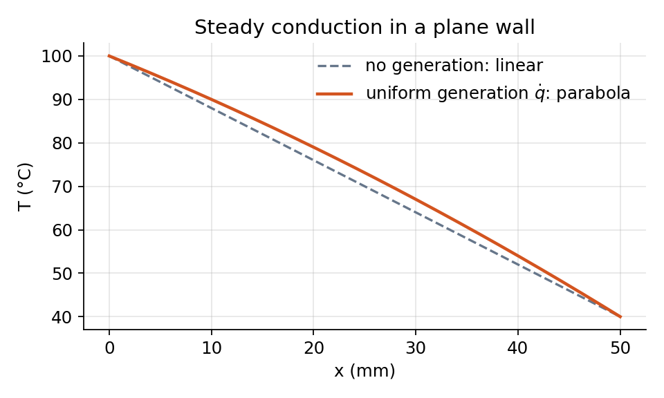
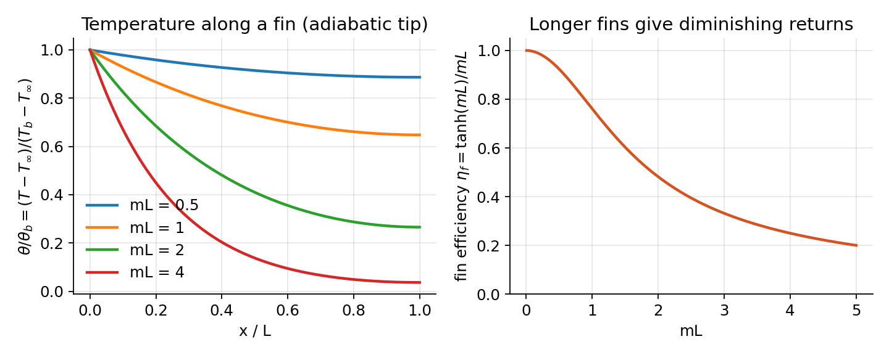

# Steady One-Dimensional Conduction

With no storage and no generation, the heat equation in one dimension is $d^2T/dx^2 = 0$: the temperature is linear and the heat rate is the same through every section. That simple fact is the basis of the thermal-resistance method.

## Plane Wall and Thermal Resistance

For a wall of thickness $L$, area $A$, with faces at $T_1$ and $T_2$, 

$$
q_x = -kA\frac{dT}{dx} = \frac{kA}{L}(T_1 - T_2) = \frac{T_1 - T_2}{R_{\text{cond}}},
\qquad R_{\text{cond}} = \frac{L}{kA}.
$$

!!! abstract "Thermal resistances"

    Heat rate $=$ temperature difference $/$ resistance, in direct analogy with Ohm’s law: 

    $$
    R_{\text{cond,wall}} = \frac{L}{kA},\qquad
    R_{\text{conv}} = \frac{1}{hA},\qquad
    R_{\text{rad}} = \frac{1}{h_r A},\qquad
    R_{\text{cond,cyl}} = \frac{\ln(r_2/r_1)}{2\pi L k},\qquad
    R_{\text{cond,sph}} = \frac{1}{4\pi k}\left(\frac{1}{r_1} - \frac{1}{r_2}\right).
    $$

     Resistances in series add; resistances in parallel add as conductances. The overall heat transfer coefficient is defined by $q = UA\,\Delta T_{\text{overall}}$ with $UA = 1/R_{\text{total}}$.

The method is exact for one-dimensional steady conduction without generation and is a good approximation whenever the temperature varies mainly along one direction. Its power is that a wall with paint, insulation, an air gap, and convection on both sides becomes a chain of resistances that can be written down in one line.

## Contact Resistance

Two solids pressed together touch only at the peaks of their surface roughness; the gaps are filled with air or vacuum. The result is a temperature jump at the interface, described by a contact resistance $R''_{t,c} = \Delta T_{\text{interface}}/q''$ with typical values $10^{-4}$ to $10^{-3}$ m$^2\cdot$K/W for bare metal joints. Thermal grease, soft interface pads, and higher clamping pressure all reduce it, and in electronics packaging it is often the dominant resistance in the whole path.

## Cylinders and Spheres

In a cylinder the area through which heat flows grows with radius, so the temperature is logarithmic rather than linear: 

$$
T(r) = T_{s,1} + (T_{s,2} - T_{s,1})\frac{\ln(r/r_1)}{\ln(r_2/r_1)},
\qquad
q_r = \frac{2\pi L k\,(T_{s,1} - T_{s,2})}{\ln(r_2/r_1)} .
$$

 Adding insulation to a small pipe can *increase* the heat loss: the conduction resistance grows with the outer radius but the convection resistance $1/(2\pi r L h)$ shrinks. The total is minimum at the **critical radius** $r_{cr} = k/h$ for a cylinder ($2k/h$ for a sphere). For pipes this is only a few millimetres and rarely matters; for thin wires it is why insulation can help cooling.

## Heat Generation

With uniform generation $\dot q$ in a plane wall of thickness $L$ with faces at $T_1$ and $T_2$, integrating $k\,d^2T/dx^2 = -\dot q$ twice gives a parabola: 

$$
T(x) = \frac{\dot q}{2k}\,x\,(L - x) + (T_2 - T_1)\frac{x}{L} + T_1 .
$$

 The heat rate is no longer the same through every section, so the resistance method does not apply inside the generating region; it still applies to everything outside it.

<figure markdown="span">
{ width="72%" }
<figcaption>Steady temperature in a plane wall with and without uniform generation (computed).</figcaption>
</figure>

## Extended Surfaces: Fins

A fin increases the surface area for convection. Along a fin of constant cross-section $A_c$, perimeter $P$, and conductivity $k$, in a fluid at $T_\infty$ with coefficient $h$, the energy balance on a slice gives, with $\theta = T - T_\infty$, 

$$
\frac{d^2\theta}{dx^2} - m^2\theta = 0,
\qquad m^2 = \frac{hP}{kA_c}.
$$

!!! abstract "Fin with an adiabatic tip"

    For a fin of length $L$ with base excess temperature $\theta_b$ and negligible heat loss from the tip, 

    $$
    \frac{\theta}{\theta_b} = \frac{\cosh m(L-x)}{\cosh mL},
    \qquad
    q_f = \sqrt{hPkA_c}\;\theta_b \tanh mL,
    \qquad
    \eta_f = \frac{q_f}{h P L\,\theta_b} = \frac{\tanh mL}{mL}.
    $$

     A tip that convects is handled by the corrected length $L_c = L + A_c/P$ in the same formulas.

The **fin efficiency** $\eta_f$ compares the fin to an ideal fin at the base temperature everywhere; the **fin effectiveness** $\varepsilon_f = q_f/(hA_c\theta_b)$ compares it to no fin at all, and fins are worth adding only when $\varepsilon_f \gtrsim 2$. Because $\tanh mL$ saturates, a fin longer than about $mL = 2.5$ adds material without adding heat transfer.

<figure markdown="span">
{ width="72%" }
<figcaption>Temperature along an adiabatic-tip fin for several <em>m</em><em>L</em>, and the fin efficiency (computed).</figcaption>
</figure>
