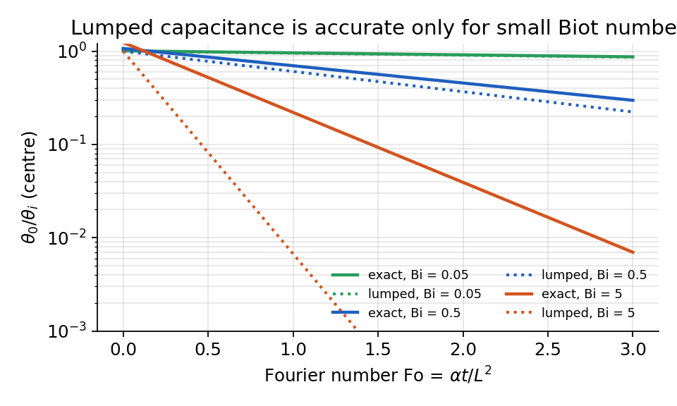
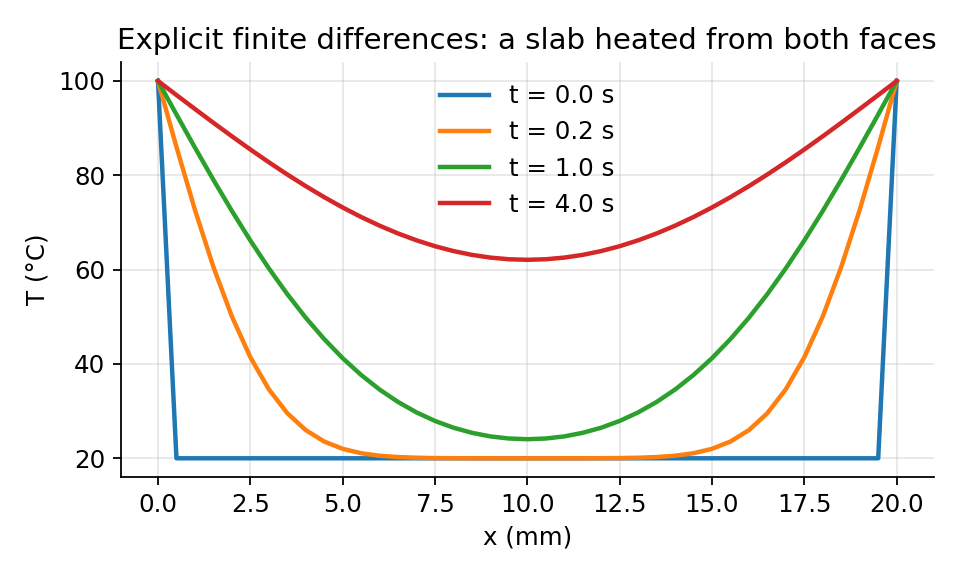

# Transient Conduction

When the boundary conditions change, the interior does not respond at once. Two dimensionless numbers decide how a body responds: the Biot number compares the resistance inside the body to the resistance at its surface, and the Fourier number is a dimensionless time.

## The Lumped Capacitance Method

If the body is nearly uniform in temperature, the energy balance is on the whole body: 

$$
\rho V c_p \frac{dT}{dt} = -hA_s (T - T_\infty)
\quad\Longrightarrow\quad
\frac{T - T_\infty}{T_i - T_\infty} = \exp\!\left(-\frac{hA_s}{\rho V c_p}\,t\right) = \exp(-t/\tau),
\qquad \tau = \frac{\rho V c_p}{hA_s}.
$$

!!! abstract "Biot number and the validity of lumping"

    $$
    \mathrm{Bi} = \frac{h L_c}{k},\qquad L_c = \frac{V}{A_s}.
    $$

     The lumped method is accurate to within a few percent when $\mathrm{Bi} < 0.1$: the surface resistance dominates and the interior keeps up with the surface. For larger Bi the interior lags and the full heat equation must be solved.

## Exact Solution for a Plane Wall

For a wall of half-thickness $L$ initially at $T_i$, suddenly exposed on both faces to a fluid at $T_\infty$, separation of variables gives an infinite series in the Fourier number $\mathrm{Fo} = \alpha t/L^2$: 

$$
\theta^* = \frac{T - T_\infty}{T_i - T_\infty} = \sum_{n=1}^{\infty} C_n \exp(-\zeta_n^2\,\mathrm{Fo})\cos(\zeta_n x^*),
\qquad
C_n = \frac{4\sin\zeta_n}{2\zeta_n + \sin 2\zeta_n},
\qquad \zeta_n \tan\zeta_n = \mathrm{Bi}.
$$

 For $\mathrm{Fo} > 0.2$ the first term is enough (the one-term approximation), which is what the classical charts tabulate. The same structure holds for the infinite cylinder (Bessel functions) and the sphere; a finite block is the product of the one-dimensional solutions of its three dimensions.

<figure markdown="span">
{ width="72%" }
<figcaption>Centre temperature of a plane wall: exact one-term solution against the lumped approximation for three Biot numbers (computed). The two agree for small Bi and diverge as Bi grows.</figcaption>
</figure>

## The Semi-Infinite Solid

Early in a transient, before the far boundary has been felt, any body looks semi-infinite. For a sudden surface temperature $T_s$, 

$$
\frac{T(x,t) - T_s}{T_i - T_s} = \operatorname{erf}\!\left(\frac{x}{2\sqrt{\alpha t}}\right),
\qquad
q''_s(t) = \frac{k\,(T_s - T_i)}{\sqrt{\pi\alpha t}} .
$$

 The penetration depth grows as $\sqrt{\alpha t}$: doubling the time reaches only $\sqrt2$ deeper. That square-root law is the signature of diffusion and explains why thick walls buffer daily temperature swings so well.

## Numerical Solution: Finite Differences

Real problems rarely have series solutions. Replacing derivatives by differences on a grid of spacing $\Delta x$ and time step $\Delta t$ gives the explicit scheme 

$$
T_i^{\,n+1} = T_i^{\,n} + \mathrm{Fo}_\Delta\left(T_{i+1}^{\,n} - 2T_i^{\,n} + T_{i-1}^{\,n}\right),
\qquad \mathrm{Fo}_\Delta = \frac{\alpha\,\Delta t}{\Delta x^2} \le \frac12 ,
$$

 where the limit on $\mathrm{Fo}_\Delta$ is the stability condition: a time step larger than that makes the solution oscillate and blow up. Implicit schemes remove the limit at the cost of solving a linear system each step. The entire explicit method fits in a few lines:

~~~ python
import numpy as np
L, alpha, nx = 0.02, 1e-5, 41              # slab thickness (m), diffusivity (m^2/s), nodes
dx = L / (nx - 1)
dt = 0.4 * dx**2 / alpha                   # Fo_delta = 0.4 < 0.5 for stability
T = np.full(nx, 20.0); T[0] = T[-1] = 100.0  # initial 20 C, both faces held at 100 C
for n in range(400):
    T[1:-1] += alpha * dt / dx**2 * (T[2:] - 2*T[1:-1] + T[:-2])
print(T)                                   # temperature at t = 400*dt
~~~

<figure markdown="span">
{ width="72%" }
<figcaption>Output of the code above at four times: the faces are held at 100 C and heat diffuses toward the centre (computed).</figcaption>
</figure>

## Where Conduction Meets the Rest of the Course

Every convection problem in Part II ends with a heat transfer coefficient $h$, and every radiation problem in Part III ends with a net flux at a surface. Both enter conduction only through the boundary condition. Conduction is what happens inside; convection and radiation are what the boundary sees.
