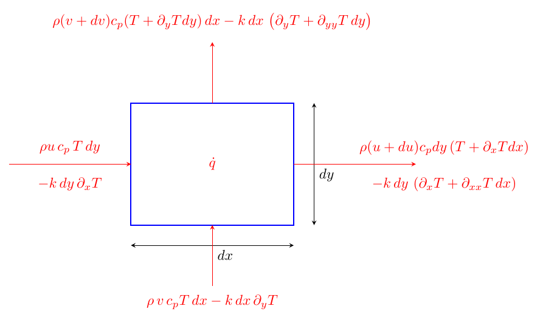
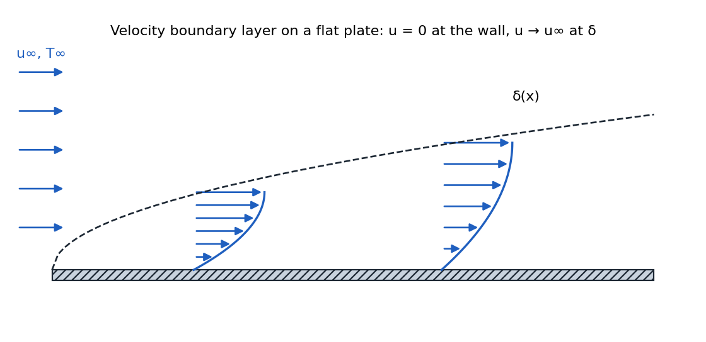
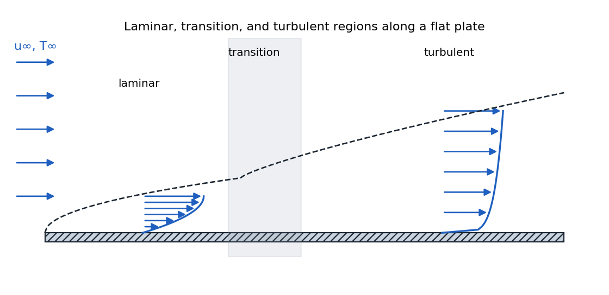
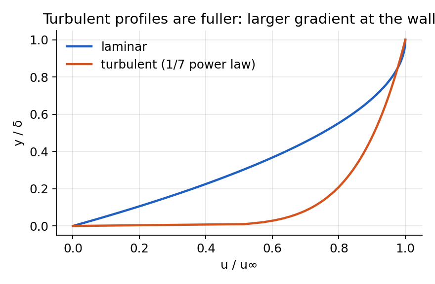
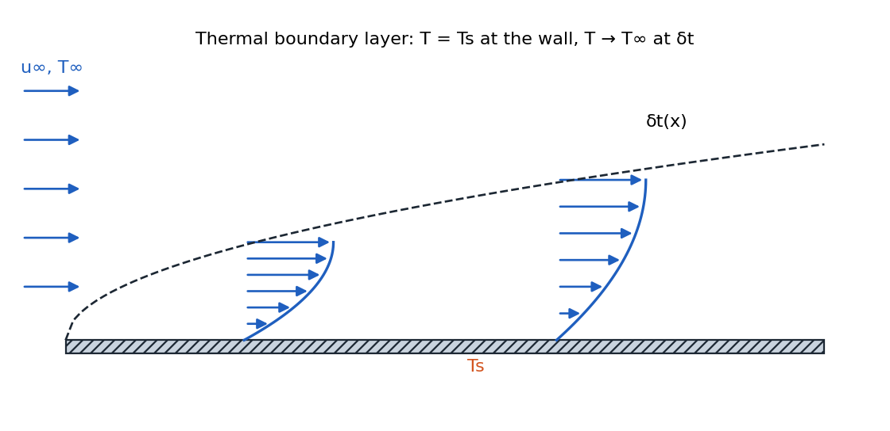
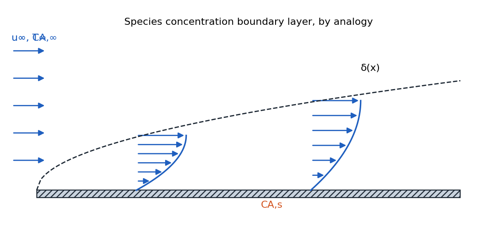
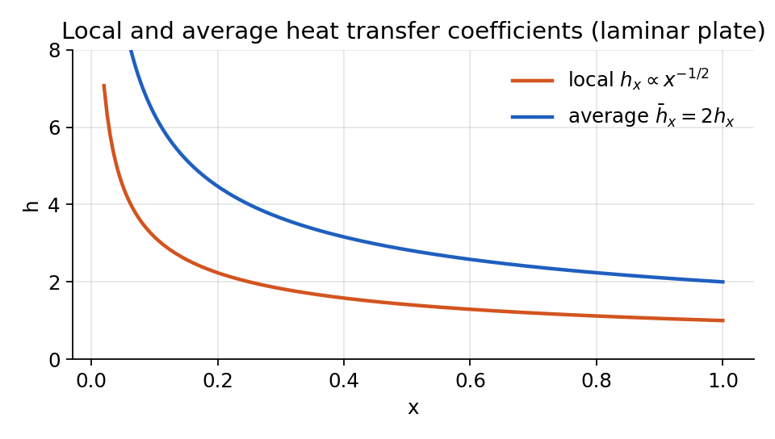
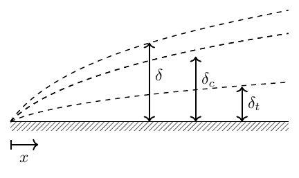

# Introduction to Convection

## Fundamentals of Convection

Convection is diffusion with motion can be conceptualized as: 

$$
\text{Convection} = \text{Diffusion} + \text{[Fluid] Motion}
$$

-   Convection is diffusion with motion, whether due to fluid flow or mass movement.

-   Conduction is **only diffusion**, while convection involves both diffusion and advection (mass transport).

-   If a material is moving (as dictated by your coordinate system), it should be treated as a convection problem, not a conduction problem.

-   This course shifts focus from applying empirical correlations (as in undergraduate studies) to understanding the **mechanisms** behind them, formulating mathematical models, and generating new correlations.

-   The **thermal energy equation** is central to analyzing convection, whether through analytical or numerical methods.

-   A key challenge is ensuring that convection problems are formulated **correctly and completely**, with the exact number of conditions needed for a unique solution.

## Governing Equations for Convection

The system involves coupling multiple physical phenomena:

1.  **Heat Diffusion**: 3 unknowns ($q_x$, $q_y$, $q_z$) and 1 unknown ($T$).

2.  **Fluid Motion** (governed by the Navier-Stokes equations and additional constraints):

    -   Conservation of mass (Continuity equation)

    -   Conservation of linear momentum (Navier-Stokes equations)

    -   Conservation of angular momentum

    -   Constitutive law (e.g., Newtonian fluid)

### Conservation of Mass (Continuity Equation)

For a general (compressible) flow: 

$$
\frac{\partial \rho}{\partial t} + \nabla \cdot (\rho \mathbf{u}) = 0,
$$

 or in index (Einstein) notation: 

$$
\partial_0\, \rho+ \partial_i\, (\rho u_i) = 0.
$$

For an incompressible flow (constant density, $\rho$ constant), the equation simplifies to: 

$$
\nabla \cdot \mathbf{u} = 0,
$$

 or equivalently: 

$$
\partial_x\, u +\partial_y\, v + \partial_z\, w = 0.
$$

**Note on Incompressibility:**

-   The incompressibility assumption is often valid for liquids like water and oil.

-   For gases, the assumption holds when the Mach number is less than 0.3.

-   For most heat transfer problems, this is a reasonable assumption, except in cases of rapid temperature variations or high-speed flows.

-   Internal flows with compression effects may require careful consideration.

### Conservation of Linear Momentum (Navier-Stokes Equations)

For a Newtonian fluid, the Navier-Stokes equations describe the balance of linear momentum:

$$
\left\{\begin{array}{ll}
        x-\text{direction:} &
        \rho\left(u\,\partial_{x}\,u + v\,\partial_{y}\,u\right)
        =-\partial_{x}\,\operatorname{{P}} 
        +\partial_{x}\,\sigma_{xx}
        + \partial_{y}\,\tau_{xy}
        + \operatorname{F}_x
        \\[1.5em]
        y-\text{direction:} &
        \rho\left(u\,\partial_{x}\,v + v\,\partial_{y}\,v\right)
        = - \partial_{y}\,\operatorname{{P}} 
        + \partial_{y}\,\sigma_{yy}
        + \partial_{x}\,\tau_{yx}
        + \operatorname{F}_y
    \end{array}
    \right.
$$

For Newtonian fluids, the stress tensor components are:

$$
\begin{aligned}
    \sigma_{xx} & = \mu \left\{2\,\, \partial_x u -\frac{2}{3}\,\,\Bigl[\partial_x u+\partial_y v\Bigr] \right\}
    \\[0.7em]
    \sigma_{yy} & = \mu \left\{2\,\, \partial_y v -\frac{2}{3}\,\,\Bigl[\partial_x u+\partial_y v\Bigr] \right\}
    \\[0.7em]
    \tau_{xy} & = \tau_{yx} = \mu \left( \partial_y\,u + \partial_x \,v \right)
\end{aligned}
$$

#### Key Insights:

-   The Navier-Stokes equations describe the balance of linear momentum while incorporating fluid properties such as viscosity.

-   The stress tensor formulation accounts for normal and shear stresses in the fluid.

-   The assumption that $\tau_{xy} = \tau_{yx}$ follows from the conservation of angular momentum.

-   If the fluid is Newtonian, viscosity is a linear function of the strain rate.

## Energy Equation for Convection

Consider a two-dimensional differential control volume of size $dx \times dy$ and unit depth. Energy enters and leaves through both conduction and convection. The advective term $\rho c_p u\,T$ accounts for energy carried by the bulk flow, whereas conduction is governed by Fourier’s law. (At boundaries, one often expresses convection with Newton’s law of cooling, $hA\!\left(T_s - T_\infty\right)$, which involves the surface–ambient temperature difference.)

<figure markdown="span">
{ width="72%" }
</figure>

##### Assumptions:

-   steady state: $\partial_0 T = 0$

-   constant properties

-   isotropic $k$

-   no radiation

##### Differential energy balance.

$$
\begin{aligned}
    &
    \dot{\mathrm{E}}_{\text {in }}-\dot{\mathrm{E}}_{\text {out }}+\dot{\mathrm{E}}_{\text {gen }}=0
    \\[0.5em]
    &-\Bigl[
      \rho u c_p \,\partial_x T \,dx\,dy
      + \rho\,\mathrm{d}u\,c_p\,T\,dy
      + \rho v c_p \,\partial_y T \,dx\,dy
      + \rho\,\mathrm{d}v\,c_p\,T\,dx
    \Bigr]
    \\[0.3em]
    &\quad
    + k \,\partial_{xx} T \,dx\,dy
    + k \,\partial_{yy} T \,dx\,dy  
    \\[0.3em]
    &\quad
    -\Bigl[
      \rho\,\mathrm{d}u\,c_p\,\partial_x T \,dy\,dx
      + \rho\,\mathrm{d}v\,c_p\,\partial_y T \,dy\,dx
    \Bigr]
    + \dot{q}\,dx\,dy
    =0 
    \end{aligned}
$$

##### Viscous dissipation:

Viscous effects convert mechanical energy into heat. In 2D, the dissipation term is expressed as ($\mathrm{W/m^3}$) 

$$
\mu\Phi
= \mu\!\left[
  2\!\left(\partial_x u\right)^{2}
  + 2\!\left(\partial_y v\right)^{2}
  + \left(\partial_y u + \partial_x v\right)^{2}
\right]
$$

Adding this term to the balance yields 

$$
\begin{aligned}
    &-\Bigl[
      \rho u c_p \,\partial_x T \,dx\,dy
      + \rho\,\mathrm{d}u\,c_p\,T\,dy
      + \rho v c_p \,\partial_y T \,dx\,dy
      + \rho\,\mathrm{d}v\,c_p\,T\,dx
    \Bigr] 
    \\[0.3em]
    &\quad
    + k \,\partial_{xx} T \,dx\,dy
    + k \,\partial_{yy} T \,dx\,dy
    -\Bigl[
      \rho\,\mathrm{d}u\,c_p\,\partial_x T \,dy\,dx
      + \rho\,\mathrm{d}v\,c_p\,\partial_y T \,dy\,dx
    \Bigr] \\[0.3em]
    &\quad
    + \dot{q}\,dx\,dy
    + \mu\Phi\,dx\,dy
    =0 
    \end{aligned}
$$

 Terms such as $\mathrm{d}u\,dy\,dx$ and $\mathrm{d}v\,dy\,dx$ are negligibly small. After division by $dx\,dy$, 

$$
\begin{aligned}
    &-\rho u c_p \partial_x T
    -\rho c_p T\,\partial_x u
    -\rho v c_p \partial_y T
    -\rho c_p T\,\partial_y v
    +k\partial_{xx} T
    +k\partial_{yy} T
    +\dot{q}
    +\mu\Phi
    =0
    \\[1em]
    &-\rho u c_p \partial_x T
    -\rho c_p T (\,\partial_x u + \,\partial_y v)
    -\rho v c_p \partial_y T
    +k\partial_{xx} T
    +k\partial_{yy} T
    +\dot{q}
    +\mu\Phi
    =0
\end{aligned}
$$

 From continuity, we have 

$$
\partial_x u + \,\partial_y v = 0
$$

 Therefore, 

$$
\begin{aligned}
    &    \rho u c_p \partial_x T
    + \rho v c_p \partial_y T
    = k\left(\partial_{xx} T + \partial_{yy} T\right)
    + \dot{q}
    + \mu\Phi
    \\[1em]
    & \boxed{\rho c_p 
    (u\,\partial_x T
    + v\,\partial_y T)
    = k\left(\partial_{xx} T + \partial_{yy} T\right)
    + \dot{q}
    + \mu\Phi
    }
    \end{aligned}
$$

 This form clearly shows the contributions of conduction, convection, internal heat generation, and viscous dissipation.

!!! abstract "Definition"

!!! abstract "Definition"

## The Nature of Convection

Convection is the coupling between diffusion and motion: 

$$
\text{Convection} = \text{Diffusion} + \text{Fluid Motion}
$$

 In most heat rejection applications, fluid motion is crucial because it provides access to an effectively infinite heat sink (ambient air or flowing water). Unlike conduction problems, convection requires solving both the energy equation and fluid mechanics equations.

## Governing Equations for Convection

!!! abstract "Definition"

    The thermal energy equation for steady-state convection is: 

    $$
    \rho c_p \left(u\frac{\partial T}{\partial x} + v\frac{\partial T}{\partial y}\right) = k\nabla^2 T + \dot{q} + \mu\Phi
    $$

     Where $\mu\Phi$ represents viscous dissipation. For transient problems and when $k$ is not constant, we have: 

    $$
    \rho c_p \left[\frac{\partial T}{\partial t} + \mathbf{u}\cdot \nabla T\right] = \nabla \cdot(k\nabla T) + \dot{q} + \mu\Phi
    $$

     The viscous dissipation term $\mu\Phi$ in 2D is: 

    $$
    \mu\Phi = \mu\left\{2 \left[ 
        \left(\frac{\partial u}{\partial x}\right)^2 + \left(\frac{\partial v}{\partial y}\right)^2 \right] 
        + \left(\frac{\partial u}{\partial y} + \frac{\partial v}{\partial x}\right)^2\right\}
    $$

    This term is often negligible at low speeds but becomes important in high-shear applications like lubrication.

## Boundary Layer Concept

### Velocity Boundary Layer

When uniform flow encounters a flat plate, a boundary layer develops:

-   At the surface, fluid velocity is zero (no-slip condition)

-   The velocity gradually increases with distance from the surface

-   At some distance $\delta$ from the surface, the velocity reaches 99% of the free-stream velocity $u_\infty$ 

$$
u = 0.99 u_\infty
$$

-   The region where velocity transitions from 0 to $u_\infty$ is called the velocity boundary layer

-   The boundary layer thickness $\delta$ increases with distance from the leading edge

<figure markdown="span">
{ width="72%" }
<figcaption>Velocity boundary layer development on a flat plate.</figcaption>
</figure>

The wall shear stress is determined by the velocity gradient at the wall: 

$$
\tau_s = \mu\left.\frac{\partial u}{\partial y}\right|_{y=0}
$$

Engineers often use a dimensionless friction coefficient: 

$$
C_f = \frac{\tau_s}{\frac{1}{2}\rho\, u_\infty^2}
$$

<figure markdown="span">
{ width="72%" }
<figcaption>Trends of <em>C</em><em>f</em> and <em>τ</em><em>s</em> (similar to <em>δ</em> and <em>h</em> for thermal boundary layers).</figcaption>
</figure>

### Flow Regimes and Transitions

The boundary layer can exist in three regimes:

-   **Laminar**: Near the leading edge, flow is smooth and ordered

-   **Transition**: At some distance from the leading edge, instabilities develop

-   **Turbulent**: Further downstream, the flow becomes fully turbulent with enhanced mixing

<figure markdown="span">
{ width="72%" }
<figcaption>Velocity boundary layer development on a flat plate.</figcaption>
</figure>

In the transition region:

-   The boundary layer appears to thicken

-   The wall shear stress increases

-   Upon reaching fully turbulent flow, shear stress decreases again but remains higher than in the laminar region

<figure markdown="span">
{ width="72%" }
<figcaption>Comparison of laminar and turbulent velocity boundary layer profiles for the same free stream velocity.</figcaption>
</figure>

### Thermal Boundary Layer

When the plate temperature differs from the free-stream temperature, a thermal boundary layer develops:

-   At the wall, the temperature is $T_s$ (surface temperature)

-   The temperature gradually transitions to $T_\infty$ (free-stream temperature)

-   The thermal boundary layer thickness $\delta_T$ is defined where $(T_s-T)/(T_s-T_\infty) = 0.99$

-   Like the velocity boundary layer, $\delta_T$ increases with distance from the leading edge

<figure markdown="span">
{ width="72%" }
<figcaption>Species concentration boundary layer development on a flat plate.</figcaption>
</figure>

The wall heat flux is determined by the temperature gradient at the wall: 

$$
q''_s = -k_f\left.\frac{\partial T}{\partial y}\right|_{y=0} = h_x(T_s-T_\infty)
$$

 The local convection coefficient is defined as: 

$$
h = \frac{q''_s}{\underbrace{T_s - T_\infty}_{\Delta T}}
$$

 In the laminar region, the convection coefficient decreases with distance from the leading edge. In the turbulent region, mixing enhances heat transfer, causing a significant increase in $h$ (The trend is shown in Fig. <a href="#fig::h_and_delta" data-reference-type="ref" data-reference="fig::h_and_delta">1</a>)

### Concentration Boundary Layer

Mass transport will not be our focus in this course, but it’s important to understand the concept of concentration boundary layers, especially for those without previous exposure to mass transport.

<figure markdown="span">
{ width="72%" }
<figcaption>Species concentration boundary layer development on a flat plate.</figcaption>
</figure>

Consider a surface with liquid water exposed to dry air (relative humidity less than 100%):

-   At the surface, water vapor concentration reaches saturation ($C_{A,s}$)

-   The surrounding air has a lower concentration ($C_{A,\infty}$)

-   A gradient forms in the region adjacent to the surface

-   Similar to velocity and thermal boundary layers, the concentration boundary layer is defined using the 99% rule: 

$$
\left[\left(C_{\mathrm{A}, s}-C_{\mathrm{A}}\right) /\left(C_{\mathrm{A}, s}-C_{\mathrm{A}, \infty}\right)\right]=0.99
$$

This means the concentration boundary layer extends to the point where the concentration difference has decreased to 99% of the total difference between the surface and free stream values.

The concentration at any point transitions from $C_{A,s}$ at the surface to $C_{A,\infty}$ in the free stream, with the boundary layer thickness ($\delta_m$) growing with distance from the leading edge in a similar shape to velocity and thermal boundary layers.  
The molar flux at the surface is governed by *Fick’s law* of diffusion: 

$$
N''_A = -D_{AB}\left.\frac{\partial C_A}{\partial y}\right|_{y=0}
$$

Where:

-   $N''_A$ is the molar flux \[kmol/(s·m$^2$)\] or \[kilo mole/(second·meter$^2$)\]

-   $D_{AB}$ is the binary diffusion coefficient \[m$^2$/s\]

-   $C_A$ is the concentration of species A \[kmol/m$^3$\]

-   $B$ is the matrix material and $A$ is the solution that dissolves inside

-   $D_{AB}$ tells you how fast material $A$ can diffuse in solvent $B$

The convective mass transfer coefficient is defined as: 

$$
h_m = \frac{N''_A}{\underbrace{C_{A,s} - C_{A,\infty}}_{\Delta C_A}}
$$

The unit of $h_m$ is \[m/s\], which is the same as velocity.

#### Why Boundary Layers Are Important?

We put so much emphasis on boundary layers because they contain all the significant physics of heat transfer. The heat transfer between a surface and the surrounding fluid (at temperature $T_\infty$) occurs entirely within this thin layer. All the important gradients that drive heat transfer are confined to this region.

## Local and Average Convection Coefficient

In the first part of the course (conduction), we used Newton’s law of cooling with a convection coefficient $h$. Now we can understand $h$ more precisely:

<figure markdown="span">
{ width="72%" }
<figcaption>Local and total convection heat transfer. (a) Surface of arbitrary shape. (b) Flat plate.</figcaption>
</figure>

-   The local heat transfer coefficient $h_x$ at any point on a surface is defined as: 

$$
h_x = \frac{q''_s}{T_s - T_\infty}
$$

 where $q''_s$ is the local heat flux at that point.

-   For the same object, the local $h$ can vary significantly from one location to another.

-   The average heat transfer coefficient $\bar{h}$ is defined as: 

$$
\bar{h} = \frac{1}{A_s}\int_{A_s} h_x\,dA_s
$$

-   This definition only works when $(T_s - T_\infty)$ is constant over the entire surface.

-   $\bar{h}$ is what we use in Part 1 for conduction.

Similarly, for mass transfer, we can define an average mass transfer coefficient: 

$$
\begin{aligned}
        & N_A=\bar{h}_m A_S\left(C_{A, S}-C_{A, \infty}\right)
        \\[1em]
        & \bar{h}_m = \frac{1}{A_s}\int_{A_s} h_m\,dA_s
    \end{aligned}
$$

### Mass Flux vs Molar Flux

In some cases, people use mass flux instead of molar flux:

-   Molar flux $N''_A$ \[kmol/s·m$^2$\]

-   Mass flux $n''_A$ \[kg/s·m$^2$\]

These are related by the molar mass. When using mass flux, the diffusion equation becomes: 

$$
\begin{aligned}
    & n_A^{\prime \prime}=h_m\left(\rho_{A, S}-\rho_{A, \infty}\right)\qquad \mathrm{[kg/s.m^2]}
    \\[1em]
    & n_A=h_m A_S\left(\rho_{A, S}-\rho_{A, \infty}\right)  \qquad \mathrm{[kg/s]}
    \\[1em]
    & n_{A, S}^{\prime \prime}=-\left.D_{A B} \frac{\partial \rho_A}{\partial y}\right|_{y=0}
    \end{aligned}
$$

where is $D_{AB}$ as before ($n''_{A}$: mass flux and $n_A$: mass transfer rate) and 

$$
h_m = \frac{n''_A}{\underbrace{\rho_{A, S}-\rho_{A, \infty}}_{\Delta \rho}}
$$

#### Comparison

The three transport processes (momentum, heat, and mass) can be analyzed using a unified framework:

| **Velocity**                                                                 | **Thermal**                                                              | **Concentration**                                                                 |
|:-----------------------------------------------------------------------------|:-------------------------------------------------------------------------|:----------------------------------------------------------------------------------|
| $\displaystyle \tau_w = \mu\left.\frac{\partial u}{\partial y}\right|_{y=0}$ | $\displaystyle q'' = -k\left.\frac{\partial T}{\partial y}\right|_{y=0}$ | $\displaystyle N_A'' = -D_{AB}\left.\frac{\partial C_A}{\partial y}\right|_{y=0}$ |
| $\delta$                                                                     | $\delta_t$                                                               | $\delta_c$                                                                        |
| $U_{\infty}$                                                                 | $T_{\infty}$                                                             | $C_{A,\infty}$                                                                    |
| $\mu$ (or $\nu$)                                                             | $k$                                                                      | $D_{AB}$                                                                          |
| $\tau_w$                                                                     | $q''$                                                                    | $N_A''$                                                                           |
| $\displaystyle C_f = \dfrac{\tau_w}{\tfrac12 \rho U_{\infty}^{2}}$           | $\displaystyle h = \dfrac{q''}{\Delta T}$                                | $\displaystyle h_m = \dfrac{N_A''}{\Delta C}$                                     |
| $\Delta u = U_{\infty} - 0$                                                  | $\Delta T = T_s - T_{\infty}$                                            | $\Delta C = C_{A,s} - C_{A,\infty}$                                               |

For momentum transfer the driving potential is the *dynamic pressure* $\operatorname{P}_{d} = \tfrac12 \rho U_{\infty}^{2}$, analogous to $\Delta T$ and $\Delta C$ in heat and mass transfer.

While these three processes involve different physical quantities, they share the same mathematical structure because, at the microscopic level, they all result from the same random molecular motion. When molecules move randomly between regions, they simultaneously transport momentum, energy, and mass.

## Understanding Boundary Layers as Insulation Layers

It’s crucial to understand that boundary layers act as insulation layers:  
$\left\{\begin{array}{l}
        \text { Velocity } 
        \\ 
        \text { Thermal } 
        \\ 
        \text { Concentration }
       \end{array}
\right\}$ BL is layer of **insulation for diffusion** of $\left\{\begin{array}{l}
    \text { Linear momentum } 
    \\ 
    \text { Thermal Energy } 
    \\ 
    \text { molecules. }
    \end{array}
\right\}$ driven by $\left\{\begin{array}{l}
        \text { surface shear } 
        \\ 
        \text { surface heat flux } 
        \\ 
        \text { surface molar flux}
        \end{array}\right\}$.  
Key insight: **Thicker boundary layers lead to less transfer, not more.** This is sometimes counter-intuitive for newcomers to the field.

## Microscopic View of Transport Phenomena

The transport of momentum, energy, and mass occurs simultaneously at the molecular level:

-   Random molecular motion causes molecules to move between regions of different velocity, temperature, and concentration

-   When molecules change positions, they carry their momentum, thermal energy, and identity

-   This explains why the three transport phenomena follow similar mathematical forms

Consider a simple Couette flow between parallel plates:

-   Microscopically, molecules move randomly while maintaining a net velocity gradient

-   This random motion transfers momentum from high-velocity regions to low-velocity regions

-   The same mechanism transfers thermal energy and species concentration

## Boundary Layer Equations

Based on experimental observations, in boundary layers $v \ll u$:

<figure markdown="span">
{ width="72%" }
</figure>

$$
\left\{\begin{array}{l}
    \frac{\partial^2 u}{\partial x^2} \ll \frac{\partial^2 u}{\partial y^2} 
    \\[1em]
    \frac{\partial^2 T}{\partial x^2} \ll \frac{\partial^2 T}{\partial y^2} 
    \\[1em]
    \frac{\partial^2 C_A}{\partial x^2} \ll \frac{\partial^2 C_A}{\partial y^2}
    \end{array}\right.
$$

The boundary layer equations are normalized by first defining dimensionless independent variables of the forms:

$$
x^* = \frac{x}{L}, \quad y^* = \frac{y}{L}, \quad u^* = \frac{u}{U_\infty}, \quad v^* = \frac{v}{U_\infty}
$$

 

$$
\begin{gathered}
    T^* \equiv \frac{T-T_s}{T_{\infty}-T_s} 
    \\[1em]
    C_{\mathrm{A}}^* \equiv \frac{C_{\mathrm{A}}-C_{\mathrm{A}, s}}{C_{\mathrm{A}, \infty}-C_{\mathrm{A}, s}}
    \end{gathered}
$$

| Boundary Layer |                                                                             Conservation Equation                                                                             | Boundary Conditions |                         |
|:--------------:|:-----------------------------------------------------------------------------------------------------------------------------------------------------------------------------:|:-------------------:|:-----------------------:|
|      3-4       |                                                                                                                                                                               |        Wall         |       Free Stream       |
|    Velocity    |   $u^*\frac{\partial u^*}{\partial x^*} + v^*\frac{\partial u^*}{\partial y^*} = -\frac{dp^*}{dx^*} + \frac{1}{\operatorname{Re_L}}\frac{\partial^2 u^*}{\partial y^{*2}}$    |  $u^*(x^*,0) = 0$   |  $u^*(x^*,\infty) = 1$  |
|    Thermal     |    $u^*\frac{\partial T^*}{\partial x^*} + v^*\frac{\partial T^*}{\partial y^*} = \frac{1}{\operatorname{Re_L} \,\operatorname{Pr}}\frac{\partial^2 T^*}{\partial y^{*2}}$    |  $T^*(x^*,0) = 0$   |  $T^*(x^*,\infty) = 1$  |
| Concentration  | $u^*\frac{\partial C_A^*}{\partial x^*} + v^*\frac{\partial C_A^*}{\partial y^*} = \frac{1}{\operatorname{Re_L}\, \operatorname{Sc}}\frac{\partial^2 C_A^*}{\partial y^{*2}}$ | $C_A^*(x^*,0) = 0$  | $C_A^*(x^*,\infty) = 1$ |

In other words, 

$$
\begin{array}{l}
         u^* = f_v\left(x^*,y^*,\operatorname{Re}, 1, \frac{dp^*}{dx^*}\right)  
         \\[1em]
         T^* = f_t\left(x^*,y^*,\operatorname{Re}, \operatorname{Pr}, \frac{dp*}{dx*}\right) 
         \\[1em]
         C^*_A = f_c\left(x^*,y^*,\operatorname{Re}, \operatorname{Sc}, \frac{dp*}{dx*}\right)          
    \end{array}
$$

| Boundary Layer |                    Similarity Parameter(s)                     |
|:--------------:|:--------------------------------------------------------------:|
|    Velocity    | $\operatorname{Re}_L = \frac{\rho U L}{\mu}=\frac{U\, L}{\nu}$ |
|    Thermal     | $\operatorname{Re}_L, \operatorname{Pr} = \frac{\nu}{\alpha}$  |
| Concentration  | $\operatorname{Re}_L, \operatorname{Sc} = \frac{\nu}{D_{AB}}$  |

#### Note

For a flat plate, $\frac{\partial p^*}{\partial x^*} = 0$ (zero pressure gradient).  
*proof:* This may not sound intuitive, but can be explained using Bernoulli’s equation: 

$$
P + \rho gz + \frac{1}{2}\rho u^2 = \text{constant}
$$

For a flat plate flow, we can neglect the $\rho gz$ term. If we look at the flow just above the boundary layer, the velocity $u$ is constant ($u_\infty$), which means the dynamic pressure term $\frac{1}{2}\rho u^2$ is constant. Since the total is constant, the static pressure $P$ must also be constant, meaning $\frac{dp}{dx} = 0$.  
The boundary layer is actually extremely thin compared to how it’s typically illustrated. If drawn to scale for a typical flow at 1 m/s, it would be barely visible. The thick representation is only for visualization purposes, to show that the layer exists.

## Dimensionless Numbers

### Reynolds Number

!!! abstract "Definition"

    $$
    \operatorname{Re_L} = \frac{\rho\, U\,L}{\mu} =\frac{U\, L}{\mu/\rho} = \frac{U\,L}{\nu} = \frac{\text{Inertial Force}}{\text{Viscous Force}}
    $$

-   Low Reynolds number: Viscous forces dominate (e.g., honey)

-   High Reynolds number: Inertial forces dominate, leading to instability and turbulence

### Prandtl Number

!!! abstract "Definition"

    $$
    \text{Pr} = \frac{\nu}{\alpha} = \frac{\mu c_p}{k} =\frac{\text{Viscous Diffusion Rate}}{\text{Thermal Diffusion Rate}}
    $$

where:

-   $\nu$ is the kinematic viscosity,

-   $\alpha$ is the thermal diffusivity,

-   $\mu$ is the dynamic viscosity,

-   $c_p$ is the specific heat at constant pressure, and

-   $k$ is the thermal conductivity.

$$
\text{Pr} \approx \left\{
    \begin{array}{ll}
         0.01 &  \text{liquid metals (low viscosity, high thermal conductivity)}
         \\[0.3em]
         0.7 &  \text{most gases at room temperature}  
         \\
         1 & \text{water vapor}
         \\[0.3em]
         7 &  \text{water (decreasing with temperature)}
         \\[0.3em]
         2  \sim 5 &  \text{refrigerants}
         \\[0.3em]
         100-50,000 &  \text{engine oils (high viscosity, low thermal conductivity)}
    \end{array}
    \right.
$$

### Schmidt Number

The Schmidt number (Sc) is a dimensionless quantity that characterizes mass transfer in a fluid. It is defined as the ratio of momentum diffusivity (kinematic viscosity, $\nu$) to mass diffusivity ($D_{AB}$):

!!! abstract "Definition"

    $$
    \text{Sc} = \frac{\nu}{D_{AB}} = \frac{\mu}{\rho D_{AB}} =\frac{\text{Viscous Diffusion Rate}}{\text{Molar Diffusion Rate}}
    $$

where:

-   $\nu$ is the kinematic viscosity,

-   $\mu$ is the dynamic viscosity,

-   $\rho$ is the fluid density, and

-   $D$ is the mass diffusivity.
