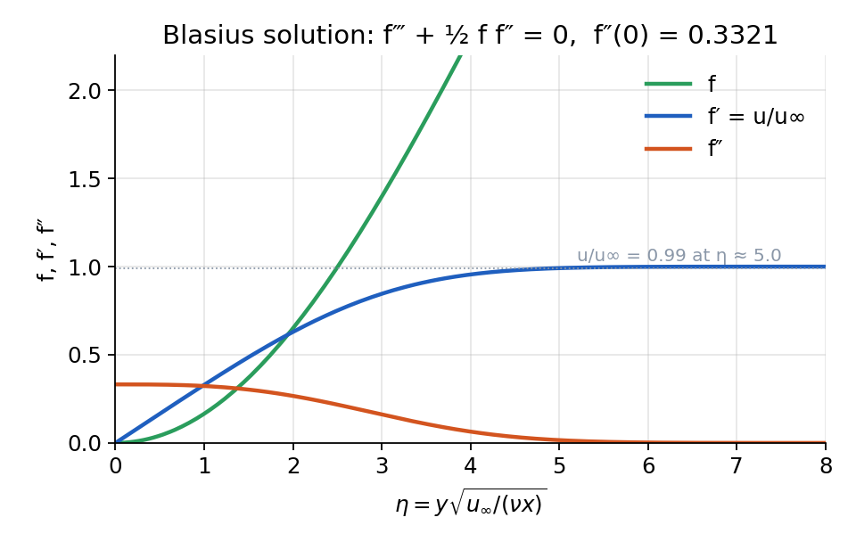
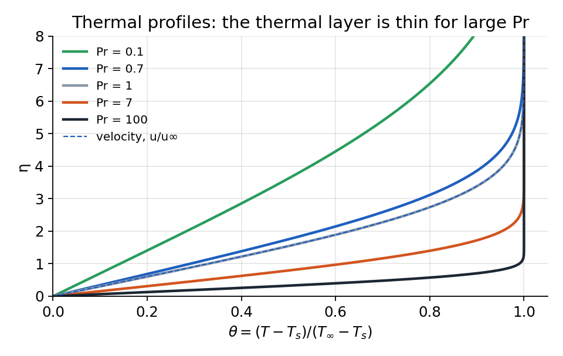
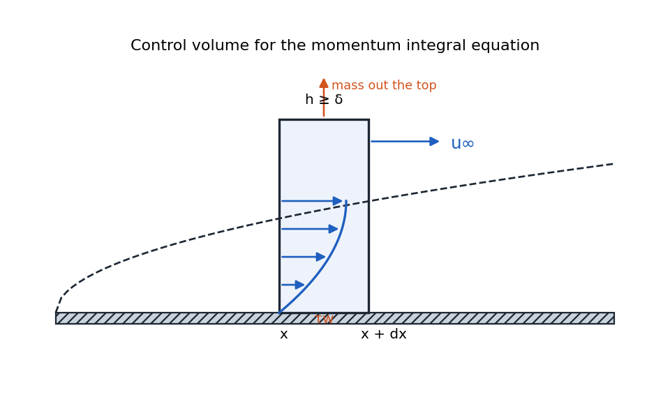
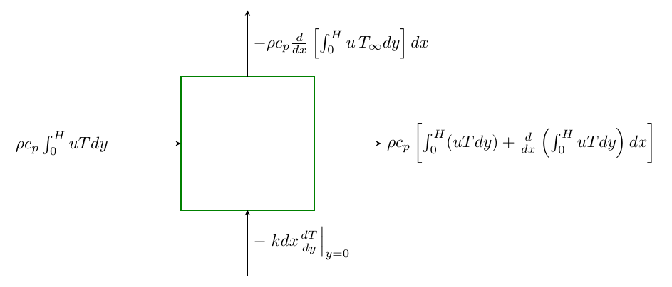
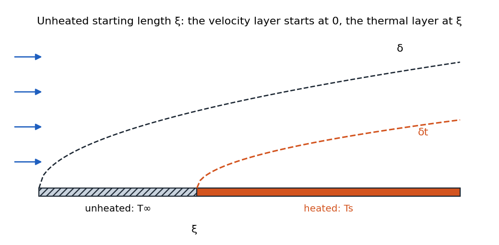

# External Flow: Flat Plates, Wedges, and the Integral Method

### Nusselt Number and Heat Transfer Coefficients over a Flat Plate

For a flow over a flat plate, the local heat transfer can be determined by examining the solution at the surface. Since the fluid velocity at the wall is zero (no-slip condition), heat transfer at the surface reduces to conduction:

$$
q_s'' = -k\left.\frac{\partial T}{\partial y}\right|_{y=0} = h_x (T_s - T_\infty)
$$

!!! abstract "Definition"

    $$
    h_x = \frac{-k\left.\frac{\partial T}{\partial y}\right|_{y=0}}{T_s - T_\infty}\ \qquad \textit{,flow over a flat surface}
    $$

The Nusselt number is defined as:

!!! abstract "Definition"

    $$
    \text{Nu}_x =  \frac{h_x \cdot x}{k_f} = f(x^*,\operatorname{Re_L}, \operatorname{Pr}) = \frac{\text{convective heat transfer}}{\text{conductive heat transfer}}
    $$

Where:

-   $h$ is the local heat transfer coefficient

-   $x$ is the distance from the leading edge

-   $k_f$ is the thermal conductivity of the fluid

*Physical meaning:* The Nusselt number represents the ratio of convective heat transfer to conductive heat transfer. It indicates the enhancement of heat transfer due to convection relative to conduction across the same fluid layer.

#### Average Nusselt Number

The average Nusselt number over a length $L$ is defined as:

!!! abstract "Definition"

    $$
    \overline{\text{Nu}} = \frac{\bar{h}\cdot L}{k_f} = f(\operatorname{Re_L}, \operatorname{Pr})
    $$

where

!!! abstract "Definition"

    $$
    \overline{h} = \frac{1}{L}\int_0^L \,h_x\,dx
    $$

*Note:* If we know Nu, we can find $h$. All relationships can be found in table 7.7 and 8.4 of textbook.  
*Warning:* It’s important to note that the average Nusselt number is not the average of local Nusselt numbers. Rather, it’s defined using the average heat transfer coefficient: 

$$
\overline{\text{Nu}} \neq \frac{1}{L}\int_0^L\operatorname{Nu}_x \,dx
$$

### Mass Transfer: Sherwood Number

We can define a similar dimensionless parameter called the Sherwood number: 

$$
\text{Sh}_x = \frac{h_m\cdot x}{D_{AB}} = \frac{\partial C^*_A}{\partial y^*} \Bigl \vert_{y^* =0} = \frac{\text{Convective mass transfer}}{\text{Diffusive mass transfer}}
$$

Where:

-   $h_m$ is the mass transfer coefficient \[m/s\]

-   $D_{AB}$ is the binary diffusion coefficient \[m²/s\]

The average Sherwood number is defined as: 

$$
\overline{\text{Sh}} = \frac{\bar{h}_m L}{D_{AB}}
$$

### Heat and Mass Transfer Analogy

Thermal boundary layers and concentration boundary layers have identical forms by replacing

-   $\text{Pr} \rightarrow \text{Sc}$

-   $\text{Nu} \rightarrow \text{Sh}$

*Example:* For laminar flow over a flat plate with $\operatorname{Pr} \ge 0.6$, we have 

$$
\operatorname{Nu_x} = 0.332 \, \operatorname{Re_x}^{1/2}\,\operatorname{Pr}^{1/3}
$$

 for the same type flow, we can say 

$$
\operatorname{Sh_x} = 0.332 \, \operatorname{Re_x}^{1/2}\,\operatorname{Sc}^{1/3}
$$

 In general, for boundary *laminar* layer flows, Nusselt and Sherwood numbers follow the form: 

$$
\text{Nu} \sim f(x^*, \operatorname{Re_L})\,\text{Pr}^n \sim \operatorname{Re_L}^m\, \operatorname{Pr}^n
$$

 

$$
\text{Sh} \sim f(x^*, \operatorname{Re_L})\, \text{Sc}^n \sim  \operatorname{Re_L}^m\, \operatorname{Sc}^n
$$

This leads to the relationship: 

$$
\frac{\text{Nu}}{\text{Sh}} \approx \left(\frac{\text{Pr}}{\text{Sc}}\right)^n \approx Le^{-n}
$$

The ratio $\frac{\text{Sc}}{\text{Pr}}$ is known as the Lewis number ($\text{Le}$): 

$$
\text{Le} = \frac{\text{Sc}}{\text{Pr}} = \frac{\nu/D_{AB}}{\nu/\alpha} = \frac{\alpha}{D_{AB}}
$$

For most boundary layer flows, $n \approx 1/3$, which leads to: 

$$
\frac{\text{Nu}}{\text{Sh}} \approx \left(\frac{\text{Pr}}{\text{Sc}}\right)^{1/3} = \text{Le}^{-1/3}
$$

Similarly, the ratio of boundary layer thicknesses follows: 

$$
\frac{\delta_t}{\delta_C} \approx \left(\frac{\text{Sc}}{\text{{Pr}}}\right)^n = \text{Le}^{n}
$$

 It can be shown that 

$$
\frac{h}{h_m}=\rho\, c_p L_e^{1-n}=\frac{k}{D_{AB}\, L_e^n}
$$

### Similarity Approach for Laminar Boundary Layer Over a Flat Plate

From experimental observations, velocity profiles at different locations along a flat plate can be made to collapse into a single curve when properly scaled in the boundary-layer region. This suggests a similarity solution approach: 

$$
u = f(y\cdot g(x)) = f(\eta),
$$

 where we define the similarity variable $\eta$ to capture the dependence on both $x$ and $y$.

**Governing Equations (Boundary Layer Approximation):** 

$$
\begin{aligned}
  u\frac{\partial u}{\partial x} + v\frac{\partial u}{\partial y} &= \nu \frac{\partial^2 u}{\partial y^2}, \\
  \frac{\partial u}{\partial x} + \frac{\partial v}{\partial y} &= 0.
\end{aligned}
$$

**Stream Function:** We introduce the stream function $\psi$ such that: 

$$
u = \frac{\partial \psi}{\partial y}, \quad v = -\frac{\partial \psi}{\partial x}.
$$

 This identically satisfies the continuity equation.

**Similarity Variables:** We choose: 

$$
\psi(x,y) = \sqrt{\nu U_\infty x}\, f(\eta), \quad\text{where}\quad \eta = y \sqrt{\frac{U_\infty}{\nu x}}.
$$

 Then, 

$$
u = \frac{\partial \psi}{\partial y} = \left( f'(\eta)\,\sqrt{\nu U_\infty x} \right)\!\left(\sqrt{\frac{U_\infty}{\nu x}} \right) = U_\infty\, f'(\eta),
$$

 

$$
v = -\frac{\partial \psi}{\partial x} = -\frac{d}{dx}\Bigl(\sqrt{\nu U_\infty x}\, f(\eta)\Bigr).
$$

 One can show: 

$$
v = \frac{1}{2}\sqrt{\frac{\nu U_\infty}{x}}\bigl(\eta f'(\eta) - f(\eta)\bigr) = U_\infty\,\sqrt{\frac{\nu}{U_\infty x}}\,\frac{\eta f' - f}{2} = Re^{-1/2}_x\,\frac{\eta f' - f}{2},
$$

 where $Re_x = \frac{U_\infty x}{\nu}$ is the Reynolds number based on distance $x$.

##### Substituting into the Momentum Equation: 

By carefully differentiating and substituting into 

$$
u \frac{\partial u}{\partial x} + v\frac{\partial u}{\partial y} = \nu \frac{\partial^2 u}{\partial y^2}
$$

 one obtains the ordinary differential equation: 

$$
f'''+\frac{1}{2} f f'' = 0 \quad\text{or equivalently}\quad f f'' + 2f'''=0.
$$

 This is a nonlinear ODE with boundary conditions: 

$$
f(0)=0,\quad f'(0)=0,\quad f'(\infty)=1.
$$

 Because it is nonlinear, a classic approach is the “shooting method” :

1.  Guess $f''(0)$ at $\eta=0$.

2.  Integrate numerically in $\eta$ from 0 to some large value.

3.  Check if $f'(\infty)=1$. If not, adjust $f''(0)$ and repeat.

##### Solutions and Key Results:

-   At $\eta\approx 5.0$, the velocity $u\approx 0.99\,U_\infty$. This defines the boundary-layer thickness: 

$$
\delta \approx 5\sqrt{\frac{\nu x}{U_\infty}}\quad\Rightarrow\quad \frac{\delta}{x} = \frac{5}{\sqrt{Re_x}}.
$$

-   The local friction coefficient $C_{f,x}$ is given by: 

$$
C_{f,x} = \frac{\tau_{w}}{\frac{1}{2}\rho U_\infty^2}
$$

 where 

$$
\tau_w = \mu\frac{\partial u}{\partial y}\Bigr\rvert_{y=0} = \mu\left[ U_\infty f''(0)\sqrt{\frac{U_\infty}{\nu x}}\right]
$$

 Numerically, $f''(0)\approx 0.332$, so: 

$$
C_{f,x} = \frac{0.664}{\sqrt{Re_x}}
$$

-   The average friction coefficient over a plate of length $L$ is $\overline{C}_{f} = 2\,C_{f,x}\bigl|_{x=L}$

-   $\operatorname{Re} \uparrow\, \Leftrightarrow \, \delta \downarrow \,\Leftrightarrow \, u_\infty \uparrow$

<figure markdown="span">
{ width="72%" }
<figcaption>Belasius solution.</figcaption>
</figure>

The figure is computed, not copied; the whole solution is a shooting problem on $f''(0)$:

~~~ python
import numpy as np
from scipy.integrate import solve_ivp
from scipy.optimize import brentq

def blasius(s):                       # integrate f''' = -f f''/2 from a guess s = f''(0)
    rhs = lambda eta, y: [y[1], y[2], -0.5 * y[0] * y[2]]
    return solve_ivp(rhs, [0, 10], [0, 0, s], rtol=1e-9)

s = brentq(lambda s: blasius(s).y[1, -1] - 1, 0.2, 0.5)   # choose s so that f'(inf) = 1
print(f"f''(0) = {s:.4f}")                                 # 0.3321
~~~

### Similarity Approach for Thermal Boundary Layer Over A Flat Plate

Thermal Energy Equation for a Flat Plate is as follows: 

$$
\begin{aligned}
  u\frac{\partial T}{\partial x} + v\frac{\partial T}{\partial y} = \alpha\,\frac{\partial^2 T}{\partial y^2},
\end{aligned}
$$

 where $\alpha = k/(\rho c_p)$ is the thermal diffusivity. Define the dimensionless temperature: 

$$
T^* = \theta = \frac{T - T_s}{T_\infty - T_s},\quad 0 \le \theta \le 1,
$$

 with boundary conditions: 

$$
\begin{array}{ll}
        y =0, &  \theta = 0\\
        y = \infty, & \theta = 1\\
        x =0,  & \theta = 1
    \end{array}
$$

##### Similarity Form of the Energy Equation:

Using 

$$
\eta = y\sqrt{\frac{U_\infty}{\nu x}}
$$

 same as velocity boundary layer and the known function $f(\eta)$ from the velocity solution, the dimensionless energy equation becomes: 

$$
\theta''(\eta) + \frac{\operatorname{Pr}}{2}\,f(\eta)\,\theta'(\eta) = 0,\quad \text{where}
  \quad 
  \operatorname{Pr} = \frac{\nu}{\alpha}
$$

 The boundary conditions are $\theta(0)=0$ and $\theta(\infty)=1$. Unlike the velocity ODE, this is linear in $\theta$, but it depends on $f(\eta)$ which is only known numerically.

##### Integral Form of the Solution:

 One can find the solution as follow: 

$$
\theta(\eta)=C_1 \int_0^\eta \exp \left(\frac{\operatorname{Pr}}{2} \int_0^{\eta^{\prime \prime}} f\left(\eta^{\prime}\right) d \eta^{\prime}\right) d \eta^{\prime} + C_2
$$

 where $\eta^{\prime}$ and $\eta^{\prime \prime}$ are dummy variables. Apply BCs, we’ll get 

$$
\theta(\eta) = \frac{\displaystyle\int_0^{\eta} \exp\!\Bigl(-\frac{\operatorname{Pr}}{2}\int_0^{\eta''} f(\eta')\,d\eta'\Bigr) d\eta''}{\displaystyle\int_0^{\infty} \exp\!\Bigl(-\frac{\operatorname{Pr}}{2}\int_0^{\eta''} f(\eta')\,d\eta'\Bigr) d\eta''},
$$

 In practice, one integrates numerically once $f(\eta)$ is known.

<figure markdown="span">
{ width="72%" }
<figcaption>Thermal profile solution</figcaption>
</figure>

##### Local Heat Transfer Coefficient

 Let $q''_s = -k\bigl(\partial T/\partial y\bigr)_{y=0}$. Then, 

$$
\begin{aligned}
    q''_s &= -k\biggl.\frac{\partial T}{\partial y}\biggr|_{y=0}\! \\\
    &= -k\,(T_\infty - T_s)\,\biggl.\frac{\partial \theta}{\partial y}\biggr|_{y=0}
    \\
    &= k\,(T_s - T_\infty)\,\biggl.\frac{\partial \theta}{\partial \eta}\biggr|_{\eta=0}\,\frac{\partial \eta}{\partial y}\bigg|_{y=0} 
    \\
    & = k\,(T_s - T_\infty)\,\,\sqrt{\frac{U_\infty}{\nu x}} \theta'(0)
\end{aligned}
$$

!!! abstract "Definition"

    ##### Nusselt Number (laminar flow)

    Using local heat transfer coefficient, we can derive an expression for Nusselt number as follow: 

    $$
    h_x = \frac{q''_s}{T_s - T_\infty},\quad\text{and}\quad\text{Nu}_x = \frac{h_x\,x}{k} = \theta'(0)\,\sqrt{\text{Re}_x}.
    $$

     Numerical values of $\theta'(0) = f(\operatorname{Pr})$. For typical ranges: 

    $$
    \left\{\begin{array}{rll}
             0.6 \le \operatorname{Pr} < 10: &  \theta'(0)\approx 0.332\,\operatorname{Pr}^{1/3}, & \text{Nu}_x = 0.332\,\text{Re}_x^{1/2}\,\operatorname{Pr}^{1/3}
             \\[1em]
             \operatorname{Pr} < 0.05: & \theta'(0)\approx 0.565\,\operatorname{Pr}^{1/2}, & \text{Nu}_x = 0.565\,\text{Re}_x^{1/2}\,\operatorname{Pr}^{1/2}
             \\[1em]
             \operatorname{Pr} > 10: & \theta'(0)\approx 0.0339\,\operatorname{Pr}^{1/3}, & \text{Nu}_x = 0.339\,\text{Re}_x^{1/2}\,\operatorname{Pr}^{1/3}
        \end{array}
        \right.
    $$

##### Average Nusselt Number:

Analogous to the friction coefficient, one obtains:

!!! abstract "Definition"

    $$
    \overline{\text{Nu}}_L = \frac{\overline{h}\cdot L}{k_f}=2\,\text{Nu}_x\Bigl|_{x=L} = 2\,\theta'(0)\,\sqrt{\text{Re}_L}
          \qquad \overline{h} = 2 h
    $$

#### Boundary Layer Thickness Ratio

The ratio of thermal to velocity boundary layer thickness depends on the Prandtl number: 

$$
\frac{\delta_t}{\delta} \approx \begin{cases}
\text{Pr}^{-1/3}, & \operatorname{Pr} > 0.6 
\\[1em]
\text{Pr}^{-1/2}, & \operatorname{Pr} \ll 0.1
\end{cases}
$$

This means:

-   For Pr &gt; 1 (e.g., water, oils): $\delta_t < \delta$ (thermal boundary layer is thinner)

-   For Pr = 1: $\delta_t = \delta$ (boundary layers are equal)

-   For Pr &lt; 1 (e.g., liquid metals): $\delta_t > \delta$ (thermal boundary layer extends beyond velocity boundary layer)

### Mass Transfer Boundary Layers Solution

We’ll get the similar solution for mass transfer. Particularly, 

$$
\frac{\delta_c}{\delta} = \operatorname{Sc}^{-1/3}
$$

 Unlike the Prandtl number, which spans several orders of magnitude ($10^{-2}$ to $10^5$), the Schmidt number typically has a narrower range:

|                | Air  | Water |
|:--------------:|:----:|:-----:|
| $\mathrm{O}_2$ | 0.99 |  441  |
|    Mehanal     | 1.14 |  540  |
|    Ammonia     | 0.57 |  360  |

Schmidt number for different oxygen, methanol, and Ammonia in air or water

For quick estimates:

-   Gas diffusion: $Sc \approx 1$

-   Liquid diffusion: $Sc \approx 100-500$

This difference occurs because liquids have much higher density and smaller mean free paths between molecular collisions, significantly impeding diffusion.

## Review of Nusselt Number

The Nusselt number is a dimensionless parameter representing the solution at the boundary of the solid-liquid interface. It is defined as:

$$
\left.\frac{\partial T^*}{\partial y^*}\right|_{y^*=0} = \text{Nu}_x = \frac{h \cdot x}{k_f} = f(x^*,\operatorname{Re_L},\operatorname{Pr}) = \frac{\text{conv. HT}}{\text{cond. HT}}
$$

 also 

$$
\overline{\operatorname{Nu}} =\frac{\overline{h} \cdot L}{k_f} = f(\operatorname{Re_L}, \operatorname{Pr})
$$

 If we know $\operatorname{Nu}$ then we can find $h = \operatorname{Nu} \cdot k_f / L$. Nu is tabulated for different flows (table 7.7 and 8.4) Similarly 

$$
\text{friction coefficient: } C_f = \frac{2}{\operatorname{Re_L}} f(x^*,\operatorname{Re_L}) = \frac{2}{\operatorname{Re_L}}\frac{\partial u^*}{\partial y^*} \Bigl \vert_{y^*=0}
$$

 It’s important to note that:

-   A larger Nusselt number does not necessarily mean higher heat transfer (for the same problem)

-   The average Nusselt number is not the average of local Nusselt numbers (it’s defined using the average heat transfer coefficient)

!!! abstract "Definition"

    In general 

    $$
    \operatorname{Nu}_{x}=C \,\operatorname{Re}^m \cdot\operatorname{Pr}^n
    $$

     For turbulet, $m=0.8$ but for laminar $m=0.5$. Also for small Pr, we have $n=0.5$ but for Pr $\sim 1-1000$, we have $n = 1/3$.

## Integral Method for Boundary Layer Problems

The integral method provides an alternative approach to solve boundary layer problems:

-   Instead of solving differential equations directly, we apply conservation laws to a control volume

-   We approximate the velocity and temperature profiles using polynomials

-   This approach provides good physical insight and often produces remarkably accurate results at the interface

-   The method is particularly valuable when exact solutions are unavailable

### Derivation Using Control Volume Analysis

Consider a steady, incompressible, two-dimensional flow over a flat plate. We define a control volume that extends in the streamwise direction from $x$ to $x+dx$ and vertically from the wall ($y=0$) to a height $h$ where $h \geq \delta$ (the boundary layer thickness). For $y>\delta$ the velocity is constant at $U_\infty$.

<figure markdown="span">
{ width="72%" }
<figcaption>Control volume within the momentum boundary layer.</figcaption>
</figure>

##### Conservation of Mass

For steady, incompressible flow, the mass entering and leaving the control volume must be balanced. The mass flow rates are:

-   At upstream face (face 1): $\dot{m}_1 = \int_0^h \rho\,u(y,x)\,dy$

-   At downstream face (face 2): 

$$
\dot{m}_2 = \int_0^h \rho\,u(y,x+dx)\,dy \approx \dot{m}_1 + \frac{d}{dx}\left(\int_0^h \rho\,u\,dy\right)dx
$$

-   Vertical mass flux through top surface: $\dot{m}_a = \rho\,v\big|_{y=h}\,dx$

Mass conservation requires: 

$$
\dot{m}_2 = \dot{m}_1 + \dot{m}_a
$$

Therefore: 

$$
\frac{d}{dx}\left(\int_0^h \rho\,u\,dy\right) = \rho\,v\big|_{y=h}
$$

For constant density, this relation determines the entrainment velocity at the top of the control volume.

##### Conservation of Momentum

Next, we apply momentum conservation to the same control volume.

The momentum fluxes are:

-   Momentum entering at face 1: $\dot{M}_1 = \int_0^h \rho\,u^2\,dy$

-   Momentum leaving at face 2: 

$$
\dot{M}_2 = \int_0^h \rho\,u^2\,dy + \frac{d}{dx}\left(\int_0^h \rho\,u^2\,dy\right)dx
$$

-   Momentum carried by fluid exiting through top surface: 

$$
\dot{M}_a = U_\infty\,\dot{m}_a = U_\infty\,\rho\,v\big|_{y=h}\,dx = U_\infty\,\frac{d}{dx}\left(\int_0^h \rho\,u\,dy\right)dx
$$

##### Momentum Balance

The net change in momentum must equal the force acting on the fluid. **For a flat plate with zero pressure gradient**, the only significant force is the wall shear stress $\tau_w$ acting over the wetted surface area $dx$: 

$$
\tau_w\,dx = \dot{M}_1 - (\dot{M}_2 - \dot{M}_a)
$$

Substituting the expressions for $\dot{M}_1$, $\dot{M}_2$, and $\dot{M}_a$: 

$$
\begin{aligned}
    & -\tau_w d x=\frac{d}{d x}\left(\int_0^\delta \rho u^2 d y\right) d x-U_\infty \frac{d}{d x}\left(\int_0^\delta \rho u d y\right) d x 
    \\[0.5em]
    & -\tau_w=\frac{d}{d x}\left(\int_0^\delta \rho u^2 d y\right)-U_\infty \frac{d}{d x}\left(\int_0^\delta \rho u d y\right)
    \\[0.5em]
    & -\tau_w=\frac{d}{d x}\left(\int_0^\delta \rho u^2 d y\right)-\frac{d}{d x} \int_0^\delta \rho u U_\infty d y
    \\[0.5em]
    & \tau_w=\frac{d}{d x}\left[\int_0^\delta \rho u(U_\infty-u) d y\right]
    \\[0.5em]
    & \tau_w =\frac{d}{d x}\left[\rho U_\infty^2 \underbrace{\int_0^\delta \rho \frac{u}{U_\infty}\left(1-\frac{u}{U_\infty}\right) d y}_{\delta_M}\right]
    \end{aligned}
$$

 Thus, 

$$
\frac{\tau_w}{\rho}=\frac{d}{d x}\left(U_\infty^2 \delta_M\right)
$$

!!! abstract "KMIE"

    Kármán Momentum Integral Equation (KMIE) for a flat plate defined as follows: 

    $$
    \frac{\tau_w}{\rho}=\frac{d}{d x}\left(U_\infty^2 \delta_M\right)
    $$

    where the momentum thickness $\delta_M$ is defined as: 

    $$
    \delta_M = \int_0^{\delta} \frac{u}{U_\infty}\left(1-\frac{u}{U_\infty}\right)dy
    $$

*Note:* we assumed the pressure to be constant, so $dp/dx = dU_\infty/x = 0$. This represents the loss of momentum flux in the boundary layer due to viscous effects.

##### Alternative Form Using Wall Shear Stress

For a Newtonian fluid, the wall shear stress is: 

$$
\tau_w = \mu\left.\frac{\partial u}{\partial y}\right|_{y=0}
$$

Therefore, the von Kármán momentum integral equation can also be written as: 

$$
\mu\left.\frac{\partial u}{\partial y}\right|_{y=0} = \rho U_\infty^2 \frac{d\delta_M}{dx} = \rho \frac{d}{d x} \int_0^\delta u\left(U_{\infty}-u\right)\;dy
$$

This form explicitly connects the local velocity gradient at the wall to the rate of change of momentum thickness along the plate.

#### Typical Methodology using KMIE

Typical Methodology using KMIE The typical methodology for using the KMIE is as follows:

1.  Obtain an approximate expression for $U_\infty=U_\infty(x)$ from inviscid flow theory, e.g., potential flow theory. Recall that Bernoulli’s equation can be used to relate the pressure and $U_\infty$.

2.  Assume a velocity profile in the boundary layer subject to the appropriate boundary conditions, i.e., assume a form for, 

$$
\frac{u}{U_\infty}=f\left(\frac{y}{\delta}\right)
$$

 subject to the boundary conditions, 

$$
\frac{u}{U_\infty}\left(\frac{y}{\delta}=0\right)=0 \quad \text { and } \quad \frac{u}{U_\infty}\left(\frac{y}{\delta}=1\right)=1
$$

 The form of the approximate velocity profile is typically found based on curve fits to experimental measurements of the boundary layer velocity profile. Higher order profiles will have additional boundary conditions. For example, a cubic curve fit will also have a boundary condition that matches the slope of the velocity profile at the free stream boundary.

3.  The shear stress at the wall for a laminar flow can also be determined from the Newtonian stress-strain rate constitutive relations to be, 

$$
\tau_w=\left.\mu\left(\frac{U_\infty}{\delta}\right) \frac{d(u / U_\infty)}{d(y / \delta)}\right|_{\frac{y}{\delta}=0}
$$

#### Velocity Profile Approximation

To solve the momentum integral equation, we approximate the velocity profile within the boundary layer using a third-order polynomial:

$$
\frac{u}{U_\infty} = a_0 + a_1\frac{y}{\delta} + a_2\left(\frac{y}{\delta}\right)^2 + a_3\left(\frac{y}{\delta}\right)^3
$$

 The boundary conditions are:

1.  **No-slip at the wall:** $u = 0$ at $y = 0$

2.  **Matching the free stream:** $u = U_\infty$ at $y = \delta$

3.  **Zero velocity gradient at the edge:** $\frac{\partial u}{\partial y} = 0$ at $y = \delta$

4.  **Zero curvature at the edge:** $\frac{\partial^2 u}{\partial y^2} = 0$ at $y = \delta$

Solving for the Coefficients, 

$$
\boxed{
    \frac{u}{U_\infty} = \frac{3}{2}\left(\frac{y}{\delta}\right) - \frac{1}{2}\left(\frac{y}{\delta}\right)^3
    }
$$

#### Momentum Integral Analysis

The momentum thickness $\delta_M$ is: 

$$
\delta_M = \int_0^\delta \frac{u}{U_\infty}\left(1-\frac{u}{U_\infty}\right)dy = \frac{39}{280}\delta
$$

 Using KMIE: 

$$
\frac{d}{d x}\left(\frac{39}{280} \rho U_{\infty}^2 \delta\right)= \left.\mu \frac{\partial u}{\partial y}\right|_{y=0}
$$

 using our approximate solution for $u/U_\infty$: 

$$
\left.\mu \frac{\partial u}{\partial y}\right|_{y=0} = \frac{3}{2} \mu \frac{U_{\infty}}{\delta}
$$

 Therefore, 

$$
\begin{aligned}
        & \frac{d}{d x}\left(\frac{39}{280} \rho U_{\infty}^2 \delta\right) = \frac{3}{2} \mu \frac{U_{\infty}}{\delta}
        \\[.5em]
        &\delta \cdot d \delta  =\frac{140}{13} \frac{\mu}{\rho U_\infty} d x
        \\[0.5em]
        &\frac{\delta^2}{2} =\frac{140}{13} \frac{\nu \cdot x}{U_\infty}+ \cancelto{0}{const.}
        \\[0.5em]
        & \boxed{
        \delta  =4.64 \sqrt{\frac{\nu x}{U_{\infty}}}
        } 
    \end{aligned}
$$

 In dimensionless form, using the Reynolds number $\text{Re}_x = \frac{U_\infty x}{\nu}$: 

$$
\boxed{
        \frac{\delta}{x} = \frac{4.64}{\sqrt{\text{Re}_x}}
        }
$$

This compares well with the exact solution from the similarity method, which gives: 

$$
\frac{\delta}{x} = \frac{5.0}{\sqrt{\text{Re}_x}}
$$

showing that the integral method is remarkably accurate (within  7%).

##### Skin Friction Coefficient

Substituting $\tau_w$ and $\delta$ into local skin friction coefficient: 

$$
C_f = \frac{\tau_w}{\frac{1}{2}\rho U_\infty^2}  = \frac{0.646}{\sqrt{\text{Re}_x}}
$$

 This compares well with the exact Blasius solution: 

$$
C_f = \frac{0.664}{\sqrt{\text{Re}_x}}
$$

demonstrating that our approximation is within  3% of the exact value.

### Integral Analysis of Thermal Boundary Layer

##### Thermal Boundary Layer Thickness

The thermal boundary layer thickness $\delta_t$ is defined as the distance from the surface at which the temperature reaches approximately 99% of the free stream temperature: 

$$
\frac{T - T_\infty}{T_s - T_\infty} = 0.99
$$

 Two main scenarios exist: either the thermal boundary layer is thicker ($\delta_t > \delta$), typical for low Prandtl number fluids (e.g., liquid metals), or thinner ($\delta_t < \delta$), common for fluids like water and oils ($\mathrm{Pr} > 1$). Here, we focus on the second scenario, $\delta > \delta_t$.

<figure markdown="span">
{ width="72%" }
<figcaption>Schematic of the control volume showing conduction and convection terms.</figcaption>
</figure>

##### Integral Energy Equation

Applying energy conservation to a control volume within the thermal boundary layer, we have: 

$$
\begin{aligned}
        \cancel{\rho c_p \int_0^H u T \,dy} - k\left.\frac{\partial T}{\partial y}\right|_{y=0}dx = \rho c_p\left[\cancel{\int_0^H u T \,dy} + \frac{d}{dx}\left(\int_0^H u T \,dy\right)dx\right]
        \\[0.5em]
        - \rho c_p  \frac{d}{dx}\left(\int_0^H u\, T_\infty\,dy\right)dx        
    \end{aligned}
$$

 For $y>\delta_t$, our integral become 0 since $T=T_\infty$. Rearranging, we obtain the simplified energy integral equation:

!!! abstract "KMIE for temperature profile"

    $$
    \frac{d}{dx}\left[\int_0^{\textcolor{red}{\delta_t}} (T_\infty - T) u \,dy\right] = \alpha \left.\frac{\partial T}{\partial y}\right|_{y=0}
    $$

##### Polynomial Temperature Profile Approximation

We approximate the temperature distribution using a cubic polynomial: 

$$
\theta^* = \frac{\theta}{\theta_\infty} = \frac{T - T_s}{T_\infty - T_s} = C_1 + C_2 y + C_3 y^2 + C_4 y^3
$$

The boundary conditions are: 

$$
\begin{aligned}
    & y=0, \quad T=T_s \quad \Rightarrow \quad \theta^* = 0 \\
    & y=\delta_t, \quad T=T_\infty \quad \Rightarrow \quad \theta^* = 1 \\
    & \left.\frac{\partial^2 T}{\partial y^2}\right|_{y=0}=0 \\
    & \left.\frac{\partial T}{\partial y}\right|_{y=\delta_t}=0
    \end{aligned}
$$

Applying these conditions and solving for coefficients, we get the temperature profile as given in the professor’s notes: 

$$
\theta^* =  \frac{T - T_s}{T_\infty - T_s} = \frac{3}{2}\frac{y}{\delta_t} - \frac{1}{2}\left(\frac{y}{\delta_t}\right)^3
$$

##### Solving the Integral Equation

Substituting the velocity profile $u/U_\infty = \frac{3}{2} \frac{y}{\delta}-\frac{1}{2}\left(\frac{y}{\delta}\right)^3$ and temperature profile into the integral energy equation, and defining the thickness ratio $\zeta = \delta_t/\delta$, leads to the differential equation (from class notes): 

$$
\frac{3}{20} U_\infty \theta_\infty\frac{d}{dx}(\delta \zeta^2) = \frac{3}{2}\alpha\frac{\theta_\infty}{\zeta \delta}
$$

After simplifications, we have the linear ODE: 

$$
\begin{aligned}
            & \zeta^3+ 4 x \zeta^2 \frac{d \zeta}{d x}=\frac{13}{14} \frac{\alpha}{\nu}
            \\[0.5em]
            &\zeta^3 + \frac{4}{3} x \frac{d \zeta^3}{dx} = \frac{13}{14}\frac{\alpha}{\nu}
    \end{aligned}
$$

Solving the ODE, we obtain: 

$$
\zeta^3 = C x^{-3/4} + \frac{13}{14}\frac{\alpha}{\nu}
$$

Applying the boundary condition $\zeta(x_0)=0$ at the starting heating point $x=x_0$, gives: 

$$
C = -\frac{13}{14}\frac{x_0^{3/4}}{\mathrm{Pr}}
$$

 Thus, the final thickness ratio expression is:

!!! abstract "Definition"

    $$
    \zeta = \frac{\delta_t}{\delta} = \frac{1}{1.026}\mathrm{Pr}^{-1/3}\left[1-\left(\frac{x_0}{x}\right)^{3/4}\right]^{1/3}
    $$

##### Unheated source

If velocity boundary layer growth begins at $x=0$, while thermal boundary layer development begins at $x=x_0$ (in textbook instead of $x_0$ they used $\xi$ notation). Hence there is no heat transfer for $0 \leq x \leq x_0$:

<figure markdown="span">
{ width="72%" }
<figcaption>Flat plate in parallel flow with unheated starting length.</figcaption>
</figure>

!!! abstract "Definition"

    $$
    \zeta = \frac{\delta_t}{\delta} = \frac{1}{1.026}\mathrm{Pr}^{-1/3}\left[1-\left(\frac{x_0}{x}\right)^{3/4}\right]^{1/3}H(x - x_0)
    $$

where $H(x - x_0)$ is the Heaviside function: 

$$
H(x - x_0) = \begin{cases}
0 & x < x_0\\
1 & x \geq x_0
\end{cases}
$$

 When heating begins at the leading edge ($x_0=0$), this simplifies to:

!!! abstract "Definition"

    $$
    \frac{\delta_t}{\delta} = \frac{1}{1.026}\mathrm{Pr}^{-1/3}
    $$

##### Local Heat Transfer Coefficient and Nusselt Number

The wall heat flux $q''_s$ from Fourier’s law is: 

$$
q''_s = -k\left.\frac{\partial T}{\partial y}\right|_{y=0} = \frac{3}{2}\frac{k(T_s - T_\infty)}{\delta_t}
$$

!!! abstract "Definition"

    The local heat transfer coefficient is: 

    $$
    h_x = \frac{q''_s}{T_s - T_\infty} = \frac{3k}{2\delta_t}
    $$

    Substituting $\delta_t$ into this expression, the local Nusselt number $\mathrm{Nu}_x$ is:

    $$
    \mathrm{Nu}_x = \frac{h_x x}{k} = 0.332 \mathrm{Pr}^{1/3}\mathrm{Re}_x^{1/2}\left[1-\left(\frac{x_0}{x}\right)^{3/4}\right]^{-1/3} \ \ (x>x_0)
    $$

 

    $$
    \mathrm{Nu}_x = 0.332\,\mathrm{Pr}^{1/3}\,\mathrm{Re}_x^{1/2}
    $$

*Note 1:* For $h_x$ we can not use Heaviside function because if $x<x_0$ then $h_x$ is not defined not zero. But $\delta_t$ is zero so using Heaviside there is appropriate.  
*Note 2:* This integral method result matches the exact solution.

## Wedge Flow

**Conduction shape factors** $q = S\,k\,(T_1 - T_2)$ for selected two- and three-dimensional systems (after the standard tabulation in heat-transfer textbooks):

| **System**                                                                                             | **Restrictions**       | **Shape factor $S$**                                                             |
|:-------------------------------------------------------------------------------------------------------|:-----------------------|:---------------------------------------------------------------------------------|
| Isothermal sphere of diameter $D$ buried at depth $z$ (to centre) in a semi-infinite medium            | $z > D/2$              | $\dfrac{2\pi D}{1 - D/4z}$                                                       |
| Horizontal isothermal cylinder of length $L$ and diameter $D$ buried at depth $z$                      | $L \gg D$              | $\dfrac{2\pi L}{\cosh^{-1}(2z/D)}$; $\dfrac{2\pi L}{\ln(4z/D)}$ for $z > 3D/2$   |
| Vertical cylinder of length $L$ in a semi-infinite medium                                              | $L \gg D$              | $\dfrac{2\pi L}{\ln(4L/D)}$                                                      |
| Two parallel cylinders of length $L$, diameters $D_1$, $D_2$, centres $w$ apart, in an infinite medium | $L \gg D_1, D_2, w$    | $\dfrac{2\pi L}{\cosh^{-1}\!\left[\dfrac{4w^2 - D_1^2 - D_2^2}{2D_1D_2}\right]}$ |
| Circular cylinder of length $L$ midway between parallel planes a distance $2z$ apart                   | $z \gg D/2$, $L \gg z$ | $\dfrac{2\pi L}{\ln(8z/\pi D)}$                                                  |
| Circular cylinder of length $L$ centred in a square solid of side $w$                                  | $w > D$, $L \gg w$     | $\dfrac{2\pi L}{\ln(1.08\,w/D)}$                                                 |
| Disk of diameter $D$ on the surface of a semi-infinite medium                                          | —                      | $2D$                                                                             |
| Edge of two adjoining walls of thickness $L$, depth $D$                                                | $D > L/5$              | $0.54\,D$                                                                        |
| Corner of three walls of thickness $L$                                                                 | $L \ll$ wall lengths   | $0.15\,L$                                                                        |
