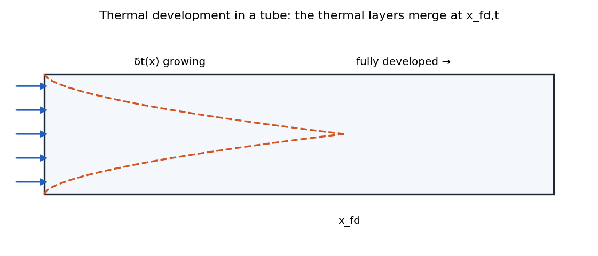
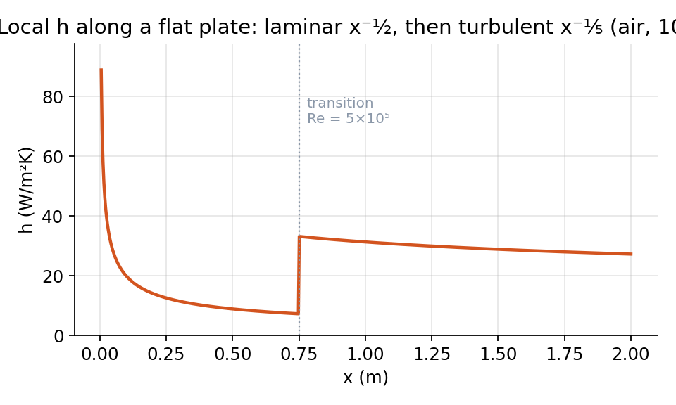
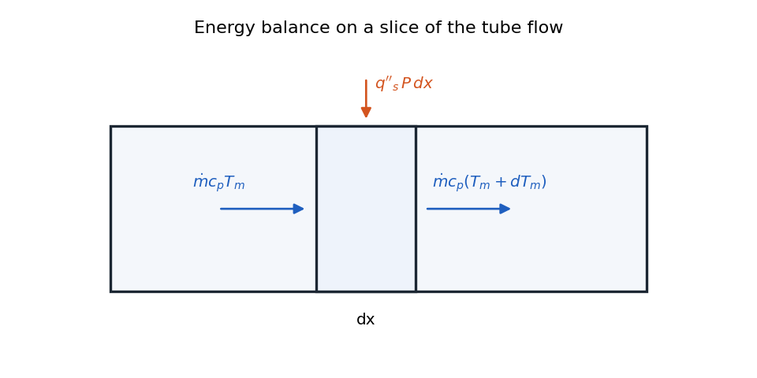
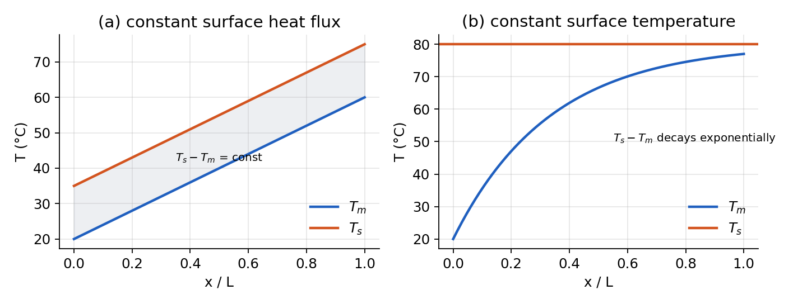
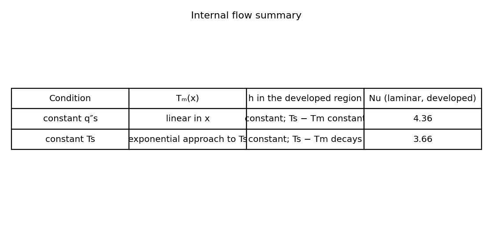

# Internal Flow

## Internal Flow Heat Transfer

Internal flows differ fundamentally from external flows in several important ways:

| **External Flow**                                                    | **Internal Flow**                                                              |
|:---------------------------------------------------------------------|:-------------------------------------------------------------------------------|
| Heat transfer between surface and free-stream temperature $T_\infty$ | Heat transfer between surface and local bulk temperature (varying temperature) |
| Boundary layer grows continuously                                    | Boundary layers grow until they meet, becoming fully developed                 |
| $\text{Re}_x$ varies with position along surface                     | $\text{Re}_D$ is constant throughout the flow                                  |
| changing $\operatorname{Re}_{x,c}$ lead to different types of flows  | Same flow type for all $\operatorname{Re}_{D,c}$ at different $x$              |
| $h_x = q''_x/(T_s - \textcolor{red}{T_\infty})$                      | $h_x = q''_x/(T_s - \textcolor{red}{T_m})$                                     |

<figure markdown="span">
{ width="72%" }
<figcaption>Laminar, hydrodynamic boundary layer development in a circular tube.</figcaption>
</figure>

For internal flows, the boundary layer development creates distinct flow regions:

-   Hydrodynamic entrance region (developing velocity profile)

-   Hydrodynamic fully developed region (constant velocity profile)

<figure markdown="span">
{ width="72%" }
<figcaption>Thermal boundary layer development in a circular tube.</figcaption>
</figure>

Similarly for thermal boundary layers

-   Thermal entrance region (developing temperature profile)

-   Thermally fully developed region (constant shape temperature profile)

#### Internal Flow Concepts for Pipe Flow

When fluid enters a pipe, boundary layers develop along the walls. Eventually, these boundary layers meet at the centerline, and the flow becomes fully developed.

The critical Reynolds number for circular pipe flow is approximately 

$$
\operatorname{Re}_{D,c} = 2300
$$

 Regarding flow type in pipes: 

$$
\begin{array}{rcl}
    0-2300: && \text{Laminar} 
    \\
    2300-10^{4}: && \text{Transition} 
    \\
    >10^{4} : && \text{Turbulent}
    \end{array}
$$

 However, for heat transfer purposes, any flow with $\text{Re}_D > 2300$ is treated as turbulent because even transitional flows exhibit significant mixing that dominates over molecular diffusion.

!!! abstract "Definition"

    For flow in circular pipe: 

    $$
    \left\{\begin{array}{ll}
                 \text{Laminar: }&  \frac{x_{fd,h}}{D} \approx 0.05\text{Re}_D
                 \\[1.5em]
                 \text{Turbulent: }& \frac{x_{fd,h}}{D} \approx 10
            \end{array}
            \right.
    $$

##### Mean velocity:

Mean velocity can be defined as 

$$
u_m  = \frac{1}{A}\int u\; dA
$$

 for cicular pipe: 

$$
u_m   = \frac{2}{r^2_D}\int_0^{r_0}\,u(r,x)\, rdr
$$

-   **mass flow rate:** 

$$
\dot{m} = \rho u_m A_c
$$

 where $u_m$ is mean velocity and $A_c = \pi D^4/4$. It can be shown

!!! abstract "Definition"

    

    $$
    u_m = \frac{\dot{m}}{\rho A_c} = \frac{\dot{m}}{\rho \pi R^2}
    $$

-   **Reynolds number:**

!!! abstract "Definition"

    

    $$
    \operatorname{Re}=\frac{\rho \,u_m D_h}{\mu}=\frac{4 \dot{m}}{\pi D \mu}
    $$

where $D_h = 4A/P$ called hydraulic diameter. For uniform pipe, $u_m = u_{in}$.

#### Velocity Profile in Fully Developed Flow

For fully developed laminar flow in a circular pipe, the velocity profile is parabolic: 

$$
\frac{u(r)}{u_m} = 2\left[1-\left(\frac{r}{R}\right)^2\right]
$$

 The maximum velocity at the centerline is twice the mean velocity: 

$$
u_{max} = 2u_m
$$

The mean velocity is related to the pressure gradient by: 

$$
\begin{aligned}
        u_m &= -\frac{R^2}{8\mu}\frac{dP}{dx}
        \\[0.5em]
        \frac{\Delta P}{L} &= \frac{32 \mu}{D^2} u_m
        \\[0.5em]
        \frac{\Delta P}{L} &=\frac{32 \mu}{D^2} \,\frac{\dot{m}}{\rho \pi R^2}
        \\[0.5em]
        \frac{\Delta P}{L} &=\frac{32 \mu}{D^2} \,\frac{\dot{V}}{\pi R^2}
    \end{aligned}
$$

 yielding

!!! abstract "Definition"

    $$
    \frac{\Delta P}{L} =\frac{128 \mu \dot{V}}{\pi D^4}
    $$

#### Friction Factor

The friction factor can be defined in two ways:

1.  Darcy (or Moody) friction factor: 

$$
f = -\frac{dP/dx \cdot D}{\rho u_m^2/2}
$$

2.  Fanning friction factor: 

$$
C_f = \frac{\tau_s}{\rho u_m^2/2}
$$

For a fully developed circular pipe in laminar flow with smooth surface4, the relationship is: 

$$
f = \frac{64}{\text{Re}_D} \quad \text{and} \quad C_f = \frac{16}{\text{Re}_D}
$$

Note that $f = 4C_f$ for pipe flow. It’s crucial to identify which definition is being used in a specific context.

### Thermal Analysis of Internal Flow

There are two cases:

1.  constant surface temperature

2.  constant heat flux

Each case has their own equation and properties.

!!! abstract "Definition"

    The thermal entry length: 

    $$
    \left\{\begin{array}{ll}
                 \text{Laminar: }&  \frac{x_{fd,t}}{D} \approx 0.05\,\text{Re}_D\cdot\text{Pr}
                 \\[1.5em]
                 \text{Turbulent: }& \frac{x_{fd,t}}{D} \approx 10
            \end{array}
            \right.
    $$

#### Bulk Temperature

The bulk (or mean) temperature is defined as the mixing cup temperature that would result if the flow at a given cross-section were collected and mixed adiabatically.

!!! abstract "Definition"

    General formula: 

    $$
    \dot{m} c_p T_m=\int_{A c} \rho u\, c_p \, T \,d A_c
    $$

     If $c_p$ and $\rho$ are constant and given $\dot{m} = \rho u_m A_c$, we’ll have 

    $$
    T_m=\frac{2}{u_m r_n^2} \int_0^{r_0} u\cdot T\cdot r\ d r
    $$

#### Newton’s cooling law for internal flow

We no longer have $T_\infty$, but we have $T_m$ which is not constant: 

$$
h(x) = \frac{q_s''}{T_s - T_m(x)}
$$

#### Thermally Fully Developed Condition

A flow is considered thermally fully developed when the dimensionless temperature profile no longer changes with axial position: 

$$
\frac{\partial}{\partial x}\left[\frac{T_s(x) - T(r,x)}{T_s(x) - T_m(x)}\right] = 0
$$

This implies that while temperatures may change with position, the shape of the temperature profile remains constant.

#### Convection heat transfer coefficient in fully developed region

For the case of constant surface temperature, in the thermally fully developed region, this simplifies to: 

$$
\frac{\partial}{\partial x}\left[\frac{T(r,x) - T_s}{T_m(x) - T_s}\right] = 0 \longrightarrow \frac{T(r,x) - T_s}{T_m(x) - T_s} = f(r)
$$

 So 

$$
\frac{\partial T / \partial r \,(r=r_0) }{T_s - T_m} = f'(r) = constant
$$

 A mathematical consequence of thermal fully developed flow is that the local heat transfer coefficient becomes constant: 

$$
q''_s = h\,(T_s-T_m) = k \frac{\partial T}{\partial r} \Bigl\vert_{r_0} \Rightarrow \frac{\left.\frac{\partial T}{\partial r}\right|_{r_0}}{T_s-T_m}=\frac{h}{k}=\text { constant }
$$

 which means $h$ is constant.

<figure markdown="span">
{ width="72%" }
<figcaption>Axial variation of the convection heat transfer coefficient for flow in a tube.</figcaption>
</figure>

### Energy Analysis of Internal Flow

#### Key Assumptions

For most internal flow analyses, we make the following assumptions:

1.  **Neglect axial conduction** - Justified by comparing advection to axial conduction: 

$$
\frac{\text{advection}}{\text{axial conduction}} = \frac{\rho c_p u_m T_m}{k\frac{dT_m}{dx}} \gg 1
$$

 For typical water flow at 1 m/s with temperature change of 100°C over 1 m: 

$$
\frac{\text{advection}}{\text{axial conduction}} \approx \frac{1000 \times 4000 \times 1 \times 50}{0.6 \times 100} \approx 3.3 \times 10^6
$$

 This means axial conduction contributes less than one part per million to the heat transfer.

2.  **Incompressible flow** - Valid for liquids and gases at low speeds

3.  **Constant properties** - Can be evaluated at the bulk temperature or film temperature

4.  **No internal heat generation** - Unless specifically considered in the problem

## Internal Flow Analysis and Temperature Distributions

### Energy Balance in Internal Flows

For internal flows, we perform an energy balance on a control volume between $x$ and $x+dx$:

<figure markdown="span">
{ width="72%" }
<figcaption>Control volume for internal flow in a tube.</figcaption>
</figure>

Energy in:

-   Advection: $\dot{m}c_pT_m$

-   Heat through surface: $q''_sP\,dx$

Energy out:

-   Advection: $\dot{m}c_p(T_m + dT_m)$

For steady state, the balance yields: 

$$
q''_sP\,dx = \dot{m}c_p\,dT_m
$$

Or: 

$$
\boxed{
        \frac{dT_m}{dx} = \frac{q''_sP}{\dot{m}c_p}
        }
$$

Using the definition of heat transfer coefficient: 

$$
q''_s = h(T_s - T_m)
$$

The energy balance becomes: 

$$
\boxed{
        \frac{dT_m}{dx} = \frac{hP}{\dot{m}c_p}(T_s - T_m)
        }
$$

### Case 1: Constant Heat Flux

For constant heat flux ($q''_s = \text{constant}$), the mean temperature increases linearly: 

$$
\frac{dT_m}{dx} = \frac{q''_sP}{\dot{m}c_p} = \text{constant}
$$

Therefore: 

$$
T_m(x) = T_{m,i} + \frac{q''_sP}{\dot{m}c_p}x
$$

where $T_{m,i}$ is the inlet temperature.

The surface temperature can be determined from:

!!! abstract "Definition"

    $$
    T_s(x) = T_m(x) + \frac{q''_s}{h(x)}
    $$

In the fully developed region where $h$ is constant, the surface temperature also increases linearly with the same slope as the bulk temperature, maintaining a constant temperature difference: 

$$
T_s(x) - T_m(x) = \frac{q''_s}{h} = \text{constant for } x > x_{fd,t}
$$

 In the entrance region, the heat transfer coefficient is higher, resulting in a smaller temperature difference near the inlet. The surface temperature profile will have a non-linear portion in the entrance region before becoming linear in the fully developed region.

### Case 2: Constant Surface Temperature

For constant surface temperature ($T_s = \text{constant}$), the energy balance is: 

$$
\frac{dT_m}{dx} = \frac{\bar{h}P}{\dot{m}c_p}(T_s - T_m)
$$

 Assuming $\bar{h}$ is constant (valid for the fully developed region), this can be integrated:

!!! abstract "Definition"

    $$
    \frac{T_s - T_m(x)}{T_s - T_{m,i}} = \exp \left(-\frac{\bar{h}\,P }{\dot{m} c_p}\,x \right)
    $$

The mean temperature approaches the surface temperature exponentially, Figure <a href="#fig:delta_T_vs_x_pipe" data-reference-type="ref" data-reference="fig:delta_T_vs_x_pipe">1</a>. It can be proven over a pipe of length $L$

!!! abstract "Definition"

    $$
    \frac{\Delta T_0}{\Delta T_i}=\frac{T_s-T_{m, 0}}{T_s-T_{m, i}}=\exp \left(-\frac{P L}{\dot{m} c_p} \bar{h}\right)
    $$

The total heat transfer rate is:

!!! abstract "Definition"

    $$
    \begin{aligned}
                q &= \dot{m}c_p[T_m(x) - T_i] = \dot{m}c_p(T_s - T_i)(1 - e^{-\frac{\bar{h}P}{\dot{m}c_p}\,x})
                \\[0.5em]
                q &= \dot{m}c_p \Delta T = \rho c_p u_m A_c\Delta T
            \end{aligned}
    $$

<figure markdown="span">
{ width="72%" }
<figcaption>Axial temperature variations for heat transfer in a tube. (a) Constant surface heat flux. (b) Constant surface temperature.</figcaption>
</figure>

### Log Mean Temperature Difference (LMTD)

For heat exchanger applications, it’s useful to define the log mean temperature difference: 

$$
\Delta T_{lm} = \frac{\Delta T_i - \Delta T_o}{\ln(\Delta T_i/\Delta T_o)}
$$

where:

-   $\Delta T_i = T_s - T_i$ (inlet temperature difference)

-   $\Delta T_o = T_s - T_o$ (outlet temperature difference)

This allows the total heat transfer to be expressed simply as: 

$$
\begin{aligned}
        q_{c a n \nu} &=\dot{m} c_{p}\, \Delta T_{l m} \cdot \ln \left(\Delta T_0 / \Delta T_i\right) \cdot(-1)
        \\[1em]
        & = \dot{m} c_p \cdot \Delta T_{l m} \cdot\left(-\frac{P L}{\dot{m} c_p} \bar{h}\right)(-1)
        \\[0.5em]
        & = \bar{h} \cdot PL\cdot \Delta_{lm}
        \\[0.5em]
        & = \bar{h}A_s \Delta T_{lm}
    \end{aligned}
$$

!!! abstract "Definition"

    $$
    q_{conv} = \bar{h}A_s \Delta T_{lm}
    $$

The LMTD is useful for heat exchanger design because:

-   It represents an effective temperature difference for the entire heat exchanger

-   It’s convenient for experimental measurements (only need inlet and outlet temperatures)

-   It simplifies heat exchanger calculations

#### Internal heat flow summary

<figure markdown="span">
{ width="72%" }
<figcaption>Internal heat flow summary</figcaption>
</figure>

### Entry Length Considerations

While the entry region has higher heat transfer coefficients, it’s often a small portion of the total heat exchanger length. Most practical applications focus on the fully developed region because:

-   The entry region is usually short compared to the total length

-   Outlet temperature is often more important than high local heat transfer rates

-   For cooling systems with radiators, higher outlet temperatures can reduce radiator size

-   Mathematical analysis is much simpler in the fully developed region

For typical fluids like air or water with Prandtl numbers around 1, the hydrodynamic and thermal entry lengths are similar. For turbulent flow, the entry length is approximately 10 pipe diameters.

### Nusselt Numbers for Internal Flows

1.  Determine where the flow is fully developed (both hydrodynamically and thermally)

2.  Identify whether the flow is laminar or turbulent based on Reynolds number

3.  Select the appropriate Nusselt number correlation based on flow regime.

!!! abstract "Definition"

    For fully developed flow we have:

    -   **Laminar flow** ($\text{Re}_D < 2300$):

        -   For constant surface temperature: $\text{Nu}_D = 3.66$

        -   For constant heat flux: $\text{Nu}_D = 4.36$

    -   **Turbulent flow** ($\text{Re}_D > 2300$):

        -   *Dittus-Boelter* equation: 

    $$
    \begin{aligned}
                            \text{Nu}_D &= 0.023\,\text{Re}_D^{0.8}\cdot\text{Pr}^n
                            \\[1em]
                            &\left[\begin{array}{l}
                            0.6 \lesssim \operatorname{Pr} \lesssim 160 \\
                            R e_D \gtrsim 10,000 \\
                            L / D \gtrsim 10
                            \end{array}\right]        
                            \end{aligned}
    $$

        -   $n = 0.3$ for cooling ($T_s < T_m$)

        -   $n = 0.4$ for heating ($T_s > T_m$)

Note that in real applications, pipe surfaces may have conditions between constant temperature and constant heat flux. The true Nusselt number would typically fall between the two limiting values provided for laminar flow.
