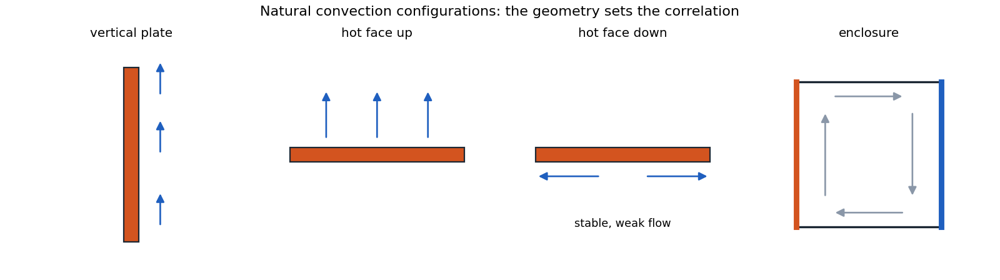
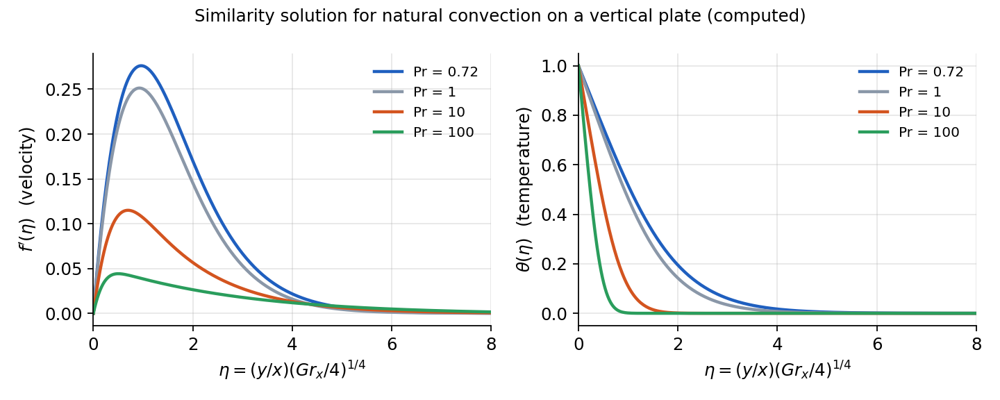

# Natural Convection

!!! example "Example"

Natural convection occurs when fluid motion is caused by buoyancy forces due to density variations in the fluid. Unlike forced convection, there is no external mechanism (like a pump or fan) driving the flow.

### Physical Mechanism

When a fluid is heated or cooled relative to its surroundings:

-   The fluid density changes with temperature.

-   This creates buoyancy forces.

-   Fluid motion is induced by these buoyancy forces.

-   Heat transfer occurs due to this fluid motion.

For most fluids, heating causes expansion (density decrease), which leads to upward movement. However, some substances have anomalous thermal expansion behavior:

-   Water between $0^\circ \mathrm{C}$ and $4^\circ \mathrm{C}$ has a negative thermal expansion coefficient (density increases with temperature)

-   This property is crucial for aquatic life, as it keeps lakes from freezing solid

### Visualization of Natural Convection

Natural convection can be visualized in several ways:

-   Dye injection in water cavities with temperature differences.

-   Shadowgraph techniques showing density variations (e.g., the rising thermal plume above a human hand).

-   Schlieren imaging showing convection currents around heated objects.

Even at relatively low temperature differences, natural convection can create significant fluid motion and mixing effects.

## Mathematical Formulation of Natural Convection

The key difference in analyzing natural convection compared to forced convection is that the temperature and velocity fields are inherently coupled:

-   In forced convection, we could solve for the velocity field first, then use it to find the temperature field

-   In natural convection, temperature differences cause the fluid motion, so both fields must be solved simultaneously

<figure markdown="span">
{ width="72%" }
<figcaption>Natural Convection Configurations</figcaption>
</figure>

## Boundary Layers in Natural Convection

In natural convection, the development of velocity and thermal boundary layers differs from forced convection:

-   In forced convection, the velocity boundary layer develops first, and the thermal boundary layer develops within it

-   In natural convection, fluid motion is caused by temperature differences, so the thermal boundary layer initiates the velocity boundary layer

-   For most fluids with Prandtl numbers near 1 (like air and water), the velocity and thermal boundary layers are of similar thickness

-   For fluids with very high Prandtl numbers (like oils), the velocity boundary layer can be much thicker than the thermal boundary layer

<figure>

<em>δ</em> and <em>δ</em><em>t</em> profile in natural convection.

<figcaption>figure</figcaption>
</figure>

The velocity profile in natural convection is also distinctive:

-   The fluid velocity is zero at the wall (no-slip condition)

-   The velocity reaches a maximum within the boundary layer

-   The velocity decreases to zero in the quiescent fluid outside the boundary layer

This contrasts with forced convection, where the velocity asymptotically approaches the free stream velocity. 

$$
$$
$$

$$
#### Volumetric Thermal Expansion Coefficient: 

This coefficient $\beta$ is used to relate the local density difference to the local temperature difference:
$$

\beta=-\left.\frac{1}{\rho} \frac{\partial \rho}{\partial T}\right|_{p=\mathrm{constant}}

$$
For ideal gases, $\beta = \frac{1}{T ~[\text{K}]}$ where $T$ is absolute temperature.

#### Boussinesq Approximation:

It assumes:

-   Neglect all other temperature-dependent property effects in the governing equations

-   Density variation is approximated linearly with temperature:
$$

\beta \approx-\frac{1}{\rho} \frac{\left(\rho_{\infty}-\rho\right)}{\left(T_{\infty}-T\right)} \quad \Rightarrow \quad\left(\rho_{\infty}-\rho\right) \approx \rho \beta\left(T-T_{\infty}\right)

$$
## Natural Convection on Vertical Flat Plate

#### Governing equations:

1.  Continuity equation:
$$

\frac{\partial u}{\partial x}+\frac{\partial v}{\partial y}=0

$$
2.  Momentum equation with buoyancy term:

    $x$-direction:
$$

\begin{aligned}
            & u \frac{\partial u}{\partial x}+v \frac{\partial u}{\partial y}= -\frac{1}{\rho} \overbrace{\frac{\partial P}{\partial x}}^{\rho_\infty g} - g +v \frac{\partial^2 u}{\partial y^2}
            \\[0.5em]
            &u \frac{\partial u}{\partial x}+v \frac{\partial u}{\partial y}=\frac{\left(\rho_{\infty}-\rho\right)}{\rho} g+v \frac{\partial^2 u}{\partial y^2}
            \\[0.5em]
            & u \frac{\partial u}{\partial x}+v \frac{\partial u}{\partial y}=g \beta\left(T-T_{\infty}\right)+v \frac{\partial^2 u}{\partial y^2}
            \end{aligned}

$$
$y$-direction:
$$

0 = \frac{\partial P}{\partial y}

$$
3.  Energy equation:
$$

u \frac{\partial T}{\partial x}+v \frac{\partial T}{\partial y}=\alpha \frac{\partial^2 T}{\partial y^2}

$$
This can be solved using similarity method and
$$

\eta=\frac{y}{x}\left(\frac{\mathrm{Gr}_x}{4}\right)^{1 / 4}

$$
<figure markdown="span">
{ width="72%" }
<figcaption>Similarity approach solution for natural convection in vertical flat plate.</figcaption>
</figure>

## Grashof and Rayleigh Dimensionless Numbers

Natural convection problems introduce new dimensionless parameters:

!!! abstract "Definition"

    ##### Grashof Number

    The Grashof number represents the ratio of buoyancy forces to viscous forces:
    $$

    \text{Gr}_L = \frac{g\beta(T_s-T_\infty)L^3}{\nu^2}

    $$

This parameter plays a role in natural convection similar to the Reynolds number in forced convection.

!!! abstract "Definition"

    ##### Rayleigh Number

    The Rayleigh number is the product of the Grashof and Prandtl numbers:
    $$

    \text{Ra}_L = \text{Gr}_L \cdot \text{Pr} = \frac{g\beta(T_s-T_\infty)L^3}{\nu\alpha}

    $$

This parameter determines the nature of the flow and heat transfer in natural convection.

## Nusselt Number for Vertical Flat Plate

Recall that the heat flux at the surface is by conduction
$$

q_s^{\prime \prime}=-\left.k_f \frac{\partial T}{\partial y}\right|_{y=0}=-\left.\frac{k_f}{x}\left(T_s-T_{\infty}\right)\left(\frac{\mathrm{Gr}_x}{4}\right)^{1 / 4} \frac{d T^*}{d \eta}\right|_{\eta=0}

$$
!!! abstract "Definition"

    The Nusselt number then becomes
    $$

    \mathrm{Nu}_x=\frac{h x}{k_f}=\frac{q_s^{\prime \prime}}{\left(T_s-T_{\infty}\right)} \frac{x}{k_f}=-\left.\left(\frac{\mathrm{Gr}_x}{4}\right)^{1 / 4} \frac{d T^*}{d \eta}\right|_{\eta=0}

    $$
    From the temperature profile solution
    $$

    -\left.\frac{d T^*}{d \eta}\right|_{\eta=0}=f(\operatorname{Pr}) \approx \frac{0.75 \operatorname{Pr}^{1 / 2}}{\left(0.609+1.221 \operatorname{Pr}^{1 / 2}+1.238 \operatorname{Pr}\right)^{1 / 4}}

    $$
    Therefore
    $$

    h=\frac{q_s{ }^{\prime \prime}}{\left(T_s-T_{\infty}\right)}=\frac{k_f}{x}\left(\frac{\mathrm{Gr}_x}{4}\right)^{1 / 4} f(\operatorname{Pr})

    $$

#### Average Nusselt Numbers and h:
$$

\bar{h}=\frac{1}{L} \int_0^L h d x=\frac{k_f}{L}\left(\frac{g \beta\left(T_S-T_{\infty}\right)}{4 v^2}\right)^{1 / 4} f(\operatorname{Pr}) \int_0^L \frac{1}{x^{1 / 4}} d x

$$
It can be shown that
$$

\bar{h}=\frac{4}{3} h \Rightarrow \overline{\mathrm{Nu}}_L=\frac{4}{3} \mathrm{Nu}_L

$$
## Nusselt Number Empirical Correlations

For a vertical plate, critical Rayleigh number is $\mathrm{Ra}_{L,c} = 10^9$. Beyond this number, the flow is turbulent. Here are some useful formula for flat plate:

!!! abstract "Definition"

    Nusselt number in free convection for vertical flat plates:
    $$

    \overline{\mathrm{Nu}}_L=C \cdot \mathrm{Ra}_L^n : \quad
        \left\{
        \begin{array}{ccc}
            \text {Laminar flow: } & n=1 / 4, C=0.59 & \left(10^4<\mathrm{Ra}_L<10^9\right) 
            \\[1.5em]
            \text {Turbulent flow: } &n=1 / 3, C=0.10 & \left(\operatorname{Ra}_L>10^9\right)
        \end{array}\right.

    $$
    Alternatively, the *Churchill* and *Chu* correlation for the entire range of laminar and turbulent flow:
    $$

    \overline{\mathrm{Nu}}_L=\left(0.825+\frac{0.378 \mathrm{Ra}_L^{1 / 6}}{\left[1+(0.492 / \mathrm{Pr})^{9 / 16}\right]^{8 / 27}}\right)^2

    $$

For horizontal plates and other geometries, specific correlations are available in heat transfer references.

When evaluating fluid properties, the film temperature should be used:
$$

T_f = \frac{T_s + T_\infty}{2}

$$
!!! abstract "Definition"

    For long horizotnal cylinder we have:
    $$

    \overline{N u}_D=\frac{\bar{h} D}{k}=C \operatorname{R a_D}^n

    $$
    where $C$ and $n$ can be calculated using the table below:
    $$

    \begin{array}{llc}
            \operatorname{\boldsymbol{R} \boldsymbol{a}_{\boldsymbol{D}}} & \boldsymbol{C} & \boldsymbol{n} \\
            \hline 10^{-10}-10^{-2} & 0.675 & 0.058 \\
            10^{-2}-10^2 & 1.02 & 0.148 \\
            10^2-10^4 & 0.850 & 0.188 \\
            10^4-10^7 & 0.480 & 0.250 \\
            10^7-10^{12} & 0.125 & 0.333 \\
            \hline
            \end{array}

    $$

## Combined Forced and Natural Convection

In many real situations, both forced and natural convection effects are present. The relative importance is determined by comparing the Grashof and Reynolds numbers:

-   $\text{Gr}_L/\text{Re}_L^2 \ll 1$: Forced convection dominates

-   $\text{Gr}_L/\text{Re}_L^2 \gg 1$: Natural convection dominates

-   $\text{Gr}_L/\text{Re}_L^2 \approx 1$: Both mechanisms are significant

For the combined case, the general approach is to calculate both the forced convection Nusselt number ($\text{Nu}_{\text{forced}}$) and the natural convection Nusselt number ($\text{Nu}_{\text{natural}}$), then combine them using an appropriate correlation:
$$

\text{Nu} = (\text{Nu}_{\text{forced}}^3 + \text{Nu}_{\text{natural}}^3)^{1/3}$$

This approach accounts for both mechanisms and provides a smooth transition between the limiting cases.

## Applications of Natural Convection

Natural convection is important in many applications:

-   Cooling of electronic components

-   HVAC systems and building ventilation

-   Solar collectors and thermal energy storage

-   Food processing and preservation

-   Environmental flows in the atmosphere and oceans

-   Passive cooling systems in nuclear reactors

While natural convection typically provides lower heat transfer coefficients than forced convection (2-25 W/m²K vs. 25-250 W/m²K), it requires no external power for fluid motion, making it desirable for passive cooling systems and energy-efficient designs.
