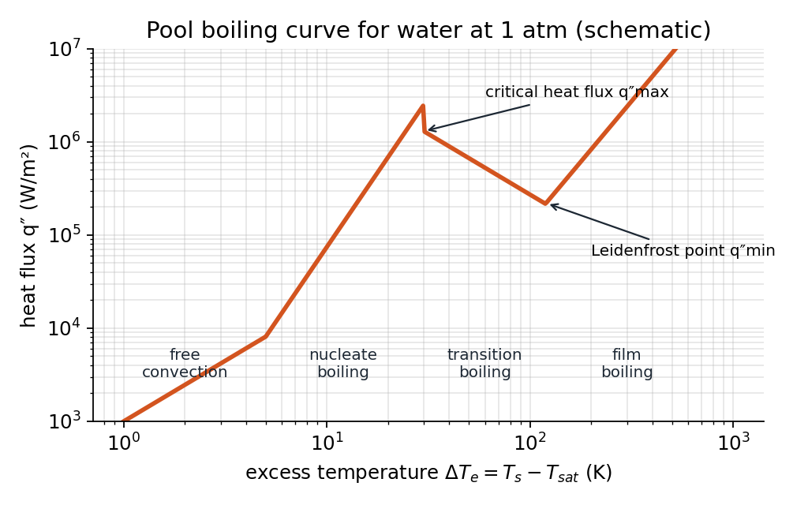

# Boiling and Condensation

## Introduction to Phase Change Heat Transfer

In previous lectures, we discussed natural convection where there is a strong coupling between buoyancy and temperature. Boiling and condensation processes demonstrate even more nonlinear behavior, not only due to temperature coupling but also because of phase changes and moving boundaries, which make numerical solutions challenging. Therefore, we will focus on correlations and identifying different modes of heat transfer to guide initial calculations.

### Heat Transfer Coefficients Across Different Regimes

Recall that the convection heat transfer coefficient is defined based on the heat flux and a characteristic temperature difference:

$$
h = \frac{q''}{\Delta T}
$$

For different heat transfer modes, we define $\Delta T$ differently:

-   External forced convection: $\Delta T = T_s - T_{\infty}$

-   Internal forced convection: $\Delta T = T_s - T_m$

-   Boiling and condensation: $\Delta T = T_s - T_{sat}$

The typical ranges of heat transfer coefficients for different heat transfer modes are:

-   Free convection: 2-25 W/m²K (for centimeter-scale structures)

-   Forced convection in gases: 25-250 W/m²K

-   Forced convection in liquids: 50-1,000 W/m²K (2-20 times enhancement over free convection)

-   Boiling and condensation: 2,500-100,000 W/m²K

It’s important to note that the heat transfer coefficient itself is not the ultimate goal; rather, it provides a convenient way to calculate heat transfer rates. The correct approach is to identify the required heat flux and temperature conditions, then determine which heat transfer method or fluid is most appropriate.

## Boiling Heat Transfer

### Boiling Curve

Consider a small heated surface immersed in a pool of liquid at temperature $T_{\infty}$. As we increase the surface temperature $T_s$, the heat flux $q''$ changes in a characteristic manner.

Initially, when $T_s < T_{sat}$, the heat transfer occurs through natural convection. As $T_s$ approaches and exceeds $T_{sat}$, bubbles begin to form, and the heat flux increases dramatically. This is known as nucleate boiling.

For boiling, we define the temperature difference as: 

$$
\Delta T_{excess} = T_s - T_{sat}
$$

This is a better reference temperature for boiling because it allows for comparison across different fluids, as the boiling point will vary between liquids but the curve shapes remain similar.

### Applications of Boiling Heat Transfer

Boiling heat transfer has numerous applications:

-   Refrigeration

-   Power plants

-   HVAC systems

-   Heat exchangers

-   Chemical processing

-   Microelectronics cooling

An interesting application is found in inkjet printers. The highest quality inkjet printers use thermal bubble technology rather than piezoelectric actuators. In thermal bubble inkjet printing, a small heating element rapidly boils a tiny amount of ink, creating a vapor bubble that ejects a droplet. This allows for extremely high-resolution printing, with some professional printers capable of producing dots as small as 1.8 microliters, much smaller than a human hair.

### Important Physical Parameters in Boiling

Several key physical parameters influence boiling heat transfer:

-   **Latent heat of vaporization ($h_{fg}$)**: The energy required to convert a liquid to vapor at constant temperature.

-   **Saturation temperature ($T_{sat}$)**: The temperature at which the liquid-vapor phase equilibrium exists at a given pressure. This is the point where the rate of molecules leaving the liquid equals the rate of molecules returning from the vapor.

-   **Surface tension ($\sigma$)**: Forces acting along the liquid-vapor interface that tend to minimize the surface area. Surface tension significantly affects bubble formation and growth.

-   **Buoyancy forces**: Generated by density differences between the vapor and liquid phases, these forces drive the movement of bubbles.

Surface tension creates substantial pressure differences across curved interfaces. For example, a 10 nm diameter air bubble in water would experience an internal pressure of approximately 115 atmospheres (11.5 MPa) due to surface tension, while a 100 nm bubble would still experience about 15 atmospheres (1.5 MPa). These high pressures must be overcome for bubble nucleation to occur.

Newton’s law for cooling in boiling can be written as: 

$$
q'' = h(T_s - T_{sat})
$$

Note that the saturation temperature $T_{sat}$ depends on pressure. For water at one atmosphere, $T_{sat} \approx 100^\circ \mathrm{C}$ and the latent heat of vaporization is approximately 2260 $\mathrm{kJ/kg}$.

### Classification of Boiling

Boiling can be classified in different ways:

1.  Based on fluid motion:

    -   **Pool boiling**: No external pumping, fluid motion primarily due to natural convection and bubble dynamics

    -   **Flow boiling**: External pumping creates forced convection

2.  Based on bulk liquid temperature:

    -   **Subcooled boiling**: Bulk liquid temperature is below $T_{sat}$, bubbles form at the heated surface but may collapse as they rise through the cooler liquid

    -   **Saturated boiling**: Bulk liquid temperature is at or above $T_{sat}$, bubbles grow and rise to the free surface

These classifications can be combined, resulting in saturated pool boiling, subcooled flow boiling, etc. In this course, we will focus primarily on pool boiling, as it provides a clearer foundation for understanding boiling phenomena.

## Pool Boiling Regimes

### Boiling Curve and Regimes

The pool boiling process can be divided into several distinct regimes:

1.  **Natural convection region**: When $T_s < T_{sat}$ or only slightly above $T_{sat}$, heat transfer occurs primarily through natural convection without bubble formation.

2.  **Nucleate boiling region**: As $T_s - T_{sat}$ increases to a few degrees, bubbles begin to form at specific nucleation sites on the surface. This region is divided into two sub-regions:

    -   **Isolated bubbles**: Individual bubbles form at discrete nucleation sites and don’t interact with each other

    -   **Jets and columns**: At higher superheat, bubbles begin to merge and form vapor columns

3.  **Critical heat flux (CHF)**: The point at which the heat flux reaches a maximum value. Beyond this point, vapor begins to blanket parts of the surface, reducing heat transfer effectiveness.

4.  **Transition boiling**: Above CHF, increasing surface temperature actually results in decreasing heat flux due to the formation of unstable vapor films.

5.  **Film boiling**: At very high surface temperatures, a stable vapor film covers the entire surface. Heat transfer occurs through conduction and radiation across this vapor layer, which has poor thermal conductivity.

6.  **Leidenfrost point**: The minimum heat flux point that marks the transition between transition boiling and film boiling.

For a small heated wire or element with low thermal mass, if the heat flux exceeds CHF, the temperature can jump suddenly from the nucleate boiling region to the film boiling region (thermal runaway), potentially leading to burnout. However, for objects with large thermal mass, like a metal sphere, the cooling process follows the entire boiling curve more gradually.

<figure markdown="span">
{ width="72%" }
<figcaption>Heat Flux Controlled Boiling Curve</figcaption>
</figure>

### Nucleate Boiling Correlation

!!! abstract "Definition"

    For the nucleate boiling regime, the heat flux can be calculated using the *Rohsenow* correlation:

    $$
    q'' = \mu_l h_{fg} \left[ \frac{g(\rho_l - \rho_v)}{\sigma} \right]^{1/2} \left[ \frac{c_{p,l}(T_s - T_{sat})}{C_{sf}h_{fg}\text{Pr}_l^n} \right]^3
    $$

     Where:

    -   $\mu_l$ is the liquid viscosity

    -   $h_{fg}$ is the latent heat of vaporization

    -   $g$ is gravitational acceleration

    -   $\rho_l$ and $\rho_v$ are the densities of liquid and vapor

    -   $\sigma$ is surface tension

    -   $c_{p,l}$ is the specific heat of the liquid

    -   $\text{Pr}_l$ is the Prandtl number of the liquid

    -   $C_{sf}$ is a coefficient that depends on the surface-fluid combination

    -   $n$ is an exponent (typically 1.0 for water, 1.7 for other fluids)

Note that the heat flux is proportional to $(T_s - T_{sat})^3$, explaining the steep increase in the boiling curve. The factor $\sqrt{(\rho_l - \rho_v)/\sigma}$ relates to the buoyancy forces and surface tension effects.

### Critical Heat Flux

!!! abstract "Definition"

    The critical heat flux for a horizontal surface can be estimated using the following correlation: 

    $$
    q_{CHF}^{\prime \prime}=C \rho_v h_{f g}\left[\frac{\sigma g\left(\rho_l-\rho_v\right)}{\rho_v{ }^2}\right]^{1 / 4}
    $$

    -   $C=0.131$: for horizontal cylinders, spheres and other large finite surfaces.

    -   $C=0.149$: for large horizontal plates.

This represents the balance point where vapor generation begins to impede liquid return to the surface. Systems should always be designed to operate well below the CHF (typically 60-70% of CHF) for safety and stability.

### Enhancing Boiling Heat Transfer

Boiling heat transfer can be enhanced by modifying the surface:

1.  **Surface roughness**: Rough surfaces provide more nucleation sites where bubbles can form, enhancing nucleate boiling.

2.  **Surface features**: Creating artificial cavities or crevices reduces the energy required to form the vapor-liquid interface, making bubble nucleation easier.

3.  **Sintered surfaces**: Metal particles sintered onto a surface create interconnected porous structures that enhance both nucleate boiling and liquid return pathways, significantly improving performance.

## Condensation Heat Transfer

### Types of Condensation

Condensation is the phase change from vapor to liquid that occurs when vapor contacts a surface below the saturation temperature. It can be classified into several types:

1.  **Surface condensation**:

    -   **Film condensation**: Liquid forms a continuous film on the surface

    -   **Dropwise condensation**: Liquid forms discrete droplets on the surface

2.  **Homogeneous condensation**: Occurs uniformly throughout a volume when vapor is cooled below saturation temperature, typically through expansion.

3.  **Direct contact condensation**: Achieved by injecting cold liquid into saturated vapor or by injecting vapor into cold liquid.

### Film Condensation

Film condensation generally results in lower heat transfer rates compared to dropwise condensation because the liquid film acts as a thermal resistance. However, it is more commonly encountered in practical applications and is easier to model analytically.

For vertical surface film condensation, the energy balance must be considered alongside mass balance. The mass of condensate increases as it flows down the surface due to gravity:

-   Mass deposited on the surface due to condensation

-   Mass supplied from above

-   Mass leaving through the bottom due to gravity

The temperature profile within the condensate film shows a gradient from $T_{sat}$ at the vapor-liquid interface to $T_s$ at the wall surface.

### Practical Considerations for Film Condensation

For effective condensation heat transfer, the film thickness must be controlled. Consider the following example:

For water with thermal conductivity $k \approx 0.6$ W/m·K and a film thickness of 1 mm, to achieve a heat flux of $10^5$ W/m², the temperature difference would need to be:

$$
\Delta T = \frac{q'' \cdot \delta}{k} = \frac{10^5 \cdot 10^{-3}}{0.6} \approx 167^\circ \mathrm{C}
$$

This temperature difference is impractically large. For dielectric fluids with lower thermal conductivity (e.g., $k \approx 0.05$ $\mathrm{W/mK}$), the situation is even worse.

Therefore, for film condensation to be effective, the film thickness should be maintained at the microscale (100 $\mu$m or less), especially for low-conductivity fluids.

## Film Condensation Analysis and Correlations

For laminar film condensation on a vertical plate with constant properties, assuming the vapor is at saturation temperature and neglecting vapor viscosity, the following relationships can be derived.

!!! abstract "Definition"

    Minimum Heat Flux that can sustain film boiling 

    $$
    q_{m i n}^{\prime \prime}=0.09 \rho_v h_{f g}\left[\frac{\sigma g\left(\rho_l-\rho_v\right)}{\left(\rho_l+\rho_v\right)^2}\right]^{1 / 4}
    $$

!!! abstract "Definition"

    The average Nusselt number for film condensation is:

    $$
    \overline{\text{Nu}}_L = \frac{\overline{h}L}{k_v}
    $$

     For laminar film condensation on a vertical plate, the Nusselt number can be calculated using:

    $$
    \overline{\text{Nu}}_L = \frac{\overline{h}L}{k_v} =  0.943\left[\frac{g\left(\rho_l-\rho_v\right) \,h_{fg}^{\prime}\, L^3}{\nu_v k_v\left(T_s-T_{\mathrm{sat}}\right)}\right]^{1 / 4}
    $$

    where $h_{fg}'$ is the modified latent heat that accounts for sensible heating of the condensate:

    $$
    h_{f g}^{\prime}=h_{f g}\left[1+0.68 \frac{C_{p, t} \Delta T}{h_{f g}}\right]
    $$

The heat transfer coefficient is highest at the leading edge where the film is thinnest and decreases as the film thickens along the flow path. In the turbulent regime, the heat transfer coefficient slightly increases due to enhanced mixing.

## Integrated Cooling Systems

An example of a complete thermal management solution is an immersion cooling system for electronic components:

1.  Heat is generated by electronic components (e.g., integrated circuits)

2.  The heat causes nucleate boiling of a dielectric fluid

3.  Vapor rises to a condenser plate at the top of the enclosure

4.  The vapor condenses on the cold plate

5.  Condensate returns to the reservoir by gravity

6.  The heat is ultimately rejected from the condenser plate to the ambient environment

When designing such systems, it’s important to:

-   Ensure the nucleate boiling operates well below the critical heat flux

-   Match the evaporation and condensation rates

-   Design the condenser with sufficient surface area for the required heat rejection

-   Create a complete closed loop for both energy and mass circulation
