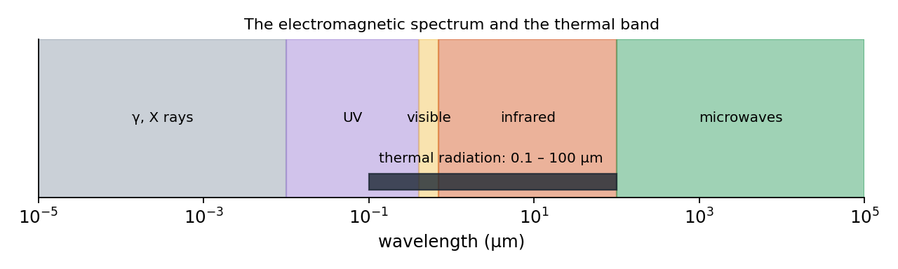
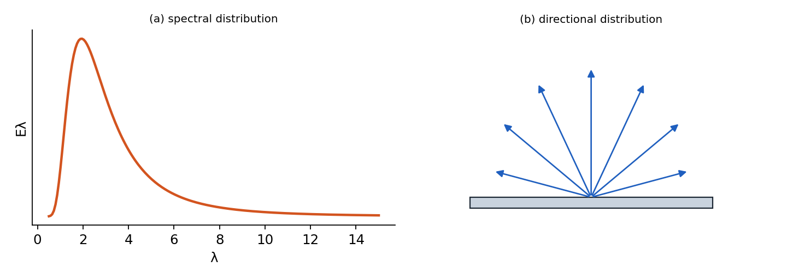
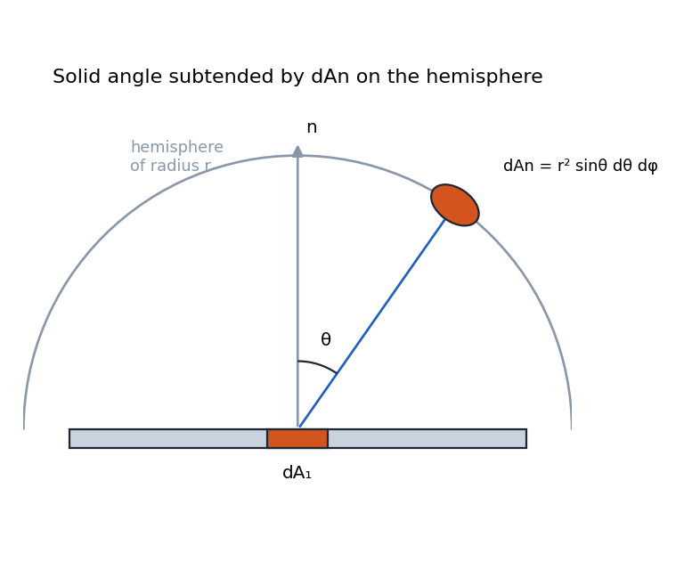

# Fundamentals of Thermal Radiation

## Introduction to Thermal Radiation

This lecture begins the third part of the heat transfer course, focusing on thermal radiation. The final exam will cover comprehensive material including all heat transfer modes, and may involve identifying which modes are dominant in different scenarios. We will spend approximately four weeks on radiation, with the last lecture reserved for review and comprehensive problems.

### Recap of Simple Radiation Model

In previous sections, we used a simplified radiation model for isothermal surfaces in isothermal enclosures. The net heat flux between the surface and its surroundings is given by:

$$
q'' = \varepsilon \sigma (T_{\text{sur}}^4 - T_{\text{surrounding}}^4)
$$

Where:

-   $\varepsilon$ is the emissivity (dimensionless, between 0 and 1)

-   $\sigma$ is the Stefan-Boltzmann constant: $5.67 \times 10^{-8}$ W/m$^2$K$^4$

-   $T_{\text{surface}}$ and $T_{\text{surrounding}}$ must be in Kelvin

However, this formula is limited in its applications. It cannot handle:

-   Surfaces with temperature gradients

-   Environments with non-uniform surrounding temperatures

-   Complex geometric interactions between surfaces

This section of the course will develop a more comprehensive understanding of radiation heat transfer, starting with the physics of the process, defining relevant terminology, and building protocols to calculate radiation exchange between multiple surfaces.

## Physical Origin of Thermal Radiation

### Fundamental Concepts

Several key concepts underpin our understanding of thermal radiation:

1.  **Vacuum as a material medium**: For radiation calculations, vacuum itself must be considered as a medium with specific material properties that allow electromagnetic waves to propagate.

2.  **Universal emission**: All matter with a finite absolute temperature emits thermal radiation in the form of Electromagnetic Waves (EMW).

3.  **Absorption requirement**: If materials emit radiation, they must also be capable of absorbing radiation; otherwise, thermodynamic laws would be violated.

4.  **Speed of propagation**: Electromagnetic waves travel at the speed of light ($c \approx 3 \times 10^8$ m/s in vacuum), which is essentially instantaneous for most heat transfer applications.

5.  **Wave characteristics**: Electromagnetic waves can be described by either wavelength ($\lambda$) or frequency ($f$), with the relationship $c = \lambda f$.

### Dipole Oscillation Mechanism

Thermal radiation originates at the atomic level through oscillating electric dipoles:

-   An electric dipole consists of a positive and negative charge separated by a small distance

-   When a dipole oscillates, it generates an oscillating electromagnetic field that propagates outward

-   The strength and frequency of the electromagnetic wave are determined by the strength and frequency of the dipole’s oscillation

-   In real materials, dipole oscillations are driven by internal thermal energy

-   Higher temperatures correspond to more energetic oscillations, producing more intense radiation

So

-   EMWs can be seen as oscillating EM fields driven by displacement of charges.

-   Outband EMW are determined by strength and frequency of oscillations.

Thermal energy causes random motion of atoms and molecules, which drives the oscillation of dipoles. This randomness follows the statistics of thermodynamics and forms the basis for blackbody radiation theory. 

$$
\begin{aligned}
        & \text{Thermal Energy} \rightarrow \text{EMW rich in freq/$\lambda $}
        \\
        &\text{Higher T (more internal Energy $U$)} \rightarrow \text{ stronger radiation} 
    \end{aligned}
$$

### Spectrum of Electromagnetic Waves

If we were to oscillate a dipole from very low frequencies up to very high frequencies ($\nu:0 \to \infty$), we would generate radiation across the electromagnetic spectrum:

-   At very low frequencies: invisible radiation

-   At approximately 430 THz: visible red light

-   Increasing frequency: orange, yellow, green, blue, violet

-   At very high frequencies: invisible again (ultraviolet)

Energy increases with frequency, which is why blue/violet light (higher frequency) carries more energy per photon than red light (lower frequency).

Thermal radiation spans a significant portion of the electromagnetic spectrum, with different wavelength regions categorized as:

-   Ultraviolet (UV): Below 0.4 $\mu$m

-   Visible: 0.4-0.7 $\mu$m

-   Near Infrared: 0.7-2 $\mu$m

-   Mid Infrared: 2-5 $\mu$m

-   Far Infrared: 5-100 $\mu$m

-   Microwave: 100 $\mu$m to centimeters

-   Radio: Centimeters and longer

For thermal engineering applications, we are primarily concerned with wavelengths from approximately 0.1 $\mu$m to 100 $\mu$m, depending on the temperature range of interest.

<figure markdown="span">
{ width="72%" }
<figcaption>Electromagnetic radiation spectrum</figcaption>
</figure>

### Material Interaction with Radiation

Real materials can be conceptualized as collections of dipoles. Their interaction with radiation depends on several factors:

-   **Emission depth**: In most solid materials, only dipoles near the surface (within a "skin depth") can emit radiation that reaches the outside world.

-   **Material opacity**: Materials that strongly absorb/emit radiation are considered opaque. For metals, the skin depth is typically 10-100 nanometers. For dielectrics like glass or water, it ranges from micrometers to millimeters.

-   **Transmission**: If the material thickness is less than the skin depth, some radiation can transmit through, making the material semi-transparent.

-   **Scattering**: Heterogeneous materials like fog or particulate suspensions can scatter radiation, making analysis more complex.

In this course, we will focus primarily on opaque materials, touch upon transparent materials, and only briefly introduce semi-transparent materials and scattering phenomena.

### Time Scales and Physics

Thermal radiation involves extremely fast processes:

-   Photon emission/absorption: Femtoseconds ($10^{-15}$ s)

-   Heat diffusion from skin layer: Picoseconds to nanoseconds ($10^{-12}$ to $10^{-9}$ s)

This rapid timescale means we typically don’t need to model absorption skin layers separately, as energy is quickly distributed in the material.

Another important characteristic of thermal radiation is the low photon density. Each photon essentially acts independently, without interacting with other photons. This makes the process linear and allows for simple superposition of radiation effects.

## Characterization of Thermal Emission

### Spectral and Directional Characteristics

Thermal radiation from real surfaces varies in two important ways:

1.  **Spectral Distribution**:Thermal radiation emitted by a surface encompasses a range of wavelengths. As shown in Figure <a href="#fig:spectral" data-reference-type="ref" data-reference="fig:spectral">1</a>, the magnitude of the radiation varies with wavelength, and the term spectral is used to refer to the nature of this dependence. As we will find, both the magnitude of the radiation at any wavelength and the spectral distribution vary with the nature and temperature of the emitting surface.

2.  **Directional Distribution**: The radiation intensity varies with the angle from the surface. This is constrained by thermodynamics, which prevents perfect collimation of thermal radiation. It can be measured by moving a detector around the surface.

These distributions help us characterize how different materials radiate energy.

<figure markdown="span">
{ width="72%" }
<figcaption>Radiation emitted by a surface. (a) Spectral distribution. (b) Directional distribution.</figcaption>
</figure>

### Surface Types

Real surfaces can generally be classified into two categories based on their directional emission patterns:

-   **Diffuse**: Surfaces where the power density (intensity) is uniform regardless of viewing angle. White paper appears equally bright from different angles because it’s approximately diffuse.

-   **Non-diffuse**: Surfaces where radiation intensity varies with direction. Glossy surfaces like glass or polished metal exhibit preferential reflection in certain directions.

## Mathematical Foundations for Radiation

### Solid Angle Concept

To describe radiation in three-dimensional space, we use the concept of solid angles:

-   **2D angle**: $d\alpha = \frac{dl}{r}$ \[rad\]

-   **3D solid angle**: $d\omega = \frac{dA_n}{r^2}$ \[sr\] (steradian)

For reference:

-   2D half space: $\frac{\pi r}{r} = \pi$ \[rad\], full space: $2\pi$ \[rad\]

-   3D half space: $2\pi$ \[sr\], full space: $4\pi$ \[sr\]

<figure markdown="span">
{ width="72%" }
<figcaption>Mathematical definitions. (a) Plane angle. (b) Solid angle. (c) Emission of radiation from a differential area <em>d</em><em>A</em>1 into a solid angle <em>d</em><em>ω</em> subtended by <em>d</em><em>A</em><em>n</em> at a point on <em>d</em><em>A</em>1. (d) The spherical coordinate system.</figcaption>
</figure>

Note that the unit of the solid angle is the steradian (sr), analogous to radians for plane angles.

### 3D Solid Angle in Spherical Coordinates

In spherical coordinates, the solid angle differential is: 

$$
d\omega = \sin\theta \, d\theta \, d\phi
$$

<figure markdown="span">
{ width="72%" }
<figcaption>The solid angle subtended by <em>d</em><em>A</em><em>n</em> at a point on <em>d</em><em>A</em>1 in the spherical coordinate system.</figcaption>
</figure>

### Summary

-   Radiation is characterized by wavelength

-   Radiation processes happen extremely fast, requiring temporal approximations

-   Emission and absorption are complementary processes with thermodynamic restrictions
