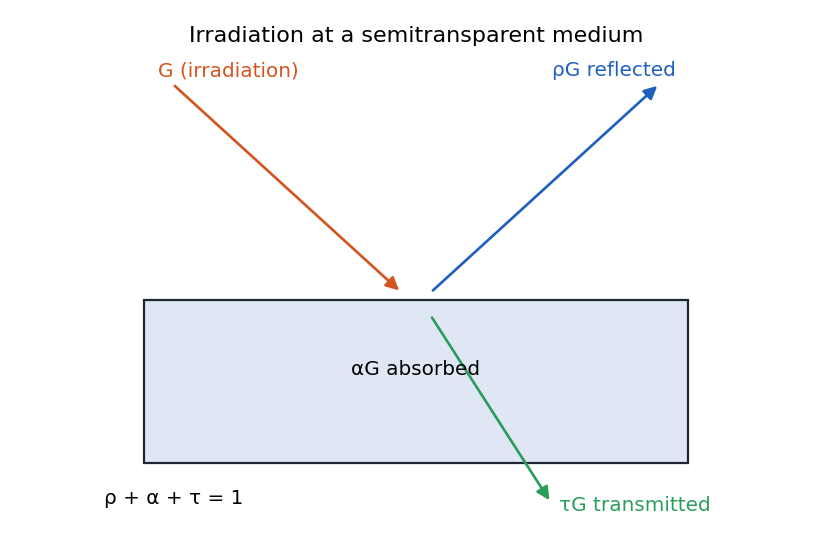
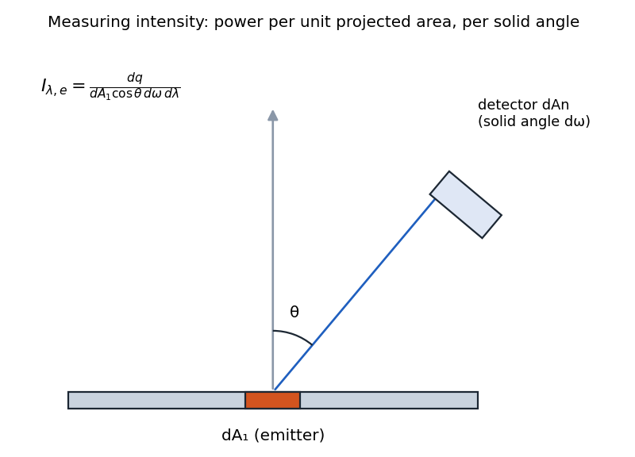
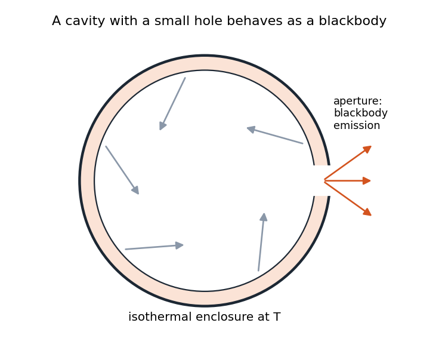
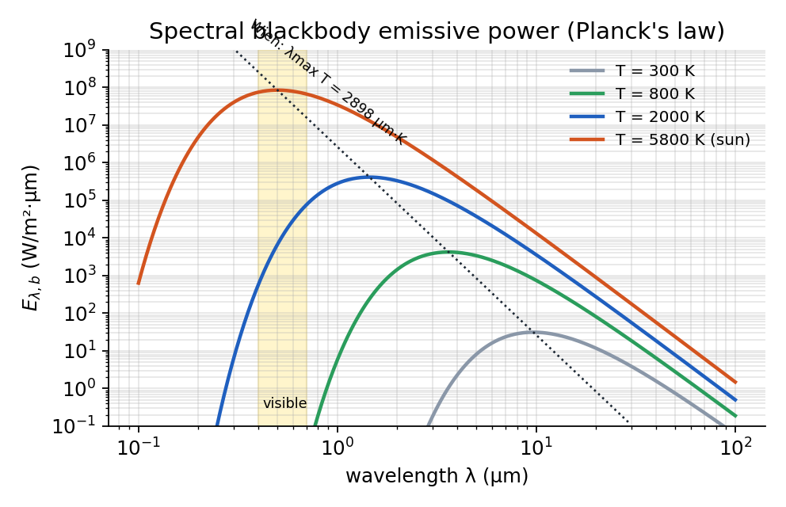
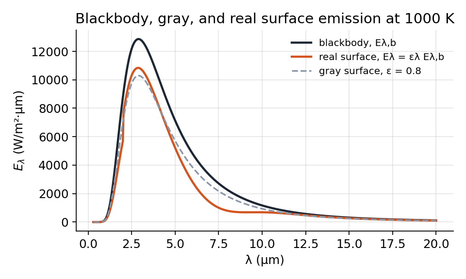
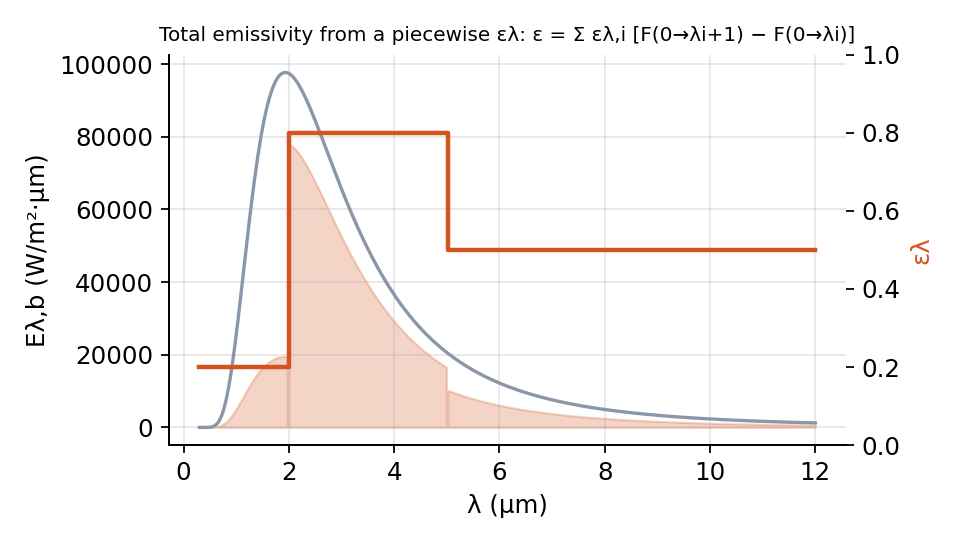
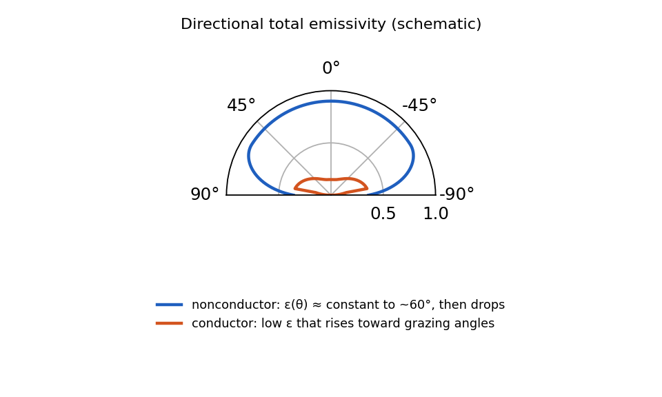
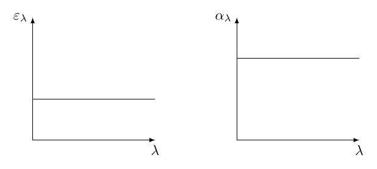

# Radiation Intensity, Surface Properties, and Blackbody Radiation

Historically, there has been debate about the nature of light:

-   Newton favored the particle theory

-   Maxwell’s equations supported the wave theory

-   Einstein later proposed the wave-particle duality concept

-   Modern physics has developed a more comprehensive understanding beyond simple duality

For thermal radiation analysis, we need to switch between wave and particle descriptions depending on the phenomenon being explained. This helps us better understand the various terminologies and processes involved in radiation heat transfer.

## Radiation Heat Fluxes

### Direction-Based Terminology

Similar to conduction heat transfer where we track heat from generation to dissipation, radiation heat transfer requires us to track the path of energy. We define key terms based on directional behavior:

<figure markdown="span">
{ width="72%" }
<figcaption>Radiation at a surface. (a) Reflection, absorption, and transmission of irradiation for a semitransparent medium. (b) The radiosity for an opaque medium.</figcaption>
</figure>

-   **Irradiation ($G$)**: Rate of incident radiation per unit area. Incoming radiation from external sources that lands on a surface (W/m$^2$).

-   **Reflection ($G_{ref}$)**: Portion of irradiation that bounces back from the surface (W/m$^2$).

-   **Absorption ($G_{abs}$)**: Portion of irradiation that is captured by the material near the surface (W/m$^2$).

-   **Transmission ($G_{tr}$)**: Portion of irradiation that passes through the material (for semi-transparent media) (W/m$^2$)

    For energy conservation in semi-transparent media: 

$$
G = G_{ref} + G_{abs} + G_{tr}
$$

    For opaque materials (no transmission): 

$$
G = G_{ref} + G_{abs}
$$

-   **Emission ($E$)**: Rate of energy emission per unit area. It is separate from irradiation processes, as it represents energy originating from within the material itself due to its temperature. It has no direct relationship with the incoming irradiation (W/m$^2$). 

$$
E = \varepsilon \sigma T^4_s
$$

-   **Radiosity ($J$)**: Rate of incident radiation per unit area . It represents the total radiation leaving a surface, combining both reflection and emission (W/m$^2$): 

$$
J = G_{ref} + E
$$

-   **Net Radiation Heat Flux ($q''_{\text{rad}}$**): is a scalar quantity representing the rate of energy transfer per unit area leaving the surface: 

$$
q''_{\text{rad}} = J - G
$$

Note that "emissive power" is somewhat of a misnomer, as it’s actually power per unit area (power density), not merely power.

## Radiative Properties

From a quantum/particle perspective, radiative properties like reflectivity, absorptivity, and transmissivity can be understood as probabilities: 

$$
\begin{aligned}
     G &=G_{\text {ref }}+G_{\text {abs }}+G_{\text {tr }} 
    \\[0.5em]
    1 &=\frac{G_{\text {ref }}}{G}+\frac{G_{\text {abs }}}{G}+\frac{G_{\text {tr }}}{G} 
    \\[0.5em]
    \quad 1 &=\rho+\alpha+\tau
    \end{aligned}
$$

 where,

-   **Reflectivity ($\rho$)**: Probability that a photon will be reflected at the surface

-   **Absorptivity ($\alpha$)**: Probability that a photon will be absorbed by the material

-   **Transmissivity ($\tau$)**: Probability that a photon will pass through the material

This probabilistic interpretation helps explain why these properties can depend on:

-   Direction of incoming photon

-   Wavelength (color) of the photon

-   Material properties

For obaque material ($\tau =0$) which means $\rho = 1- \alpha$: 

$$
\begin{aligned}
        q_{\text {rad }}^{\prime \prime} & = J - G
        \\[0.5em]
        q_{\text {rad }}^{\prime \prime} & = E + G_{ref} - G
        \\[0.5em]
        q_{\text {rad }}^{\prime \prime} & = E + \rho G - G
        \\[0.5em]
        q_{\text {rad }}^{\prime \prime} & = \underbrace{\varepsilon \sigma T_s^4}_{\textit{outbound}}- \underbrace{\alpha G}_{\textit{inbound}}
    \end{aligned}
$$

| **Flux (W/m$^2$)**                               | **Description**                                                  | **Comment**                                                                            |
|:-------------------------------------------------|:-----------------------------------------------------------------|:---------------------------------------------------------------------------------------|
| Emissive power, $E$                              | Rate at which radiation is emitted from a surface per unit area  | $E = \varepsilon\,\sigma\,T_s^{4}$                                                     |
| Irradiation, $G$                                 | Rate at which radiation is incident upon a surface per unit area | Irradiation can be reflected, absorbed, or transmitted                                 |
| Radiosity, $J$                                   | Rate at which radiation leaves a surface per unit area           | For an opaque surface: $J = E + \rho\,G$                                               |
| Net radiative flux, $q''_{\mathrm{rad}} = J - G$ | Net rate of radiation leaving a surface per unit area            | For an opaque surface: $q''_{\mathrm{rad}} = \varepsilon\,\sigma\,T_s^{4} - \alpha\,G$ |

Radiative Flux Quantities

## Radiation and Irradiation density

Temperature alone is insufficient to characterize radiation, as the distribution across wavelengths and directions is crucial. This leads to the concept of intensity.

#### Radiation Intensity

is defined as heat flux per unit solid angle per unit wavelength: 

$$
I_{\lambda,e}(\lambda,\theta,\phi) = \frac{dq}{dA_1 \cdot \cos\theta \cdot d\omega \cdot d\lambda} \left[\frac{\text{W}}{\text{m}^2 \cdot \text{sr} \cdot \mu\text{m}}\right]
$$

<figure markdown="span">
{ width="72%" }
</figure>

Where:

-   $dq$ is the energy rate

-   $dA_1$ is the surface area element

-   $\cos\theta$ accounts for the projected area

-   $d\omega$ is the solid angle element

-   $d\lambda$ is the wavelength interval

This definition includes:

-   $\cos\theta$ factor to account for projected area

-   Solid angle to measure the angular spread

-   Wavelength interval for spectral distribution

The units of intensity are W/(m$^2$·sr·$\mu$m), where "sr" represents steradian (solid angle unit) and "$\mu$m" represents the wavelength unit. 

$$
I_{\lambda ,e}(\lambda, \theta, \phi) \rightarrow
        \left\{
            \begin{array}{l}
                \text{spectral} \propto (\lambda) 
                \\
                 \text{directional} \propto (\theta, \phi)
            \end{array}
        \right.
$$

#### Irradiation Intensity

is defined similarly for incoming radiation:

$$
I_{\lambda,i}(\lambda,\theta,\phi) = \frac{dq_{\text{incident}}}{dA_1 \cos\theta \cdot d\omega\cdot d\lambda} \left[\frac{\text{W}}{\text{m}^2 \cdot \text{sr} \cdot \mu\text{m}}\right]
$$

Note: Intensity should not be confused with brightness, which is a different concept related to perception.

## Qualifiers on Surface Properties

Surface properties such as emissivity ($\varepsilon$), absorptivity ($\alpha$), reflectivity ($\rho$), and transmissivity ($\tau$) can depend on:

-   Wavelength ($\lambda$)

-   Direction, defined by angles $\theta$ and $\phi$

To describe this dependence, we use specific qualifiers:

-   **Spectral**: Indicates dependence on wavelength $\lambda$

-   **Total**: Indicates integration over all wavelengths

-   **Directional**: Indicates dependence on direction ($\theta$, $\phi$)

-   **Hemispherical**: Indicates integration over all directions

Here are some examples:

-   **Hemispherical total emissivity:** $\bar{\varepsilon}$  
    (Independent of both wavelength and direction)

-   **Hemispherical spectral emissivity:** $\varepsilon_\lambda$  
    (Depends on $\lambda$, integrated over all angles)

-   **Directional spectral absorptivity:** $\alpha_{\lambda, \theta, \phi}$  
    (Depends on both $\lambda$ and direction)

## Integrated Radiative Quantities

For engineering calculations, intensity is often integrated over direction and/or wavelength to obtain simpler quantities.

#### Spectral Hemispherical Flux

is the intensity integrated over all directions in the hemisphere: 

$$
\begin{array}{ll}
        \text{emission} &  E_{\lambda}(\lambda) =  q''_{\lambda}(\lambda)= \int_0^{2\pi} \int_0^{\pi/2} I_{\lambda,e}(\lambda,\theta,\phi) \sin\theta \cos\theta \, d\theta \, d\phi \left[\frac{\text{W}}{\text{m}^2 \cdot \mu\text{m}}\right]
        \\[1.5em]
        \text{irradiation} & G_{\lambda}(\lambda) = \int_0^{2\pi} \int_0^{\pi/2} I_{\lambda,i}(\lambda,\theta,\phi) \sin\theta \cos\theta \, d\theta \, d\phi \left[\frac{\text{W}}{\text{m}^2 \cdot \mu\text{m}}\right]
    \end{array}
$$

#### Total Heat Flux

is the spectral quantity integrated over all wavelengths: 

$$
\begin{array}{ll}
        \text{emission} &  E = q'' = \int_0^{\infty} E_{\lambda}(\lambda) \, d\lambda \left[\frac{\text{W}}{\text{m}^2}\right]
        \\[1.5em]
        \text{irradiation} & G = \int_0^{\infty} G_{\lambda}(\lambda) \, d\lambda \left[\frac{\text{W}}{\text{m}^2}\right]
    \end{array}
$$

## Diffuse Surfaces and Radiation

A surface is called **diffuse** if its radiation intensity is uniform in all directions: For diffuse emission: 

$$
I_{\lambda,e}(\lambda,\theta,\phi) = I_{\lambda,e}(\lambda) \quad \text{(independent of $\theta$ and $\phi$)}
$$

 For diffuse irradiation: 

$$
I_{\lambda,i}(\lambda,\theta,\phi) = I_{\lambda,i}(\lambda) \quad \text{(independent of $\theta$ and $\phi$)}
$$

 Therefore, 

$$
\begin{array}{ll}
        \text{emission} &  E_{\lambda}(\lambda) =  q''_{\lambda}(\lambda)= \textcolor{red}{I_{\lambda,e}(\lambda)} \int_0^{2\pi} \int_0^{\pi/2} \sin\theta \cos\theta \, d\theta \, d\phi  
        \\[1.5em]
        &  E_{\lambda}(\lambda) = I_{\lambda,e} \pi \ \left[\frac{\text{W}}{\text{m}^2 \cdot \mu\text{m}}\right]
        \\[1.5em]
        \text{irradiation} & G_{\lambda}(\lambda) = \textcolor{red}{I_{\lambda,i}(\lambda)}\int_0^{2\pi} \int_0^{\pi/2}  \sin\theta \cos\theta \, d\theta \, d\phi
        \\[1.5em]
        & G_{\lambda}(\lambda) = I_{\lambda,i}\pi \ \left[\frac{\text{W}}{\text{m}^2 \cdot \mu\text{m}}\right]
    \end{array}
$$

 When a problem is described as "diffuse," it typically means both the surface emission and irradiation are assumed to be diffuse.

### Relationship Between Intensity and Flux for Diffuse Radiation

For diffuse surfaces, the integration simplifies:

!!! abstract "Definition"

    $$
    \begin{aligned}
            E &= \int_0^{\infty} E_{\lambda} \, d\lambda 
               = \int_0^{\infty} I_{\lambda,e}(\lambda) \underbrace{\left(\int_0^{2\pi} \int_0^{\pi/2}  \sin\theta \cos\theta \, d\theta \, d\phi \right) }_{\pi}\, d\lambda  
               = \int_0^{\infty} I_{\lambda,e}\,\pi \, d\lambda
            \\[1em]
            E &= \pi I_e \ \left[\frac{\text{W}}{\text{m}^2}\right]
        \end{aligned}
    $$

     Similarly: 

    $$
    G = \pi I_i \ \left[\frac{\text{W}}{\text{m}^2}\right]
    $$

    Also for total radiosity ($J$): 

    $$
    J = E + \rho G = \pi I_e + \pi \;\overbrace{\rho I_i}^{I_r} = \pi (I_e + I_r) = \pi I_{e+r}
    $$

### Special Notes

-   Intensities are defined based on *normal area* (i.e., include a $1/\cos\theta$ term in the definitions).

-   Fluxes are defined based on *actual surface area* (i.e., include a $\cos\theta$ term in integrations).

-   In this class, we usually assume:

    1.  diffuse emission,

    2.  diffuse reflection, and

    3.  diffuse irradiation, with or without spectral distributions.

## Blackbody Radiation

A blackbody is a theoretical surface that:

-   Absorbs all incident radiation (over all $\lambda$, $\theta$, and $\phi$)

-   Emits the maximum possible thermal radiation for a given $T$ and $\lambda$

-   is a diffuse matter that is independent of directions (but emission is still a function of $\lambda$ and $T$)

$$
\left.\begin{array}{l}
    \text { perfect absorber } 
    \\
    \text { perfect emitter }
    \end{array}\right\} 
    \Rightarrow 
    \begin{aligned}
        & \text { doesn't exist. } 
        \\
        & \text { but serves at a useful reference. }
    \end{aligned}
$$

 The name "blackbody" refers to a surface, not a three-dimensional object. In reality:

-   Emission from the aperture of any isothermal enclosure will have the characteristics of blackbody radiation.

-   Irradiation of any small object inside the enclosure may be approximated as being equal to emission from a blackbody at the enclosure surface temperature.

<figure markdown="span">
{ width="72%" }
</figure>

### Planck’s Distribution

The spectral emissive power of a blackbody is described by Planck’s distribution:

!!! abstract "Definition"

    $$
    E_{\lambda,b}(\lambda,T)  = \frac{C_1}{\lambda^5[\exp(C_2/\lambda T)-1]} = \pi I_{\lambda,b}(\lambda,T)
    $$

    Where: 

    $$
    \begin{aligned}
        C_1 &= 2\pi h c_0^2 = 3.742 \times 10^8 \frac{\text{W} \cdot \mu\text{m}^4}{\text{m}^2}
        \\
        C_2 &= \frac{h c_0}{k} = 1.439 \times 10^4 \, \mu\text{m} \cdot \text{K}
        \\
        h &= 6.626 \times 10^{-34} \, \text{J} \cdot \text{s} \quad \text{(Planck's constant)} 
        \\
        k &= 1.381 \times 10^{-23} \, \text{J/K} \quad \text{(Boltzmann's constant)}
        \\
        c_0 &= 2.998 \times 10^8 \, \text{m/s} \quad \text{(speed of light in vacuum)} 
        \\
        T &= \text{absolute temperature [K]}
    \end{aligned}
    $$

Planck’s distribution was a groundbreaking development that:

-   Initially emerged from curve-fitting experimental data

-   Led to the concept of energy quantization

-   Marked the transition from classical to quantum physics

-   Introduced the quantum theory even before Planck himself fully accepted its implications

### Blackbody Radiation Properties

The spectral distribution of blackbody radiation has these key characteristics:

-   The peak wavelength shifts toward shorter wavelengths as temperature increases

-   The magnitude of the emissive power increases with temperature.

-   The shape of the spectral distribution remains similar but scales with temperature

-   Most of the energy is concentrated in certain wavelength ranges

<figure markdown="span">
{ width="72%" }
<figcaption>Spectral blackbody emissive power.</figcaption>
</figure>

Planck’s law in a few lines (the figure above is this code for several temperatures):

~~~ python
import numpy as np
C1, C2 = 3.7418e8, 1.4388e4                  # W um^4/m^2 and um K
def planck(lam_um, T):                       # spectral blackbody emissive power, W/(m^2 um)
    return C1 / (lam_um**5 * (np.exp(C2 / (lam_um * T)) - 1))

lam = np.logspace(-1, 2, 500)
E = planck(lam, 5800)                        # the sun
print(f"peak at {lam[E.argmax()]:.2f} um, Wien predicts {2898/5800:.2f} um")
~~~

### Stefan-Boltzmann Law

The total emissive power from a blackbody is obtained by integrating the Planck distribution over all wavelengths:

!!! abstract "Definition"

    $$
    E_b = \int_0^{\infty} E_{\lambda,b} \, d\lambda = \sigma T^4
    $$

    Where $\sigma = 5.67 \times 10^{-8}$ W/m$^2$K$^4$ is the Stefan-Boltzmann constant.

This law shows that the total energy emitted by a blackbody increases with the fourth power of its absolute temperature.

### Wien’s Displacement Law

Wien’s displacement law gives the wavelength of maximum emission for a blackbody:

!!! abstract "Definition"

    $$
    \lambda_{max} \cdot T = C_3 =  2897.8 \, \mu\text{m} \cdot \text{K}
    $$

This explains why different temperature objects emit radiation in different parts of the spectrum:

-   Sun ($\approx$ 5800 K): Peak in visible range ($\approx$ 0.5 $\mu$m)

-   Light bulb ($\approx$ 2900 K): Peak in near infrared ($\approx$ 1.0 $\mu$m)

-   Room temperature objects ($\approx$ 300 K): Peak in far infrared ($\approx$ 10 $\mu$m)

### Fractional Blackbody Energy Function

For engineering calculations, the fraction of blackbody energy emitted within a wavelength range is useful:

<figure markdown="span">
{ width="72%" }
<figcaption>(a) Radiation emission from a blackbody in the spectral band 0 to <em>λ</em>, (b) Fraction of the total blackbody emission in the spectral band from 0 to <em>λ</em> as a function of <em>λ</em> <em>T</em></figcaption>
</figure>

!!! abstract "Definition"

    $$
    F_{(0 \rightarrow \lambda)} \equiv \frac{\int_0^\lambda E_{\lambda, b} d \lambda}{\int_0^{\infty} E_{\lambda, b} d \lambda}=\frac{\int_0^\lambda E_{\lambda, b} d \lambda}{\sigma T^4}=\int_0^{\lambda T} \frac{E_{\lambda, b}}{\sigma T^5} d(\lambda T)=f(\lambda T)
    $$

This fraction depends only on the product $\lambda T$, and values are tabulated for convenience (Table 12.2 textbook). They may also be used to obtain the fraction of the radiation between any two wavelengths $\lambda_1$ and $\lambda_2$, since

!!! abstract "Definition"

    $$
    F_{\left(\lambda_1 \rightarrow \lambda_2\right)}=\frac{\int_0^{\lambda_2} E_{\lambda, b} d \lambda-\int_0^{\lambda_1} E_{\lambda, b} d \lambda}{\sigma T^4}=F_{\left(0 \rightarrow \lambda_2\right)}-F_{\left(0 \rightarrow \lambda_1\right)}
    $$

#### Example:

Find the efficiency of a light bulb with a tungsten filament at 2900 K, visible in range of $350-750$ nm (assume the filament is a blackbody).

*solution:* 

$$
\eta = \frac{\text{usable E}}{\text{Total E}} = \frac{\text{visible portion}}{\text{Total E}}
$$

 For a filament at 2900 K:

-   Peak wavelength $\approx$ 1.45 $\mu$m (infrared)

-   Visible range: 350-750 nm = 0.35-0.75 $\mu$m

-   $\lambda_1 T = 0.35 \times 2900 = 1015$ $\mu\, m\,K$

-   $\lambda_2 T = 0.75 \times 2900 = 2175$ $\mu\, m\,K$

From blackbody fraction tables, the efficiency is approximately: 

$$
\begin{aligned}
        \eta & = \frac{\text{visible portion}}{\text{Total E}} =  F_{(0 \rightarrow \lambda_2)} - F_{(0 \rightarrow \lambda_1)}
        \\[1em]
        & = 0.013754-0.000008
        \\[1em]
        &\approx 0.01375 \text{ or } 1.375\%
    \end{aligned}
$$

This low efficiency is typical for incandescent bulbs, which emit most energy as heat rather than visible light.

## Emission from Real Surfaces

Real surfaces emit less radiation than blackbodies at the same temperature. Emissivity quantifies this relationship: 

$$
\text{Emissivity} = \frac{\text{Radiation emitted by real surface}}{\text{Radiation emitted by blackbody at same temperature}}
$$

<figure markdown="span">
{ width="72%" }
<figcaption>Comparison of spectral distribution of blackbody and real surface emission.</figcaption>
</figure>

### Types of Emissivity

Similar to absorptivity, emissivity can be defined at different levels:

1.  Spectral, directional emissivity: 

$$
\varepsilon_{\lambda,\theta}(\lambda,\theta,\phi,T_s) = \frac{I_{\lambda,e}(\lambda,\theta,\phi,T_s)}{I_{\lambda,b}(\lambda,T_s)}
$$

2.  Total directional emissivity: 

$$
\varepsilon_{\theta}(\theta,\phi,T_s) = \frac{I_e(\theta,\phi,T_s)}{I_b(T_s)}
$$

3.  Spectral, hemispherical emissivity: 

$$
\varepsilon_{\lambda}(\lambda,T_s) = \frac{E_{\lambda}(\lambda,T_s)}{E_{\lambda,b}(\lambda,T_s)}
$$

4.  Total, hemispherical emissivity:

!!! abstract "Definition"

    

    $$
    \varepsilon(T_s)  =\frac{\int_0^{\infty} \varepsilon_\lambda E_{b, \lambda}(T) d \lambda}{\int_0^{\infty} E_{b, \lambda}(T) d \lambda}= \frac{E(T_s)}{E_b(T_s)}
    $$

     this total emissivity is intrinsic surface properties. If we are given emmisivity vs wavelength where the integration may be performed in parts:

        <figure markdown="span">
    { width="72%" }
    </figure>

        The total emmisivity can be found as follows: 

    $$
    \varepsilon=\frac{\int_0^{\infty} \varepsilon_\lambda E_{\lambda, b} d \lambda}{E_b}=\frac{\varepsilon_1 \int_0^{\lambda_1} E_{\lambda, b} d \lambda}{E_b}+\frac{\varepsilon_2 \int_{\lambda_1}^{\lambda_2} E_{\lambda, b} d \lambda}{E_b} + \cdots
    $$

     which can be simplified to 

    $$
    \varepsilon=\varepsilon_1 F_{(0 \rightarrow \lambda_1)}+\varepsilon_2\left[F_{(0 \rightarrow \lambda_2 )}-F_{(0 \rightarrow \lambda_1)}\right] + \cdots
    $$

     Each $F_{0\to \lambda_j}$ can be find using the table at $\lambda_j T_{surface}$.

### Emissivity Characteristics

General trends in material emissivity:

-   Metals typically have low emissivity, especially if polished (due to high electron mobility)

-   Dielectrics (oxides, ceramics) typically have high emissivity

-   Non-conductors have high emissitivity ($\varepsilon > 0.6$)

-   Emissivity varies with angle - typically constant near normal, dropping near grazing angles

-   For engineering calculations, normal emissivity ($\varepsilon_n$) is often a good approximation. 

$$
\varepsilon = \varepsilon_n,\qquad \qquad \text{when }\theta=0^\circ
$$

<figure markdown="span">
{ width="72%" }
<figcaption>Representative directional distributions of the total, directional emissivity.</figcaption>
</figure>

### Radiative Properties

We define several radiative properties to characterize surface behavior:

#### 1. Absorptivity:

1.  Spectral, directional absorptivity: 

$$
\alpha_{\lambda,\theta}(\lambda,\theta,\phi) = \frac{I_{\lambda,i,\text{abs}}(\lambda,\theta,\phi)}{I_{\lambda,i}(\lambda,\theta,\phi)}
$$

2.  Spectral, hemispherical absorptivity: 

$$
\alpha_{\lambda} = \frac{G_{\lambda,\text{abs}}(\lambda)}{G_{\lambda}(\lambda)}
$$

3.  Total, hemispherical absorptivity:

!!! abstract "Definition"

    

    $$
    \alpha = \frac{\displaystyle\int_0^{\infty} \alpha_\lambda(\lambda) G_\lambda(\lambda) d \lambda}{\displaystyle\int_0^{\infty} G_\lambda(\lambda) d \lambda} = \frac{\displaystyle\int_0^{\infty} \alpha_\lambda(\lambda) G_\lambda(\lambda) d \lambda}{G} = \frac{G_{abs}}{G}
    $$

        *Note:* If graph of $G_\lambda$ is given and $\alpha_\lambda$ is constant in different intervals, then we can easily integrate.

        *Note 2:* If $G_\lambda$ is not given $\alpha_\lambda$ is constant in different intervals, but surface is irradiated by large opaque enclosure, then we know $G_\lambda = E_{b,\lambda}$ so we can use fractional functions $F$ at $(\lambda_i T_{surr})$.

#### 2. Reflectivity:

1.  Spectral, directional reflectivity: 

$$
\rho_{\lambda,\theta}(\lambda,\theta,\phi) = \frac{I_{\lambda,i,\text{ref}}(\lambda,\theta,\phi)}{I_{\lambda,i}(\lambda,\theta,\phi)}
$$

2.  Spectral, hemispherical reflectivity: 

$$
\rho_{\lambda} = \frac{G_{\lambda,\text{ref}}(\lambda)}{G_{\lambda}(\lambda)}
$$

3.  Total, hemispherical reflectivity:

!!! abstract "Definition"

    

    $$
    \rho  = \frac{\displaystyle\int_0^{\infty} \rho_\lambda(\lambda) G_\lambda(\lambda) d \lambda}{\displaystyle\int_0^{\infty} G_\lambda(\lambda) d \lambda} = \frac{\displaystyle\int_0^{\infty} \rho_\lambda(\lambda) G_\lambda(\lambda) d \lambda}{G} =\frac{G_{ref}}{G}
    $$

#### 3. Transmissivity:

1.  Spectral, directional transmissivity: 

$$
\tau_{\lambda,\theta}(\lambda,\theta,\phi) = \frac{I_{\lambda,i,\text{tr}}(\lambda,\theta,\phi)}{I_{\lambda,i}(\lambda,\theta,\phi)}
$$

2.  Spectral, hemispherical transmissivity: 

$$
\tau_{\lambda} = \frac{G_{\lambda,\text{tr}}(\lambda)}{G_{\lambda}(\lambda)}
$$

3.  Total, hemispherical transmissivity:

!!! abstract "Definition"

    

    $$
    \tau = \frac{\displaystyle\int_0^{\infty} \tau_\lambda(\lambda) G_\lambda(\lambda) d \lambda}{\displaystyle\int_0^{\infty} G_\lambda(\lambda) d \lambda} = \frac{\displaystyle\int_0^{\infty} \tau_\lambda(\lambda) G_\lambda(\lambda) d \lambda}{G} = \frac{G_{trs}}{G}
    $$

### Conservation Relationships

For all radiative interactions, the conservation of energy requires:

!!! abstract "Semi-transparent media"

    $$
    \rho_{\lambda} + \alpha_{\lambda} + \tau_{\lambda} = 1 \quad \text{(spectral)}
    $$

 

    $$
    \rho + \alpha + \tau = 1 \quad \text{(total)}
    $$

!!! abstract "Opaque media"

    $$
    \rho_{\lambda} + \alpha_{\lambda} = 1 \quad \text{(spectral)}
    $$

 

    $$
    \rho + \alpha = 1 \quad \text{(total)}
    $$

## Large opaque isothermal enclosure

For a large opaque isothermal enclosure, we can apply a useful simplification:

-   For any point within the enclosure, radiosity equals irradiation: $J = G$

-   The black body emission equals both radiosity and irradiation: $E_b = G = J$ 

$$
\begin{aligned}
                    &J =\varepsilon E_b+ \rho G
                    \\[0.5em]
                    &J = \textcolor{red}{(1-\rho)} E_b+ \rho G
                    \\[0.5em]
                    &J  = (1-\rho) E_b+\rho G
                \end{aligned}
$$

 we know $J=G$ so 

$$
\begin{aligned}
                &(1-\rho) E_b+\rho G = G
                \\[0.5em]
                & (1-\rho) E_b  =(1-\rho) G
                \\[0.5em]
                & E_b  =G=J = \sigma T_{surr}^4
            \end{aligned}
$$

This means that regardless of the actual surface properties, we can treat the enclosure as having an effective emissivity of 1 (black body) for calculation purposes. This concept is sometimes called a "black body cavity" or "black cavity" and is used in practical applications and in deriving Kirchhoff’s Law.

*Note:* This approximation is also valid when the surroundings are **high‑emissivity** (nearly black, $\varepsilon\!\approx\!1$) like Sun is considered as a black body.

## Kirchhoff’s Law

#### Fundamental statement

At each wavelength $\lambda$ and direction $(\theta,\phi)$, 

$$
\varepsilon_{\lambda,\theta,\phi}(T)=\alpha_{\lambda,\theta,\phi}(T).
$$

 There are several conditions:

1.  **Diffuse surface or diffuse irradiation** If the emission/irradiation is direction‑independent (diffuse) then 

$$
\varepsilon_{\lambda}(T)=\alpha_{\lambda}(T)
$$

2.  **Large opaque isothermal enclosure with $T_s=T_{surr}$** In this special rare case, we also have 

$$
\varepsilon =\alpha
$$

3.  **Gray surface** We can assume $\varepsilon$ and $\alpha$ are wavelength independent: 

$$
\left\{\begin{aligned}
                    \varepsilon_{\lambda} &=\varepsilon_0
                    \\[0.5em]
                    \alpha_{\lambda} &=\alpha_0        
                \end{aligned}\right.
$$

 This is never universal, but a good approximation over small wavelength bands; useful for treating interacting surfaces at similar $T$.

    <figure markdown="span">
{ width="72%" }
</figure>

4.  **Diffuse + gray**: As a result of Kirchoff’s Law, $\varepsilon_{\lambda,\theta,\phi}(T)=\alpha_{\lambda,\theta,\phi}(T)$, at equilibirum:

    -   If the irradiation is diffuse OR the surface is diffuse

    -   The surface is gray

    Then we have 

$$
\varepsilon = \alpha
$$

## Net Radiative Heat Flux for a Diffuse, Opaque Surface

Consider a **diffuse, opaque** surface (transmissivity $\tau=0$) at temperature $T_s$.

#### Radiosity $J$

Because the surface is opaque, anything not emitted is reflected: 

$$
J = E + G_{ref} = \varepsilon E_b+ \rho G = \underbrace{\varepsilon\sigma T_s^{4}}_{\text{emitted}} + \underbrace{(1-\alpha)G}_{\text{reflected}}.
$$

#### Net heat flux

With the approximation $G \approx \sigma T_{surr}^{4}$ the outward net flux is 

$$
q''_{\text{rad,net}} = J - G = \sigma\bigl(\varepsilon T_s^{4} - \alpha T_{surr}^{4}\bigr).
$$

#### Gray surface or $T_s=T_{surr}$

If $\varepsilon=\alpha$ (gray assumption, or simply equal temperatures), then 

$$
q''_{\text{rad,net}} = \varepsilon\sigma\bigl(T_s^{4}-T_{surr}^{4}\bigr).
$$

 The total rate for area $A$ is $q_{\text{rad,net}} = q''_{\text{rad,net}}\,A$.

| **Concept**                                                         | **Equations**                                                                                                                                               | **Remarks**                                                                                                                              |
|:--------------------------------------------------------------------|:------------------------------------------------------------------------------------------------------------------------------------------------------------|:-----------------------------------------------------------------------------------------------------------------------------------------|
| Kirchhoff’s law                                                     | $\displaystyle \varepsilon_{\lambda,\theta,\phi}(T)                                                                                                         
                                                                                         =\alpha_{\lambda,\theta,\phi}(T)$                                                                                                          | Requires surface and radiation field at the same temperature; ensures emissivity equals absorptivity for all wavelengths and directions. |
| Gray surface                                                        |                                                                                                                                                             |                                                                                                                                          |
| $\displaystyle \alpha_{\lambda} \approx \alpha_0$                   | Assumes spectral properties constant over the relevant wavelength range, simplifying integrations when variation is negligible.                             |                                                                                                                                          |
| Diffuse surface                                                     |                                                                                                                                                             |                                                                                                                                          |
| $\displaystyle \alpha_{\lambda,\theta,\phi}\approx\alpha_{\lambda}$ | Emission and absorption independent of direction (independent of $\theta$ and $\phi$).                                                                      |                                                                                                                                          |
| Black body                                                          |                                                                                                                                                             |                                                                                                                                          |
| $\displaystyle \Rightarrow\;\varepsilon=\alpha=1,\;\rho=\tau=0$     | Ideal emitter/absorber at all $\lambda$, $\theta$, $\phi$; hemispherical emissive power $E_b=\sigma T^4$ comes from integrating radiance over a hemisphere. |                                                                                                                                          |
| Opaque surface                                                      |                                                                                                                                                             |                                                                                                                                          |
| Total: $\alpha+\rho=1$                                              | No transmission (all incident radiation is absorbed or reflected); common behavior for solids in the infrared (IR).                                         |                                                                                                                                          |

Summary of Kirchhoff’s law, gray, diffuse, black-body, and opaque-surface concepts.
