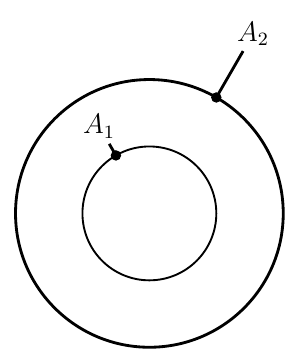
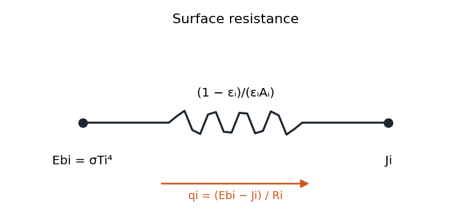
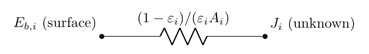

# Kirchhoff's Law and View Factors

## Kirchhoff’s Law

Due to the complexity of radiation processes, finding useful approximations for quick calculations is valuable. Kirchhoff’s Law provides an important simplification.

The complete statement of Kirchhoff’s Law is:

-   For an isothermal enclosure in radiative equilibrium, the total emissivity equals the total absorptivity for all surfaces, regardless of surface properties: 

$$
\varepsilon_{\mathrm{total}} = \alpha_{\mathrm{total}}
$$

While this is theoretically correct, it applies to thermal equilibrium where no net heat transfer occurs. However, we can apply this law practically when:

1.  $T_{\mathrm{surface}} \approx T_{\mathrm{surrounding}}$ (temperatures are not too far apart)

2.  The radiation environment is large, opaque, and isothermal

Kirchhoff’s Law can be extended to more specific cases:

-   For directional and spectral properties: $\varepsilon_{\lambda,\theta,\phi} = \alpha_{\lambda,\theta,\phi}$

-   For diffuse surfaces or diffuse radiation: $\varepsilon_{\lambda} = \alpha_{\lambda}$

-   For gray bodies or black body radiation: $\varepsilon = \alpha$

These special cases are particularly useful. If either the radiation is diffuse or the surface is diffuse, we can use $\varepsilon_{\lambda} = \alpha_{\lambda}$. This means either the surface or the environment needs to be diffuse for this relationship to hold.

## Gray Surfaces

A gray surface is an approximation where spectral properties (emissivity and absorptivity) are assumed constant across all wavelengths. This creates an apparent circular definition: 

$$
\begin{aligned}
        & \varepsilon_\lambda=\frac{\int_0^{2 \pi} \int_0^{\pi / 2} \varepsilon_{\lambda, \theta} \cos \theta \sin \theta d \theta d \phi}{\int_0^{2 \pi} \int_0^{\pi / 2} 1 \cdot \cos \theta \sin \theta d \theta d \phi}
        \\[1em]
        & \alpha_\lambda=\frac{\int_0^{2 \pi} \int_0^{\pi / 2} \alpha_{\lambda, \theta} I_{\lambda, i} \cos \theta \sin \theta d \theta d \phi}{\int_0^{2 \pi \pi} \int_0^{\pi / 2} I_{\lambda, i} \cos \theta \sin \theta d \theta d \phi}
\end{aligned}
$$

 In general, $\varepsilon_\lambda \equiv \alpha_\lambda$. but $\varepsilon_{\lambda, \theta} \equiv \alpha_{\lambda, \theta}$. When

1.  $I_{\lambda, i}$ is NOT a function of ($\theta$, $\phi$) ie., irradiation is diffuse.

2.  $\varepsilon_{\lambda, \theta}$ and $\alpha_{\lambda, \theta}$ are NOT functions of ($\theta, \phi$) i.e., surface is diffuse.

We have, $\varepsilon_\lambda=\alpha_\lambda$ for a diffuse surface or diffuse irradiation.

Similarly, 

$$
\varepsilon=\frac{\int_0^{\infty} \varepsilon_\lambda E_{\lambda, b}(\lambda, T) d \lambda}{\underbrace{\int_0^{\infty} 1 \cdot E_{\lambda, b}(\lambda, T) d \lambda}_{E_b}}
    \stackrel{?}{=} 
    \frac{\int_0^{\infty} \alpha_\lambda G_\lambda(\lambda) d \lambda}{\underbrace{\int_0^{\infty} 1 \cdot G_\lambda(\lambda) d \lambda}_{G}}=\alpha
$$

 $\varepsilon=\alpha$ when:

1.  $G_\lambda(\lambda)=c \cdot E_{\lambda, b}(\lambda, T) \longrightarrow G=c \cdot E_b(T)$ irradiation corresponds to emission from a blackbody at the same surface temperature.

2.  The surface is gray ( $\alpha_\lambda$ and $\varepsilon_\lambda$ are independent of $\lambda$ ).

we can assume a surface to be gray if. both surface emission $E_{\lambda, b}$ and irradiation fall into a region where $\varepsilon_\lambda$ and $\alpha_\lambda$ are approximately constants. **View factors for three common three-dimensional geometries** (the same relations that produce the charts above).

**Aligned parallel rectangles** $X \times Y$ a distance $L$ apart, with $\bar X = X/L$ and $\bar Y = Y/L$: 

$$
F_{ij} = \frac{2}{\pi \bar X \bar Y}\left\{ \ln\!\left[\frac{(1+\bar X^2)(1+\bar Y^2)}{1+\bar X^2+\bar Y^2}\right]^{1/2}
+ \bar X (1+\bar Y^2)^{1/2}\tan^{-1}\!\frac{\bar X}{(1+\bar Y^2)^{1/2}}
+ \bar Y (1+\bar X^2)^{1/2}\tan^{-1}\!\frac{\bar Y}{(1+\bar X^2)^{1/2}}
- \bar X\tan^{-1}\bar X - \bar Y \tan^{-1}\bar Y \right\}
$$

**Coaxial parallel disks** of radii $r_i$ and $r_j$ a distance $L$ apart, with $R_i = r_i/L$, $R_j = r_j/L$, and $S = 1 + (1+R_j^2)/R_i^2$: 

$$
F_{ij} = \tfrac12\left\{ S - \left[S^2 - 4(r_j/r_i)^2\right]^{1/2} \right\}
$$

**Perpendicular rectangles with a common edge** $X$, the surfaces having widths $Y$ (surface $i$) and $Z$ (surface $j$), with $H = Z/X$ and $W = Y/X$: 

$$
F_{ij} = \frac{1}{\pi W}\left( W\tan^{-1}\frac1W + H\tan^{-1}\frac1H - (H^2+W^2)^{1/2}\tan^{-1}\frac{1}{(H^2+W^2)^{1/2}}
+ \frac14 \ln\left\{ \frac{(1+W^2)(1+H^2)}{1+W^2+H^2}\left[\frac{W^2(1+W^2+H^2)}{(1+W^2)(W^2+H^2)}\right]^{W^2}\left[\frac{H^2(1+H^2+W^2)}{(1+H^2)(H^2+W^2)}\right]^{H^2}\right\}\right)
$$

#### Example:

Concentric spheres, find $F_{22}$.

<figure markdown="span">
{ width="72%" }
</figure>

Using summation Rule: 

$$
F_{11}+F_{12}=1
$$

 Since $A_1$ is convex surface: $F_{11}=0$. Therefore, $F_{12}=1$. Using reciprocity rule: 

$$
F_{21}=\left(A_1 / A_2\right) F_{12}
$$

 Therefore, $F_{21}=\left(A_1 / A_2\right)$ For $A_2$, using summation rule: 

$$
F_{21}+F_{22}=1
$$

 Therefore, $F_{22}=1-\left(A_1 / A_2\right)$

### Fictitious (Hypothetical) Surfaces

When an enclosure contains an opening—such as a door, window, or slot—we often replace that void with a *fictitious* surface to simplify view‑factor bookkeeping. Because every ray that leaves a real surface through the opening must eventually impinge on another real surface inside the enclosure (and vice versa), we can relate view factors by

$$
\boxed{%
   F_{\,\text{real} \rightarrow X}
   \;=\;
   \frac{A_{\text{fake}}}{A_{\text{real}}}\;
   F_{\,\text{fake} \rightarrow X}
}
$$

where:

-   $A_{\text{real}}$ is the area of the actual surface,

-   $A_{\text{fake}}$ is the area of the fictitious (opening‑cover) surface,

-   $F_{\text{fake} \rightarrow X}$ is the view factor from the fictitious surface to any other surface $X$ in the enclosure.

This construction lets you treat an opening like any other surface, apply the standard reciprocity and summation rules, and then convert the resulting view factors back to the real geometry using the boxed relation.

## Radiation Exchange between Gray, Diffuse Surfaces

The main difference between gray enclosures and black enclosures is the presence of reflection. In gray enclosures:

-   Surfaces reflect radiation

-   Even surfaces that cannot "see" each other directly can exchange energy via reflection

-   We assume diffuse, gray, opaque surfaces at uniform temperatures

For practical radiation calculations between surfaces, we make several simplifying assumptions:

-   Surfaces are diffuse (direction-independent)

-   Surfaces are gray (wavelength-independent)

-   Surfaces are opaque (no transmission)

-   Each surface has uniform temperature

The radiosity for a gray surface can be expressed as: 

$$
J = E + \rho G = \varepsilon E_b + (1-\varepsilon) G
$$

The net energy leaving a surface is: 

$$
\frac{q}{A} = J - G = \varepsilon E_b + (1-\varepsilon)G - G = \varepsilon (E_b - G)
$$

This can be rearranged to: 

$$
q = \varepsilon A (E_b - G) = \varepsilon A \left(E_b - \frac{J-\varepsilon E_b}{1-\varepsilon}\right) = \frac{\varepsilon A}{1-\varepsilon}(E_b - J)
$$

!!! abstract "Surface Resistance"

    ##### Formula

    <figure markdown="span">
    { width="72%" }
    </figure>

    ##### Circuit form

    <figure markdown="span">
    { width="72%" }
    </figure>

For each surface $i$ in the enclosure:

-   Each surface has two nodes:

    -   An $E_{b,i}$ node representing blackbody emission potential ($E_{b,i} = \sigma T_i^4$)

    -   A $J_i$ node representing radiosity (outgoing radiation)

-   surface resistance: $R_{s,i} = \frac{1-\varepsilon}{\varepsilon A}$

-   Heat transfer rate from $E_{b,i}$ to $J_i$: $q_i = \frac{E_{b,i} - J_i}{R_{s,i}}$
