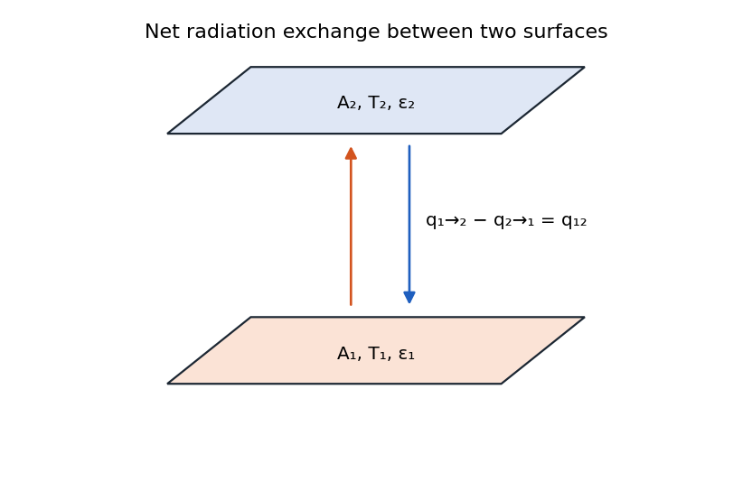
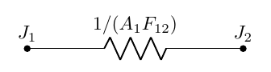
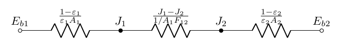
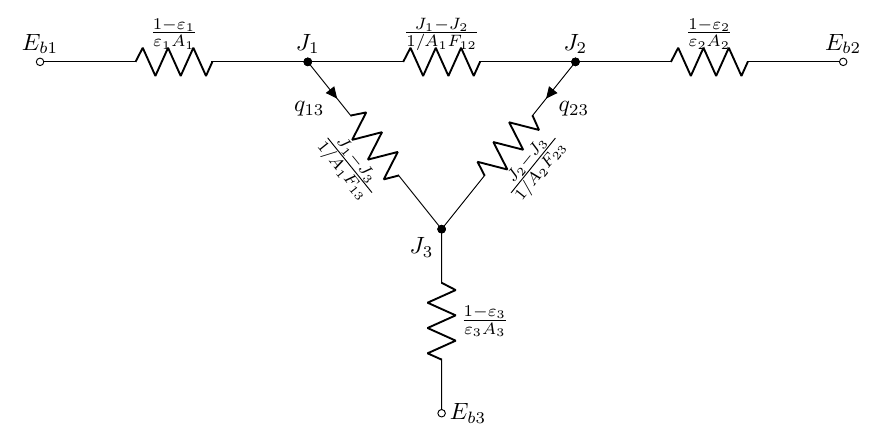
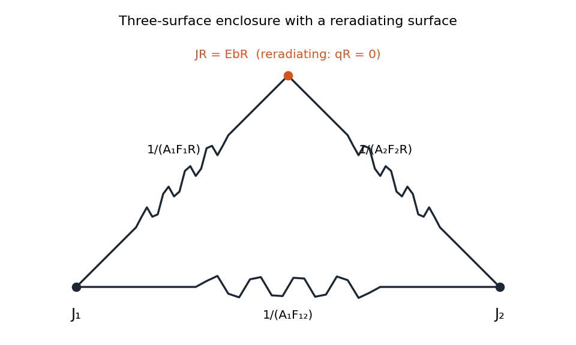
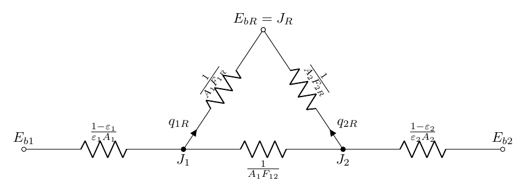
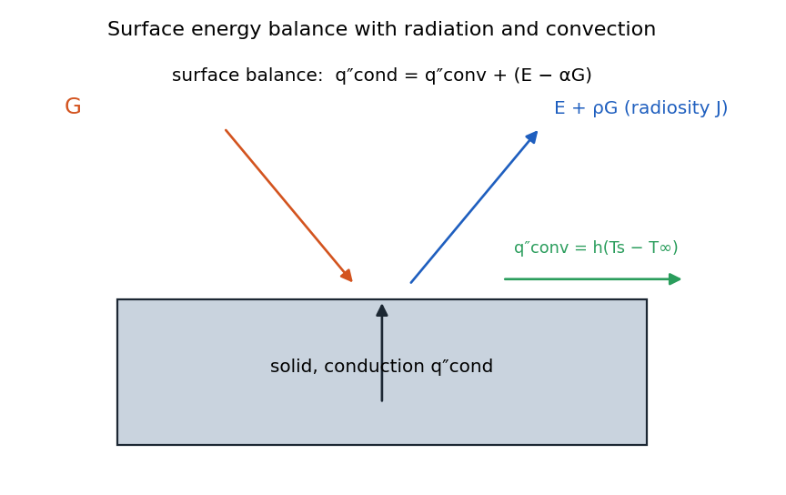

# Radiation Exchange Between Surfaces

## Net Radiation Exchange Between Two Surfaces 

<figure markdown="span">
{ width="72%" }
<figcaption>Radiation between surface 1 and 2</figcaption>
</figure>

The net exchange of radiation between two surfaces is:

$$
\begin{aligned}
        q_{12} &= q_{1\to 2} - q_{2 \to 1}
        \\[1em ]
        q_{12} & =A_1 F_{12} J_1-A_2 F_{21} J_2
    \end{aligned}
$$

Using reciprocity $\left(A_1 F_{12}=A_2 F_{21}\right)$ :

$$
q_{12} = \frac{(J_1-J_2)}{1/A_1 F_{12}}
$$

### Sign Convention

It’s critical to maintain consistent sign conventions when working with radiation networks:

-   $q_i$ is positive when heat leaves surface $i$ (cooling)

-   $q_{i \rightarrow j}$ represents the directional radiation from surface $i$ to surface $j$

-   $q_{ij}$ represents the net radiation exchange between surfaces $i$ and $j$, with $q_{ij} = -q_{ji}$

!!! abstract "Space Resistance"

    ##### Formula

    $$
    q_{12} = \frac{(J_1-J_2)}{1/A_1 F_{12}}
    $$

    ##### Circuit form

    <figure markdown="span">
    { width="72%" }
    </figure>

Space Resistance: Only involves geometry measure of how easily two surfaces exchange thermal radiation.

### Network Construction - Two Surfaces

For a two-surface enclosure:

<figure markdown="span">
{ width="72%" }
</figure>

### Network Construction - Three Surfaces

For a three-surface enclosure:

<figure markdown="span">
{ width="72%" }
</figure>

For each additional surface, we add:

-   A new $E_{bi}$ and $J_i$ node pair

-   A surface resistance connecting $E_{bi}$ to $J_i$

-   Space resistances connecting $J_i$ to all other $J$ nodes

## Network Analysis Method

To solve a radiation network:

1.  Identify the number of unknowns (typically one per surface - either $T_i$ or $q_i$)

2.  Write energy balance equations at each $J$ node using Kirchhoff’s current law

3.  For each $J$ node: $q_i = \sum_{j \neq i} q_{ij}$ (what leaves a surface must distribute to all other surfaces)

4.  Express these in terms of potentials and resistances: 

$$
\frac{E_{b, i}-J_i}{\frac{1-\varepsilon_i}{\varepsilon_i A_i}}= \sum_{j \neq i} \frac{J_i - J_j}{\frac{1}{A_i F_{i j}}}
$$

5.  Solve the resulting system of equations

For an $N$-surface enclosure, you’ll need to solve a system of $N$ equations with $N$ unknowns.

-   For a known temperature distribution, solve for heat transfer rates

-   For a known heat transfer distribution, solve for surface temperatures

#### Key Points:

$$
\left\{\begin{array}{lccl}
            q_{i \to j} = A_{i}J_{i}F_{ij} &  &&\text {Ratio of radiation ($J=E_b + \rho G$ leaves $i$ and falls on $j$} 
            \\[1em]
            q_{ij} = q_{i \to j} - q_{j \to i}&&& \text{Net radiation exchange between $i$ and $j$ (Leaving $i$ is positive)}
            \\[1em]
            q_i=\sum_{j=1}^N q_{i j} &&& \text {Total net radiation loss for $i$}
        \end{array}
        \right.
$$

 Therefore, 

$$
\boxed{
    \begin{aligned}
        &q_{ij} = - q_{ji}
        \\[1em]
        &q_{i \to j} \neq q_{j \to i} \qquad(\textit{unless $J_i = J_j$})
        \\[1em]
        &\sum_{i=1}^N q_i = \sum_{i=1}^N\sum_{j=1}^N q_{ij}= 0 \qquad \text{good for checking after solving}
    \end{aligned}
    }
$$

## Re-radiating Surfaces

A reradiating surface is one that:

-   Is thermally insulated from conduction and convection

-   Has no internal heat generation

-   Participates only in radiation heat transfer

-   Must achieve a temperature where the net radiation exchange equals zero

For a reradiating surface $i$, we have:

-   $q_i = 0$ (no net heat transfer to/from the surface)

-   $E_{bi} = J_i$ (the radiosity equals the blackbody emission)

This significantly simplifies the network, as we can eliminate the $E_{bi}$ node and directly work with the $J_i$ node. The surface resistance becomes irrelevant since there is no potential difference across it.

<figure markdown="span">
{ width="72%" }
<figcaption>Schematic of a three-surface enclosure with one surface reradiating</figcaption>
</figure>

<figure markdown="span">
{ width="72%" }
</figure>

Considering the entire circuit, we can simply find heat transfer as follow: 

$$
q_1 = - q_2 = \frac{E_{b1}-E_{b2}}{R_{s1} + [R_{13}+R_{23}]\parallel R_{12} + R_{s2}}
$$

 where 

$$
\begin{aligned}
        R_{s1} &= \frac{1-\varepsilon_1}{\varepsilon_1 A_1}
        \\[1em]
        R_{s2} &= \frac{1-\varepsilon_2}{\varepsilon_2 A_2}
        \\[1em]
        [R_{13}+R_{23}]\parallel  R_{12} &= \frac{1}{A_1 F_{12}+\left[\left(1 / A_1 F_{1 R}\right)+\left(1 / A_2 F_{2 R}\right)\right]^{-1}}
    \end{aligned}
$$

## Important Considerations for Radiation Resistance

When working with radiation resistances, several important considerations must be kept in mind:

1.  **Units:** Radiation resistances have units of $\text{m}^{-2}$, which is different from conduction or convection resistances. This means they cannot be directly combined in a single network without proper conversion.

2.  **Temperature potential:** Radiation networks use $\sigma T^4$ as the potential rather than $T$, making them fundamentally different from conduction/convection networks.

3.  **Dimensional consistency:** When solving networks, ensure all terms maintain proper dimensional consistency.

4.  **Network reduction:** While circuit reduction techniques (series, parallel) can sometimes be applied, it’s only valid for specific cases where the heat flow path is effectively one-dimensional.

5.  **Mixing modes:** Never directly connect radiation resistances to conduction/convection resistances in a single network without proper conversion - this would be like "adding apples and oranges."

## Multi-Mode Heat Transfer

Many practical problems involve multiple heat transfer modes (conduction, convection, and radiation) simultaneously. To handle such problems:

1.  Draw a control volume that captures all relevant heat transfer mechanisms

2.  Apply energy conservation to this control volume

3.  Use consistent sign conventions across all modes (e.g., positive for heat leaving the surface)

4.  Consider appropriate boundary conditions for each mode

<figure markdown="span">
{ width="72%" }
<figcaption>Surface energy balance</figcaption>
</figure>

For a steady-state surface energy balance with consistent sign convention (positive for heat leaving): 

$$
\begin{aligned}
    & \cancelto{0}{\dot{E}_{\text{in}}}-\dot{E}_{\text {out }}+\dot{E}_{\text {gen }}= \cancelto{0}{\dot{\dot{E}}_{s t}}
    \\[0.5em]
    & \dot{q}_{i, \text { ext}}=q_{i, \text { rad }}+q_{i, \text { conv. }}+q_{i, \text { cond. }}
    \end{aligned}
$$

 *Note:*

-   for $q_{i, \text { rad }}, q_{i, \text { conv }}$ and $q_{i, \text { cond, }}$, positive mean surface losses energy.

-   $q_{i \text {, rad }}$ is the $q_i$ in previous radiation network.

-   $q_{i, \text { ext }}=q_{i, \text { rad }}+q_{i, \text { conv }}+q_{i, \text { cond }}$ holds at any time, ie., transient and steady state..

### Solution Strategy for Multi-Mode Problems

When solving problems with multiple heat transfer modes:

1.  Solve the radiation network first (radiation responds essentially instantaneously)

2.  Use the resulting heat fluxes as boundary conditions for conduction/convection

3.  Apply energy conservation at each surface

4.  For complex geometries, numerical methods may be required

The instructor emphasized that radiation is effectively a "rigid" constraint that responds at the speed of light, making it appropriate to solve first and then use as a boundary condition for slower processes.

#### Example: 

Consider a very long enclosure with a uniform square cross section as shown below. One of the view factors is known as $\boldsymbol{F}_{13} \approx 0.4$. Find the rest of the view factors.

*solution:* We have

-   Due to the flat surfaces, all self-view factors are zero: $F_{11} = F_{22} = F_{33} = F_{44} = 0$

-   Due to symmetry in the square enclosure:

    -   Opposite surfaces: $F_{13} = F_{31} = F_{24} = F_{42} = 0.4$

    -   Adjacent surfaces: $F_{12} = F_{21} = F_{23} = F_{32} = F_{34} = F_{43} = F_{41} = F_{14} = 0.3$

-   Verification: For each surface, the sum of view factors equals 1 

$$
F_{i1} + F_{i2} + F_{i3} + F_{i4} = 0 + 0.3 + 0.4 + 0.3 = 1
$$

| $F_{i j}$ | $i=1$ | $i=2$ | $i=3$ | $i = 4$ |
|:---------:|:-----:|:-----:|:-----:|:-------:|
|   $j=1$   |   0   |  0.3  |  0.4  |   0.3   |
|   $j=2$   |  0.3  |   0   |  0.3  |   0.4   |
|   $j=3$   |  0.4  |  0.3  |   0   |   0.3   |
|   $j=4$   |  0.3  |  0.4  |  0.3  |    0    |
